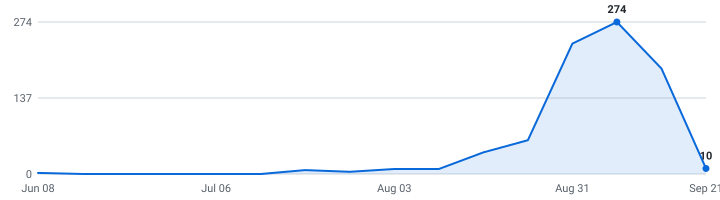

# 🔧 Summer 2027 Mechanical Engineering Internships

**A self-updating engine that tracks mechanical engineering internships so you don't have to.**

&nbsp;&nbsp;&nbsp;

### 802 open roles (476 listed below) · 135 new this week

4,620 employers tracked · data as of Sep 24, 2026 at 03:06 UTC

_468 have a cycle the employer stated · 334 are recent postings whose cycle isn't stated (listed separately, never mixed in)._

**[🖥️ Live dashboard](https://tracker05.github.io/mechanical-engineering-internships/)** · **[📡 RSS](https://tracker05.github.io/mechanical-engineering-internships/feed.xml)** · **[⚙️ JSON API](https://tracker05.github.io/mechanical-engineering-internships/api/jobs.json)** · **[✉️ Email alerts](https://tracker05.github.io/mechanical-engineering-internships/#subscribe)**

> [!TIP]
> **⭐ Star this repo** to save it and get updates when new roles are added.

Instead of refreshing a dozen career pages by hand, it reads company hiring feeds directly and keeps one live list — newest roles on top, refreshed automatically throughout the day.

**🔔 New roles in your inbox:** [subscribe by email](https://tracker05.github.io/mechanical-engineering-internships/#subscribe) - one email a day, only when new internships actually appeared, unsubscribe from any email in two clicks. (Prefer RSS-to-email? [Feedrabbit works too](https://feedrabbit.com/subscriptions/new?url=https%3A%2F%2Fraw.githubusercontent.com%2FTracker05%2Fmechanical-engineering-internships%2Fmain%2Fdocs%2Ffeed.xml).)

---

## What this is

This is an engine, not a hand-kept list. It polls company career feeds every 30 minutes, finds the internships, removes duplicates, and rebuilds this page on its own.

Every link comes straight from the source — so it's real and current, not a stale list someone forgot to update. Speed matters.

## What makes this different

| | |
|---|---|
| 📅 **[Drop Radar](#drop-radar)** | A forecast of **what's coming**. Each marquee company's typical opening window, replaced by the real drop date the moment the engine catches it live. Windows are estimates and labelled as such; only dates the engine saw itself are marked verified. |
| 🛂 **Visa intel, computed** | 🇺🇸 / 🛂 flags detected automatically from every job description, plus ✓ for employers with a real H-1B track record (USCIS data, FY2022-23 — a history, not a promise). The big lists crowdsource this by hand; here it's code. Most postings say nothing either way, and those show as unknown rather than guessed. |
| 📆 **A real date on nearly every role** | Taken from the job portal itself wherever the portal states one, so newest-first actually means newest. The exact coverage figure is printed at the bottom of this page every run. |
| 🧰 **Skill tags + pay, extracted** | Every posting's text is scanned for the stack it wants (Python, C++, PyTorch, …) and the pay it states — searchable on the [dashboard](https://tracker05.github.io/mechanical-engineering-internships/), and included in the CSV and API. |
| 🔔 **Alerts your way** | [Email digests](https://tracker05.github.io/mechanical-engineering-internships/#subscribe) or [RSS](https://tracker05.github.io/mechanical-engineering-internships/feed.xml) — point any reader, or a Slack/Discord RSS integration, at it. Plus a [live dashboard](https://tracker05.github.io/mechanical-engineering-internships/) with search, filters, and a saved-roles list that never leaves your browser. |
| ⚙️ **An engine, not a spreadsheet** | 4,880 job-board endpoints (4,620 distinct employers; some run more than one board) polled every 30 minutes across 12 ATS platforms. Full source and tests in this repo. |

## Scope

| | |
|---|---|
| **Roles** | Mechanical Design, Manufacturing, Thermal/Fluids, Automotive, Aerospace, Robotics & Controls, Structures & Materials, Energy, Test & Quality (and closely related technical internships) |
| **Region** | United States |
| **Cycles** | Summer 2027 and Fall 2026 |

## About

I'm an international student studying in the United States, so I built this for the search I'm doing myself. The list is US roles only for now — that's where I'm searching.

Use it to spot roles early and apply before they fill up. Being first genuinely helps.

## Where this is going

I'm building this in the open and adding to it as it grows.

**Recently shipped:** email alerts · the Drop Radar · auto-detected sponsorship flags · the live dashboard

**Next up:** personalized alerts (pick your categories) · per-company hiring pages · a ghost-posting detector

If it helps you, a star means a lot and tells me to keep going.

## How to use

<b>Reading the table — flags, dates, and the cycle split</b> (click to expand)

- Roles are grouped by cycle below - **newest posting on top, oldest at the bottom.**
- A cycle section holds only roles whose **employer stated that cycle** - in the title, or in the posting's own text. Postings that name no cycle anywhere are in *Recently posted — cycle not stated* further down, with **no cycle guessed for them**. Same quality bar, different amount of evidence.
- The **Posted** column is the date the company published the role.
- **_(3 openings)_ after a role title** = the employer has that many separate live requisitions for the same job, in the same place, for the same cycle. They're all real and each takes its own application, so they're linked individually (**Apply**, then **#2**, **#3**) instead of repeating the row. Counts still count requisitions, and the CSV export is never grouped.
- **🆁 after a company name** = **this role is remote** — the posting's own location or title says so. It marks the role on that row, not the whole company.
- **Flags after a role title:** 🇺🇸 = requires U.S. citizenship or a security clearance · 🛂 = the posting says it won't sponsor a work visa · 🆕 = spotted in the last 48 hours. Sponsorship flags are detected automatically from each job description - treat them as a strong hint and confirm on the posting.
- **✓ after a company name** = a real H-1B track record: USCIS approved 10+ petitions for that employer in FY2022–2023 (matched automatically against the official [H-1B Employer Data Hub](https://www.uscis.gov/tools/reports-and-studies/h-1b-employer-data-hub)). No ✓ doesn't mean they won't sponsor - it means we can't prove they have.
- Track your applications with [`data/internships.csv`](data/internships.csv) (opens in Excel / Google Sheets).
- Missing a company? Adding one takes a single line, see [CONTRIBUTING.md](CONTRIBUTING.md).

---

## Summer 2027  (254 employer-stated)

| Company | Role | Category | Location | Skills | Posted | Apply |
|---|---|---|---|---|---|---|
| The Aerospace Corporation | 2027 Chemical Propulsion Graduate Intern 🇺🇸 🆕 | Aerospace & Defense | El Segundo, CA | SolidWorks, MATLAB, Python, LabVIEW | Sep 23, 2026 | [Apply](https://aero.wd5.myworkdayjobs.com/external/job/El-Segundo-CA/XMLNAME-2027-Chemical-Propulsion-Graduate-Intern_R016672) |
| The Aerospace Corporation | 2027 Flight Loads Structural Dynamics Undergraduate Intern 🇺🇸 🆕 | Structures & Materials | El Segundo, CA | FEA, MATLAB, Python, Excel | Sep 23, 2026 | [Apply](https://aero.wd5.myworkdayjobs.com/external/job/El-Segundo-CA/XMLNAME-2027-Flight-Loads-Structural-Dynamics-Undergraduate-Intern_R016671) |
| The Aerospace Corporation | 2027 Structural Dynamics Undergraduate Intern 🇺🇸 🆕 | Structures & Materials | El Segundo, CA | FEA, MATLAB, Python | Sep 23, 2026 | [Apply](https://aero.wd5.myworkdayjobs.com/external/job/El-Segundo-CA/XMLNAME-2027-Structural-Dynamics-Undergraduate-Intern_R016668) |
| Continental | 2027 Internship - Manufacturing Engineer (Hoosier Racing Tire) 🆕 | Manufacturing & Process | Plymouth, IN, United States | No skills listed | Sep 23, 2026 | [Apply](https://jobs.smartrecruiters.com/Continental/744000151462939) |
| WSP | Construction Materials Engineering and Laboratory Testing Intern - Summer 2027 🆕 | Structures & Materials | San Diego, CA, United States | No skills listed | Sep 23, 2026 | [Apply](https://emit.fa.ca3.oraclecloud.com/hcmUI/CandidateExperience/en/sites/CX_2001/job/95670) |
| Generac | Mechanical Engineering Intern - Transfer Switch - Summer 2027 🆕 | Design & CAD | Waukesha, WI - USA | AutoCAD, Excel | Sep 23, 2026 | [Apply](https://generac.wd5.myworkdayjobs.com/external/job/Waukesha-WI---USA/Mechanical-Engineering-Intern---Transfer-Switch---Summer-2027_JR17048) |
| Northrop Grumman | 2027 Mechanical Engineer Intern – Woodland Hills CA 🇺🇸 🆕 | Design & CAD | United States-California-Woodland Hills | SolidWorks, ANSYS, FEA, MATLAB | Sep 23, 2026 | [Apply](https://ngc.wd1.myworkdayjobs.com/Northrop_Grumman_External_Site/job/United-States-California-Woodland-Hills/XMLNAME-2027-Mechanical-Engineer-Intern---Woodland-Hills-CA_R10249483) |
| Marvell | Security Verification/Validation Engineer Intern, BS - Summer 2027 🆕 | Test & Quality | Chandler, AZ | No skills listed | Sep 23, 2026 | [Apply](https://marvell.wd1.myworkdayjobs.com/marvellcareers2/job/Chandler-AZ/Security-Verification-Validation-Engineer-Intern--BS---Summer-2027_2604148) |
| AECOM | Structural Engineering Intern - Networking Event with AECOM – Boston, MA 🛂 🆕 | Structures & Materials | Boston, MA, United States (Hybrid) | AutoCAD, Excel | Sep 23, 2026 | [Apply](https://jobs.smartrecruiters.com/AECOM2/744000151381599) |
| RTX | Avionics Computer Systems Engineering Co-op (Summer/Fall 2027) - Onsite 🆕 | Aerospace & Defense | US-IA-CEDAR RAPIDS-193 ~ 1120 Collins R… | Python | Sep 22, 2026 | [Apply](https://globalhr.wd5.myworkdayjobs.com/rec_rtx_ext_gateway/job/US-IA-CEDAR-RAPIDS-193--1120-Collins-Rd-NE--BLDG193/Avionics-Computer-Systems-Engineering-Co-op--Summer-Fall-2027----Onsite_01872715) |
| Life Fitness ✓ | Manufacturing Engineering Intern - Ramsey, MN 🆕 | Manufacturing & Process | Ramsey, MN | Excel | Sep 22, 2026 | [Apply](https://lifefitness.wd1.myworkdayjobs.com/searchLFN/job/Ramsey-MN/Manufacturing-Engineering-Intern---Ramsey--MN_JR-025239) |
| Stantec | Civil/Structural Engineering Intern - Water (Summer 2027) 🆕 | Structures & Materials | Chattanooga, TN, United States | Excel, Hydraulics | Sep 22, 2026 | [Apply](https://hdhl.fa.us6.oraclecloud.com/hcmUI/CandidateExperience/en/sites/CX_1/job/1007925) |
| Charter Manufacturing | Process Engineer Intern (Summer 2027) 🆕 | Manufacturing & Process | Charter Steel - Cleveland, OH | AutoCAD, Excel | Sep 22, 2026 | [Apply](https://chartermfg.wd5.myworkdayjobs.com/Charter_Careers/job/Charter-Steel---Cleveland-OH/Process-Engineer-Intern--Summer-2027-_R08123) |
| AES | Transmission Engineering Intern - (Summer 2027) 🆕 | Automotive & Mobility | US, Indianapolis, IN | SolidWorks, Excel | Sep 22, 2026 | [Apply](https://aes.wd1.myworkdayjobs.com/AES_US/job/US-Indianapolis-IN/Transmission-Engineering-Intern----Summer-2027-_R1064839) |
| Northrop Grumman | 2027 Mechanical Engineer Intern - San Diego CA 🇺🇸 🆕 | Design & CAD | United States-California-San Diego | SolidWorks, CATIA, ANSYS, Nastran | Sep 22, 2026 | [Apply](https://ngc.wd1.myworkdayjobs.com/Northrop_Grumman_External_Site/job/United-States-California-San-Diego/XMLNAME-2027-Mechanical-Engineer-Intern---San-Diego-CA_R10252139) |
| Avav | Summer 2027 Autonomy & Robotics Engineering Intern 🆕 | Robotics & Controls | Moorpark, CA | MATLAB, Python, C++, ROS | Sep 21, 2026 | [Apply](https://avav.wd1.myworkdayjobs.com/avav/job/Moorpark-CA/Summer-2027-Autonomy---Robotics-Engineering-Intern_8551) |
| Shield AI | Summer 2027 - Mechanical Engineering Intern | Design & CAD | Seattle, Washington | SolidWorks, CATIA | Sep 21, 2026 | [Apply](https://jobs.lever.co/shieldai/da54c482-fe62-4f60-98b1-55ac0b82b3bc) |
| IMEG ✓ | Mechanical Engineering Intern / Anaheim, CA 🛂 | Design & CAD | Anaheim, CA | AutoCAD, Excel | Sep 21, 2026 | [Apply](https://wd1.myworkdaysite.com/recruiting/imeg/Imeg_Careers/job/Anaheim-CA/Mechanical-Engineering-Intern---Anaheim--CA_R-16751) |
| Zurn Elkay Water Solutions | Mechanical Engineering Intern (Summer 2027) | Design & CAD | Paso Robles, CA | Inventor, AutoCAD, Excel, Additive Manufacturing | Sep 21, 2026 | [Apply](https://elkay.wd1.myworkdayjobs.com/Elkay_External/job/Paso-Robles-CA/Mechanical-Engineering-Intern--Summer-2027-_REQ-020111) |
| Life Fitness ✓ | Mechanical Engineering Intern - Ramsey, MN | Design & CAD | Ramsey, MN | SolidWorks, Tolerance Analysis, FEA, Excel | Sep 21, 2026 | [Apply](https://lifefitness.wd1.myworkdayjobs.com/searchLFN/job/Ramsey-MN/Mechanical-Engineering-Intern---Ramsey--MN_JR-025235) |
| Charter Manufacturing | Mechanical Engineer Intern (Summer 2027) | Design & CAD | Charter Steel - Saukville, WI | SolidWorks, AutoCAD, Excel, Lean | Sep 21, 2026 | [Apply](https://chartermfg.wd5.myworkdayjobs.com/Charter_Careers/job/Charter-Steel---Saukville-WI/Mechanical-Engineering-Intern--Year-Round-_R08122) |
| IMEG ✓ | Structural Engineering Intern / Pasadena, CA 🛂 | Structures & Materials | Pasadena, CA | AutoCAD, Excel, SPC | Sep 21, 2026 | [Apply](https://wd1.myworkdaysite.com/recruiting/imeg/Imeg_Careers/job/Pasadena-CA/Structural-Engineering-Intern---Pasadena--CA_R-16756) |
| Oshkosh | Motorsports Intern (Summer 2027) | Automotive & Mobility | Huntersville +2 more | Python | Sep 21, 2026 | [Apply](https://oshkoshcorporation.wd5.myworkdayjobs.com/Oshkosh/job/Huntersville-North-Carolina-United-States/Motorsports-Intern--Summer-2027-_R50520) |
| MetOx International | Process Engineering Co-Op/Intern (Spring/Summer 2027) | Manufacturing & Process | Houston, TX | Excel, Six Sigma, Lean, Design of Experiments | Sep 21, 2026 | [Apply](https://job-boards.greenhouse.io/metoxinternationalinc/jobs/5430385008) |
| Rocket Lab | Thermal Engineering Intern Summer 2027 🇺🇸 | Thermal & Fluids | Long Beach, CA | FEA, Machining | Sep 21, 2026 | [Apply](https://job-boards.greenhouse.io/rocketlab/jobs/8000958003) |
| Draper | Mechanical Engineering & System Packaging Intern (Summer 2027) 🇺🇸 | Design & CAD | Cambridge, MA | SolidWorks, Creo, ANSYS, FEA | Sep 21, 2026 | [Apply](https://draper.wd5.myworkdayjobs.com/Draper_Careers/job/Cambridge-MA/Mechanical-Engineering---System-Packaging-Intern--Summer-2027-_JR002943) |
| Brunswick ✓ | Mercury Marine: Intern Design Analysis Group-Fluid & Thermal | Thermal & Fluids | Fond du Lac, WI | STAR-CCM+, CFD | Sep 21, 2026 | [Apply](https://brunswick.wd1.myworkdayjobs.com/search/job/Fond-du-Lac-WI/Mercury-Marine--Intern-Design-Analysis-Group-Fluid---Thermal_JR-050977) |
| WSP | Power Distribution Design Engineering Intern - Summer 2027 | Design & CAD | Salt Lake City +5 more | No skills listed | Sep 21, 2026 | [Apply](https://emit.fa.ca3.oraclecloud.com/hcmUI/CandidateExperience/en/sites/CX_2001/job/95761) |
| Stantec | Mechanical Engineering Intern/Co-op - Buildings (Summer 2027) | Design & CAD | Butler, PA, United States | AutoCAD, Revit, Excel | Sep 21, 2026 | [Apply](https://hdhl.fa.us6.oraclecloud.com/hcmUI/CandidateExperience/en/sites/CX_1/job/1007883) |
| Stantec | Mechanical Engineering Intern/Co-op - Buildings (Summer 2027) | Design & CAD | Rochester +11 more | AutoCAD, Revit, Excel | Sep 21, 2026 | [Apply](https://hdhl.fa.us6.oraclecloud.com/hcmUI/CandidateExperience/en/sites/CX_1/job/1007884) |
| AtkinsRéalis | Roadway Design Engineering Intern - Summer 2027 | Design & CAD | US.MI.Novi | No skills listed | Sep 21, 2026 | [Apply](https://slihrms.wd3.myworkdayjobs.com/careers/job/USMINovi/Roadway-Design-Engineering-Intern---Summer-2027_R-161166-1) |
| The Toro Company | Quality Engineer Intern - Ditch Witch 🛂 | Test & Quality | Perry, OK | Excel | Sep 21, 2026 | [Apply](https://ttc.wd1.myworkdayjobs.com/Toro_External_Careers/job/Perry-OK/Quality-Engineer-Intern---Ditch-Witch_JR17218) |
| AtkinsRéalis | Roadway Design Engineering Intern - Summer 2027 | Design & CAD | US.NC.Raleigh.1616 East Mill Brook Road | AutoCAD, Excel | Sep 21, 2026 | [Apply](https://slihrms.wd3.myworkdayjobs.com/careers/job/USNCRaleigh1616-East-Mill-Brook-Road/Roadway-Design-Engineering-Intern---Summer-2027_R-162556) |
| Northrop Grumman | 2027 Mechanical Engineer Intern - Baltimore MD 🇺🇸 | Design & CAD | United States-Maryland-Baltimore | No skills listed | Sep 21, 2026 | [Apply](https://ngc.wd1.myworkdayjobs.com/Northrop_Grumman_External_Site/job/United-States-Maryland-Baltimore/XMLNAME-2027-Mechanical-Engineer-Intern---Baltimore-MD_R10251088) |
| United Parcel Service (UPS) | 2027 Americas Region Industrial Engineering Summer Intern 🇺🇸 | Manufacturing & Process | US - UPS CORPORATE OFFICES (GACOR) | No skills listed | Sep 18, 2026 | [Apply](https://hcmportal.wd5.myworkdayjobs.com/Search/job/US---UPS-CORPORATE-OFFICES-GACOR/XMLNAME-2027-Americas-Region-Industrial-Engineering-Summer-Intern_R26032989) |
| RTX | Digital Hardware Design Engineer Co-op (Summer/Fall 2027)(Onsite) 🇺🇸 | Design & CAD | US-IA-CEDAR RAPIDS-130 ~ 5350 C Ave NE… | No skills listed | Sep 18, 2026 | [Apply](https://globalhr.wd5.myworkdayjobs.com/rec_rtx_ext_gateway/job/US-IA-CEDAR-RAPIDS-130--5350-C-Ave-NE--BLDG-130/Digital-Hardware-Design-Engineer-Co-op--Summer-Fall-2027--Onsite-_01871519) |
| Charter Manufacturing | Mechanical Engineer Intern (Year-Round) | Design & CAD | Charter Steel - Saukville, WI | AutoCAD, Excel, Lean | Sep 18, 2026 | [Apply](https://chartermfg.wd5.myworkdayjobs.com/Charter_Careers/job/Charter-Steel---Saukville-WI/Mechanical-Engineer-Intern--Year-Round-_R08102) |
| Merck | 2027 Future Talent Program - Manufacturing Intern 🛂 | Manufacturing & Process | USA - North Carolina - Durham (Old Oxfo… | No skills listed | Sep 18, 2026 | [Apply](https://msd.wd5.myworkdayjobs.com/searchjobs/job/USA---North-Carolina---Durham-Old-Oxford/XMLNAME-2027-Future-Talent-Program---Manufacturing-Intern_R416739) |
| Merck | 2027 Future Talent Program – West Point Vaccine Manufacturing Intern 🛂 | Manufacturing & Process | USA - Pennsylvania - West Point | Six Sigma, Lean | Sep 18, 2026 | [Apply](https://msd.wd5.myworkdayjobs.com/searchjobs/job/USA---Pennsylvania---West-Point/XMLNAME-2027-Future-Talent-Program---West-Point-Vaccine-Manufacturing-Intern_R416751) |
| Valeo | Quality Engineer Co-Op (Summer 2027) | Test & Quality | Hamilton, OH | Excel, FMEA, SPC | Sep 18, 2026 | [Apply](https://valeo.wd3.myworkdayjobs.com/valeo_jobs/job/Hamilton-OH/Quality-Engineer-Co-Op--Summer-2027-_REQ2026080099) |
| Rocket Lab | Manufacturing Engineering Intern Summer 2027 🇺🇸 | Manufacturing & Process | Wallops Island, VA | Python | Sep 17, 2026 | [Apply](https://job-boards.greenhouse.io/rocketlab/jobs/7996623003) |
| Echo Global Logistics | Process Engineer Intern- Greenfield, IN | Manufacturing & Process | Roadtex - Greenfield IN | No skills listed | Sep 17, 2026 | [Apply](https://echo.wd1.myworkdayjobs.com/Echo_Logistics/job/Roadtex---Greenfield-IN/Process-Engineer-Intern--Greenfield--IN_R4650-1) |
| WSP | Overhead Transmission Line Design Engineering Intern  - Spring/Summer 2027 | Automotive & Mobility | Phoenix, AZ, United States | SolidWorks, AutoCAD | Sep 17, 2026 | [Apply](https://emit.fa.ca3.oraclecloud.com/hcmUI/CandidateExperience/en/sites/CX_2001/job/95693) |
| Lowe's | Store Operations Industrial Engineering – Undergrad Internship – Summer 2027 | Manufacturing & Process | Mooresville, NC (SSC) 1999 | No skills listed | Sep 17, 2026 | [Apply](https://lowes.wd5.myworkdayjobs.com/LWS_External_CS/job/Mooresville-NC-SSC-1999/Store-Operations-Industrial-Engineering---Undergrad-Internship---Summer-2027_JR-02651868-1) |
| Rocket Lab | Test Engineering Intern Summer 2027 🇺🇸 | Test & Quality | Stennis Space Center, MS | Siemens NX, GD&T, MATLAB, Python | Sep 17, 2026 | [Apply](https://job-boards.greenhouse.io/rocketlab/jobs/7990350003) |
| X-energy | Test Engineering Internship - Summer 2027 | Test & Quality | Rockville, MD | Excel | Sep 17, 2026 | [Apply](https://xenergy.wd5.myworkdayjobs.com/X-energyUS/job/Rockville-MD/Test-Engineering-Internship---Summer-2027_R101320-1) |
| RTX | Industrial Engineering Co-Op (Summer/Fall 2027) 🇺🇸 | Manufacturing & Process | US-IA-CEDAR RAPIDS-108 ~ 400 Collins Rd… | SolidWorks, AutoCAD, PLM/PDM | Sep 17, 2026 | [Apply](https://globalhr.wd5.myworkdayjobs.com/rec_rtx_ext_gateway/job/US-IA-CEDAR-RAPIDS-108--400-Collins-Rd-NE--BLDG-108/Industrial-Engineering-Co-Op--Summer-Fall-2027-_01870637) |
| X-energy | Mechanical Engineering Internship - Summer 2027 | Design & CAD | Rockville, MD | SolidWorks, Creo, ANSYS, Abaqus | Sep 17, 2026 | [Apply](https://xenergy.wd5.myworkdayjobs.com/X-energyUS/job/Rockville-MD/Mechanical-Engineering-Internship---Summer-2027_R101319-1) |
| X-energy | Nuclear Engineering Internship - Summer 2027 | Energy & Power | Rockville, MD | Excel | Sep 17, 2026 | [Apply](https://xenergy.wd5.myworkdayjobs.com/X-energyUS/job/Rockville-MD/Nuclear-Engineering-Internship---Summer-2027_R101284-1) |
| Johnson & Johnson | Process Engineer Summer Intern 🛂 | Manufacturing & Process | Jacksonville +2 more | No skills listed | Sep 17, 2026 | [Apply](https://jj.wd5.myworkdayjobs.com/JJ/job/Jacksonville-Florida-United-States-of-America/Process-Engineer-Summer-Intern_R-099289) |
| Smith+Nephew ✓ | Intern Mechanical Engineering | Design & CAD | Pittsburgh, PA | SolidWorks, GD&T | Sep 17, 2026 | [Apply](https://smithnephew.wd5.myworkdayjobs.com/External/job/Pittsburgh-PA/Intern-Mechanical-Engineering_R92508) |
| Michael Baker International ✓ | Structural Intern, Summer 2027 | Structures & Materials | Boston, MA, United States | Revit | Sep 17, 2026 | [Apply](https://ebxs.fa.us2.oraclecloud.com/hcmUI/CandidateExperience/en/sites/CX_2/job/309903) |
| onsemi | Summer 2027 - Thin Films, Implant & Diffusion Process Engineering Intern | Manufacturing & Process | Hopewell Junction, NY, United States | No skills listed | Sep 16, 2026 | [Apply](https://hctz.fa.us2.oraclecloud.com/hcmUI/CandidateExperience/en/sites/CX_1001/job/2506637) |
| Michael Baker International ✓ | Structural Intern, Summer 2027 | Structures & Materials | Salt Lake City, UT, United States | Revit | Sep 16, 2026 | [Apply](https://ebxs.fa.us2.oraclecloud.com/hcmUI/CandidateExperience/en/sites/CX_2/job/309900) |
| Michael Baker International ✓ | Structural Intern, Summer 2027 | Structures & Materials | Jacksonville, FL, United States | Revit | Sep 16, 2026 | [Apply](https://ebxs.fa.us2.oraclecloud.com/hcmUI/CandidateExperience/en/sites/CX_2/job/309902) |
| Bass Pro Shops | Advanced Manufacturing Intern Summer 2027 | Manufacturing & Process | Springfield +1 more | Welding | Sep 16, 2026 | [Apply](https://basspro.wd1.myworkdayjobs.com/careers/job/Springfield-MO-Bass-Pro-Shops-Base-Camp/Advanced-Manufacturing-Intern-Summer-2027_R267458) |
| Emerson Electric | Mechanical Engineering Co-op (Summer 2027) | Design & CAD | Elyria +5 more | Solid Edge, FEA | Sep 16, 2026 | [Apply](https://hdjq.fa.us2.oraclecloud.com/hcmUI/CandidateExperience/en/sites/CX_1/job/26011001) |
| ABB ✓ | Quality Engineering Intern - Summer 2027 🛂 | Test & Quality | New Berlin +2 more | No skills listed | Sep 16, 2026 | [Apply](https://abb.wd3.myworkdayjobs.com/external_career_page/job/New-Berlin-Wisconsin-United-States-of-America/Quality-Engineering-Intern---Summer-2027_JR00047273) |
| Rendezvous Robotics | Mechanical Engineering Intern (Summer 2027) | Design & CAD | Golden, CO | SolidWorks, Fusion 360, Onshape, ANSYS | Sep 16, 2026 | [Apply](https://job-boards.greenhouse.io/rendezvousrobotics/jobs/4408601009) |
| Sensata | Mechanical Engineer Intern (Aerospace) - Summer 2027 | Aerospace & Defense | Thousand Oaks, CA | No skills listed | Sep 16, 2026 | [Apply](https://sensata.wd1.myworkdayjobs.com/Sensata-Careers/job/Thousand-Oaks-CA/Mechanical-Engineer-Intern--Aerospace----Summer-2027_IRC98482) |
| Sensata | Mechanical Engineer Intern (Aerospace) - Summer 2027 | Aerospace & Defense | Vista, CA | No skills listed | Sep 16, 2026 | [Apply](https://sensata.wd1.myworkdayjobs.com/Sensata-Careers/job/Vista-CA/Mechanical-Engineer-Intern--Aerospace----Summer-2027_IRC98483) |
| Rendezvous Robotics | Avionics Engineering Intern (Summer 2027) | Aerospace & Defense | Golden, CO | No skills listed | Sep 16, 2026 | [Apply](https://job-boards.greenhouse.io/rendezvousrobotics/jobs/4408578009) |
| Duracell | PS Manufacturing - Engineering Intern Spring/Summer 2027 | Manufacturing & Process | Cleveland, TN, United States | SolidWorks, AutoCAD | Sep 16, 2026 | [Apply](https://fa-ewub-saasfaprod1.fa.ocs.oraclecloud.com/hcmUI/CandidateExperience/en/sites/CX_26/job/1399) |
| Duracell | PS Manufacturing -Engineering Co-Op-2027 | Manufacturing & Process | Cleveland, TN, United States | No skills listed | Sep 16, 2026 | [Apply](https://fa-ewub-saasfaprod1.fa.ocs.oraclecloud.com/hcmUI/CandidateExperience/en/sites/CX_26/job/1400) |
| Lonza | Summer 2027 Manufacturing, Science & Technology Internship | Manufacturing & Process | US - Portsmouth, NH | No skills listed | Sep 16, 2026 | [Apply](https://lonza.wd3.myworkdayjobs.com/lonza_careers/job/US---Portsmouth-NH/Summer-2026-Manufacturing--Science---Technology-Internship_R79570) |
| Lonza | Summer 2027 Plant Engineer Internship | Manufacturing & Process | US - Portsmouth, NH | No skills listed | Sep 16, 2026 | [Apply](https://lonza.wd3.myworkdayjobs.com/lonza_careers/job/US---Portsmouth-NH/Summer-2026-Plant-Engineer-Internship_R79569) |
| Johnson & Johnson | Systems & Simulation Engineering Intern - Robotics R&D | Robotics & Controls | Santa Clara +2 more | ANSYS, Abaqus, FEA, MATLAB | Sep 16, 2026 | [Apply](https://jj.wd5.myworkdayjobs.com/JJ/job/Santa-Clara-California-United-States-of-America/Systems---Simulation-Engineering-Intern---Robotics-R-D_R-100027) |
| Brunswick ✓ | Mercury Marine: Industrial Engineer Intern | Manufacturing & Process | Brownsburg, IN | No skills listed | Sep 15, 2026 | [Apply](https://brunswick.wd1.myworkdayjobs.com/search/job/Brownsburg-IN/Mercury-Marine--Industrial-Engineer-Intern_JR-051584) |
| Philips | Intern – R&D Engineer – Plymouth, MN – Summer 2027 | General Engineering | Plymouth, Minnesota, United States | SolidWorks, Excel | Sep 15, 2026 | [Apply](https://philips.wd3.myworkdayjobs.com/jobs-and-careers/job/Plymouth-Minnesota-United-States/Intern---R-D-Engineer---Plymouth--MN---Summer-2027_591610) |
| Johnson & Johnson | Clinical Engineering & Human Factors Intern - Robotics R&D 🛂 | Robotics & Controls | Santa Clara +2 more | No skills listed | Sep 15, 2026 | [Apply](https://jj.wd5.myworkdayjobs.com/JJ/job/Santa-Clara-California-United-States-of-America/Clinical-Engineering---Human-Factors-Intern---Robotics-R-D_R-099931) |
| Everest | 2027 Everest Design Engineering Internship Program | Design & CAD | Warren, NJ | Excel | Sep 15, 2026 | [Apply](https://everestre.wd5.myworkdayjobs.com/careers/job/Warren-NJ/XMLNAME-2027-Everest-Design-Engineering-Internship-Program_R7401) |
| Ensign-Bickford Aerospace & Defense Company | Electronics Manufacturing Engineer Intern | Manufacturing & Process | Simsbury, CT | SPC | Sep 15, 2026 | [Apply](https://ebi.wd5.myworkdayjobs.com/ebadcareers/job/Simsbury-CT/Electronics-Manufacturing-Engineer-Intern_REQ107696-1) |
| Granite Construction | Plant Engineer Intern - Summer 2027 | Manufacturing & Process | Pleasanton, California | No skills listed | Sep 15, 2026 | [Apply](https://granite.wd1.myworkdayjobs.com/careers/job/Pleasanton-California/Plant-Engineer-Intern---Summer-2027_R0000008111) |
| Granite Construction | Plant Engineer Intern - Summer 2027 | Manufacturing & Process | Ukiah, California | No skills listed | Sep 15, 2026 | [Apply](https://granite.wd1.myworkdayjobs.com/careers/job/Ukiah-California/Plant-Engineer-Intern---Summer-2027_R0000008112) |
| Granite Construction | Plant Engineer Intern - Summer 2027 | Manufacturing & Process | Watsonville, California | No skills listed | Sep 15, 2026 | [Apply](https://granite.wd1.myworkdayjobs.com/careers/job/Watsonville-California/Plant-Engineer-Intern---Summer-2027_R0000008110) |
| The Toro Company | Test Engineering Intern - Ditch Witch 🛂 | Test & Quality | Perry, OK | No skills listed | Sep 15, 2026 | [Apply](https://ttc.wd1.myworkdayjobs.com/Toro_External_Careers/job/Perry-OK/Test-Engineering-Intern---Ditch-Witch_JR17320) |
| onsemi | Summer 2027 - REL and Failure Analysis Internship | Test & Quality | Hopewell Junction, NY, United States | No skills listed | Sep 15, 2026 | [Apply](https://hctz.fa.us2.oraclecloud.com/hcmUI/CandidateExperience/en/sites/CX_1001/job/2506613) |
| onsemi | Summer 2027 - Metrology Engineering Intern | Test & Quality | Hopewell Junction, NY, United States | Metrology, Excel | Sep 15, 2026 | [Apply](https://hctz.fa.us2.oraclecloud.com/hcmUI/CandidateExperience/en/sites/CX_1001/job/2506645) |
| Woodward Governor | Engineering Co-op - Design Engineering / Zeeland, MI (Summer 2027) | Design & CAD | Zeeland, MI, US | Excel | Sep 15, 2026 | [Apply](https://woodward.wd5.myworkdayjobs.com/woodward/job/Zeeland-MI-US/Engineering-Co-op---Design-Engineering---Zeeland--MI--Summer-2027-_JR112252) |
| Woodward Governor | Engineering Co-op - Manufacturing Engineering / Zeeland, MI (Summer 2027) | Manufacturing & Process | Zeeland, MI, US | Excel | Sep 15, 2026 | [Apply](https://woodward.wd5.myworkdayjobs.com/woodward/job/Zeeland-MI-US/Engineering-Co-op---Manufacturing-Engineering---Zeeland--MI--Summer-2027-_JR112088) |
| IMEG ✓ | Mechanical Engineering Intern / Ontario, CA 🛂 | Design & CAD | Ontario, California | AutoCAD, Excel | Sep 14, 2026 | [Apply](https://wd1.myworkdaysite.com/recruiting/imeg/Imeg_Careers/job/Ontario-California/Mechanical-Engineering-Intern---Ontario--CA_R-16414) |
| LabCorp | Intern - Mechanical Engineer 🛂 | Design & CAD | Bloomfield CT | SolidWorks, Additive Manufacturing | Sep 14, 2026 | [Apply](https://labcorp.wd1.myworkdayjobs.com/external/job/Bloomfield-CT/Intern---Mechanical-Engineer_2632739-1) |
| General Motors ✓ | 2027 Summer Intern – Motorsports Aerodynamics | Automotive & Mobility | Concord +2 more | CFD | Sep 14, 2026 | [Apply](https://generalmotors.wd5.myworkdayjobs.com/Careers_GM/job/Concord-North-Carolina-United-States-of-America/XMLNAME-2027-Summer-Intern---Motorsports-Aerodynamics_JR-202620069) |
| General Motors ✓ | 2027 Summer Intern – Sportscar Motorsports Strategy | Automotive & Mobility | Concord +2 more | Python | Sep 14, 2026 | [Apply](https://generalmotors.wd5.myworkdayjobs.com/Careers_GM/job/Concord-North-Carolina-United-States-of-America/XMLNAME-2027-Summer-Intern---Sportscar-Motorsports-Strategy_JR-202619859) |
| General Motors ✓ | 2027 Summer Intern – Motorsports Aero-Thermal Engineering | Automotive & Mobility | Milford +2 more | CFD | Sep 14, 2026 | [Apply](https://generalmotors.wd5.myworkdayjobs.com/Careers_GM/job/Milford-Michigan-United-States-of-America/XMLNAME-2027-Summer-Intern---Motorsports-Aero-Thermal-Engineering_JR-202619861) |
| RESPEC | Student Engineering Intern (Structural) | Structures & Materials | Sioux Falls, SD, United States | AutoCAD, Revit | Sep 14, 2026 | [Apply](https://jobs.smartrecruiters.com/RESPECInc/744000149447560) |
| RESPEC | Student Engineering Intern (Structural) | Structures & Materials | Brookings, SD, United States | AutoCAD, Revit | Sep 14, 2026 | [Apply](https://jobs.smartrecruiters.com/RESPECInc/744000149430049) |
| RESPEC | Student Engineering Intern (Structural) | Structures & Materials | Rapid City, SD, United States | AutoCAD, Revit | Sep 14, 2026 | [Apply](https://jobs.smartrecruiters.com/RESPECInc/744000149427190) |
| Airbus | 2027 Summer Internship - Manufacturing Engineer | Manufacturing & Process | Kinston, NC | SolidWorks, CATIA, AutoCAD, Composites | Sep 14, 2026 | [Apply](https://ag.wd3.myworkdayjobs.com/Airbus/job/Kinston-NC/XMLNAME-2027-Summer-Internship---Manufacturing-Engineer_JR10441369) |
| Anduril | 2027 Manufacturing Optimization Engineer Intern | Manufacturing & Process | Ashville, Ohio, United States | Composites | Sep 14, 2026 | [Apply](https://boards.greenhouse.io/andurilindustries/jobs/5236893007?gh_jid=5236893007) |
| Zurn Elkay Water Solutions | Industrial Engineering Intern (Summer 2027) | Manufacturing & Process | Freeport, IL | AutoCAD, Excel | Sep 14, 2026 | [Apply](https://elkay.wd1.myworkdayjobs.com/Elkay_External/job/Freeport-IL/Industrial-Engineering-Intern--Summer-2027-_REQ-020073) |
| Zurn Elkay Water Solutions | Industrial Engineering Intern (Summer 2027) | Manufacturing & Process | Lanark, IL | AutoCAD, Excel | Sep 14, 2026 | [Apply](https://elkay.wd1.myworkdayjobs.com/Elkay_External/job/Lanark-IL/Industrial-Engineering-Intern--Summer-2027-_REQ-020075) |
| Eversource Energy | 2027: Transmission System Planning Co-op 🛂 | Automotive & Mobility | Hartford, CT | No skills listed | Sep 14, 2026 | [Apply](https://eversource.wd1.myworkdayjobs.com/ExternalSite/job/Hartford-CT/XMLNAME-2026-Transmission-System-Planning-Intern_R-029918) |
| The Walt Disney Company | Disneyland Resort Industrial Engineering Intern, Summer 2027 | Manufacturing & Process | Anaheim, CA, USA | No skills listed | Sep 14, 2026 | [Apply](https://disney.wd5.myworkdayjobs.com/disneycareerdc/job/Anaheim-CA-USA/Disneyland-Resort-Industrial-Engineering-Intern--Summer-2027_10159978) |
| The Walt Disney Company | Walt Disney World Industrial Engineering Intern, Summer/Fall 2027 | Manufacturing & Process | Lake Buena Vista, FL, USA | No skills listed | Sep 14, 2026 | [Apply](https://disney.wd5.myworkdayjobs.com/disneycareer/job/Lake-Buena-Vista-FL-USA/Walt-Disney-World-Industrial-Engineering-Intern--Summer-Fall-2027_10159994-1) |
| nVent | Manufacturing Engineering Co-op (June - December 2027) | Manufacturing & Process | Anoka, MN, US | SolidWorks, AutoCAD, Lean | Sep 14, 2026 | [Apply](https://nvent.wd5.myworkdayjobs.com/nVent/job/Anoka-MN-US/Manufacturing-Engineering-Co-op--June---December-2027-_R23578) |
| nVent | Mechanical Engineering and Design Co-op (June - December 2027) | Design & CAD | Anoka, MN, US | SolidWorks, FEA, Sheet Metal | Sep 14, 2026 | [Apply](https://nvent.wd5.myworkdayjobs.com/nVent/job/Anoka-MN-US/Mechanical-Engineering-and-Design-Co-op--June---December-2027-_R23573) |
| Oshkosh | Manufacturing Intern - Summer 2027 | Manufacturing & Process | New Hudson, Michigan, United States | SolidWorks, Creo, Excel, Machining | Sep 14, 2026 | [Apply](https://oshkoshcorporation.wd5.myworkdayjobs.com/Oshkosh/job/New-Hudson-Michigan-United-States/Manufacturing-Intern---Summer-2027_R50275) |
| The Toro Company | Advanced Quality Engineering Intern - The Toro Company 🛂 | Test & Quality | Bloomington, MN | Excel | Sep 14, 2026 | [Apply](https://ttc.wd1.myworkdayjobs.com/Toro_External_Careers/job/Bloomington-MN/Advanced-Quality-Engineering-Intern---The-Toro-Company_JR17231) |
| TD Bank | 2027 Summer Internship Program - Global Technology & Solutions - Quality Engineer | Test & Quality | Mount Laurel, New Jersey | No skills listed | Sep 13, 2026 | [Apply](https://td.wd3.myworkdayjobs.com/TD_Bank_Careers/job/Mount-Laurel-New-Jersey/XMLNAME-2027-Summer-Internship-Program---Global-Technology---Solutions---Quality-Engineer_R_1510798) |
| The Walt Disney Company | Disneyland Resort Alumni Industrial Engineering Intern, Summer 2027 | Manufacturing & Process | Anaheim, CA, USA | No skills listed | Sep 12, 2026 | [Apply](https://disney.wd5.myworkdayjobs.com/disneycareerdc/job/Anaheim-CA-USA/Disneyland-Resort-Alumni-Industrial-Engineering-Intern--Summer-2027_10160092) |
| Ingredion | Process Engineering Intern | Manufacturing & Process | Belcamp, MD | Lean | Sep 12, 2026 | [Apply](https://ingredion.wd1.myworkdayjobs.com/IngredionCareers/job/Belcamp-MD/Process-Engineering-Intern_Req-40181-1) |
| Xcimer Energy | Summer 2027 Internship - Mechanical Engineering 🇺🇸 | Design & CAD | Denver, CO | FEA | Sep 11, 2026 | [Apply](https://jobs.lever.co/xcimer/c672a37e-007d-45ee-a4f9-b5d4dd25a2e3) |
| Emerson Electric | Hardware Design Engineer Intern | Design & CAD | Round Rock, TX, United States | SolidWorks, Creo, AutoCAD, MATLAB | Sep 11, 2026 | [Apply](https://hdjq.fa.us2.oraclecloud.com/hcmUI/CandidateExperience/en/sites/CX_1/job/26010801) |
| AES | Intern- Transmission Engineering Services - (Summer 2027) | Automotive & Mobility | US, Dayton, OH | SolidWorks, Excel | Sep 11, 2026 | [Apply](https://aes.wd1.myworkdayjobs.com/AES_US/job/US-Dayton-OH/Intern--Transmission-Engineering-Services----Summer-2027-_R1064727) |
| AES | Transmission Planning Engineer Intern (Summer 2027) | Automotive & Mobility | US, Indianapolis, IN | No skills listed | Sep 11, 2026 | [Apply](https://aes.wd1.myworkdayjobs.com/AES_US/job/US-Indianapolis-IN/Transmission-Planning-Engineer-Intern--Summer-2027-_R1064788) |
| Blue Origin | Summer 2027 Marine Mechanical & Test Engineering Internship - Undergraduate 🇺🇸 | Test & Quality | Space Coast, FL | No skills listed | Sep 11, 2026 | [Apply](https://blueorigin.wd5.myworkdayjobs.com/blueorigin/job/Space-Coast-FL/Summer-2027-Marine-Mechanical---Test-Engineering-Internship---Undergraduate_R72238) |
| Graco | Manufacturing Engineering Intern - Summer 2027 🛂 | Manufacturing & Process | Sioux Falls, South Dakota, USA | SolidWorks, Creo, AutoCAD, Excel | Sep 11, 2026 | [Apply](https://graco.wd501.myworkdayjobs.com/Graco_Careers/job/Sioux-Falls-South-Dakota-USA/Manufacturing-Engineering-Intern---Summer-2027_R0023643) |
| LabCorp | Intern - Quality Engineer - Oncology 🛂 | Test & Quality | Baltimore MD | No skills listed | Sep 11, 2026 | [Apply](https://labcorp.wd1.myworkdayjobs.com/external/job/Baltimore-MD/Intern---Quality-Engineer_2630918) |
| Momentive ✓ | Summer 2027- Polymers and New Product Development Production Engineer Intern | Manufacturing & Process | US WV Friendly | Excel, Six Sigma, Lean | Sep 11, 2026 | [Apply](https://momentive.wd1.myworkdayjobs.com/MC/job/US-WV-Friendly/Summer-2027--Polymers-and-New-Product-Development-Production-Engineer-Intern_R9799) |
| Momentive ✓ | Summer 2027 Reliability Engineer Intern | Test & Quality | US WV Friendly | Excel | Sep 11, 2026 | [Apply](https://momentive.wd1.myworkdayjobs.com/MC/job/US-WV-Friendly/Summer-2027-Reliability-Engineer-Intern_R9818-1) |
| Saab | Mechanical Engineer Co-Op (Summer 2027) 🇺🇸 | Design & CAD | East Syracuse, NY (Aspen Park) | SolidWorks | Sep 11, 2026 | [Apply](https://saabusa.wd1.myworkdayjobs.com/saab_careers/job/East-Syracuse-NY-Aspen-Park/Mechanical-Engineer-Co-Op--Summer-2027-_R-03261-1) |
| Amazon ✓ | Industrial Development Engineer Intern/Co-op, ROBOTICS - 2027 | Robotics & Controls | North Reading, Massachusetts, USA | SolidWorks, Creo, AutoCAD, Revit | Sep 10, 2026 | [Apply](https://www.amazon.jobs/en/jobs/10536817/industrial-development-engineer-intern-co-op-robotics-2027) |
| Bedrock Robotics | Internship 2027 Sensor Hardware Test Engineer | Test & Quality | San Francisco, CA | Python, Git | Sep 10, 2026 | [Apply](https://jobs.ashbyhq.com/bedrock-robotics/1f413f83-b897-4938-a19e-ab91bd326c51) |
| Bedrock Robotics | Internship 2027 Validation & Verification Test Engineer | Test & Quality | San Francisco, CA | Python, Hydraulics | Sep 10, 2026 | [Apply](https://jobs.ashbyhq.com/bedrock-robotics/c396dedc-06ec-4a23-8408-0194e360f30e) |
| Momentive ✓ | Summer 2027- Process Engineer Intern | Manufacturing & Process | US WV Friendly | Excel, Six Sigma, Lean | Sep 10, 2026 | [Apply](https://momentive.wd1.myworkdayjobs.com/MC/job/US-WV-Friendly/Summer-2027--Process-Engineer-Intern_R9784-1) |
| nVent | Mechanical Engineering Co-Op (June - Dec 2027) | Design & CAD | Solon, OH, US | Abaqus, FEA, MATLAB, CNC | Sep 10, 2026 | [Apply](https://nvent.wd5.myworkdayjobs.com/nVent/job/Solon-OH-US/Mechanical-Engineering-Co-Op--June---December-2027-_R23539) |
| Amazon ✓ | Hardware Development Engineer Intern/Co-Op, ROBOTICS - 2027 | Robotics & Controls | North Reading, Massachusetts, USA | SolidWorks, Creo, AutoCAD, Revit | Sep 09, 2026 | [Apply](https://www.amazon.jobs/en/jobs/10535282/hardware-development-engineer-intern-co-op-robotics-2027) |
| Allen Control Systems | Manufacturing Engineering Co-op / Intern, 2027 | Manufacturing & Process | Pflugerville, TX | SolidWorks, Creo, Fusion 360, GD&T | Sep 09, 2026 | [Apply](https://jobs.ashbyhq.com/allen-control-systems/e7cefcf6-7322-43ba-861e-22e76f8186bd) |
| Saronic | Manufacturing Engineer Intern (Summer 2027) 🇺🇸 | Manufacturing & Process | Franklin, LA | Lean | Sep 09, 2026 | [Apply](https://jobs.ashbyhq.com/saronic/2b037fca-754c-4077-b224-eb35cf2b2b97) |
| Saronic | Mechanical Engineer Intern (Summer 2027) 🇺🇸 | Design & CAD | Austin, TX | SolidWorks, AutoCAD, CFD | Sep 09, 2026 | [Apply](https://jobs.ashbyhq.com/saronic/f52ae6eb-7eba-4c64-97c7-57e2a234e088) |
| Pacific Fusion | Summer 2027 Internship- Mechanical Engineering | Design & CAD | San Leandro +3 more | SolidWorks, Creo, FEA, MATLAB | Sep 09, 2026 | [Apply](https://job-boards.greenhouse.io/pacificfusion/jobs/4398312009) |
| Pacific Fusion | Summer 2027 Internship-Manufacturing Engineering | Manufacturing & Process | San Leandro +3 more | MATLAB, Python, Excel, Machining | Sep 09, 2026 | [Apply](https://job-boards.greenhouse.io/pacificfusion/jobs/4398388009) |
| Texas Instruments ✓ | Plant Process Engineer Intern - Summer 2027 _(2 openings)_ | Manufacturing & Process | Pella, IA, United States | AutoCAD, Solid Edge, Excel | Sep 09, 2026 | [Apply](https://ebgj.fa.us2.oraclecloud.com/hcmUI/CandidateExperience/en/sites/CX_1/job/252684) [#2](https://ebgj.fa.us2.oraclecloud.com/hcmUI/CandidateExperience/en/sites/CX_1/job/253203) |
| Emerson Electric | Mechanical Engineering Internship - Summer 2027 🛂 | Design & CAD | Austin, TX, United States | Creo, Tolerance Analysis, Design of Experiments | Sep 09, 2026 | [Apply](https://hdjq.fa.us2.oraclecloud.com/hcmUI/CandidateExperience/en/sites/CX_1/job/26009934) |
| AECOM | Structural Engineering Intern | Structures & Materials | Virginia Beach +2 more | AutoCAD, Excel | Sep 09, 2026 | [Apply](https://jobs.smartrecruiters.com/AECOM2/744000148586189) |
| AECOM | Structural Engineering Intern | Structures & Materials | Hunt Valley, MD, United States (Hybrid) | AutoCAD, Excel | Sep 09, 2026 | [Apply](https://jobs.smartrecruiters.com/AECOM2/744000148614639) |
| Bosch ✓ | Manufacturing Engineer Intern - Summer 2027 _(2 openings)_ | Manufacturing & Process | Lincolnshire, IL, United States | Creo, Lean, FMEA | Sep 09, 2026 | [Apply](https://jobs.smartrecruiters.com/BoschGroup/744000148518808) [#2](https://jobs.smartrecruiters.com/BoschGroup/744000148542054) |
| Lawrence Livermore National Laboratory (LLNL) | Materials Engineering Division (MED): Undergraduate Intern - Summer 2027 | Structures & Materials | Livermore, CA, United States | Excel, Design of Experiments | Sep 09, 2026 | [Apply](https://jobs.smartrecruiters.com/LLNL/3743990015127766) |
| Lawrence Livermore National Laboratory (LLNL) | Materials Engineering Division (MED): Graduate Intern - Summer 2027 | Structures & Materials | Livermore, CA, United States | Excel, Design of Experiments | Sep 09, 2026 | [Apply](https://jobs.smartrecruiters.com/LLNL/3743990015127776) |
| Clarios ✓ | Advanced Manufacturing Intern (Summer 2027) 🛂 | Manufacturing & Process | United States, Michigan, Holland | PLC | Sep 09, 2026 | [Apply](https://clarios.wd5.myworkdayjobs.com/clarioscareers/job/United-States-Michigan-Holland/Advanced-Manufacturing-Intern--Summer-2027-_WD49914) |
| HMH | Manufacturing Shop Operations Intern | Manufacturing & Process | Houston, TX | Excel | Sep 09, 2026 | [Apply](https://hmhw.wd12.myworkdayjobs.com/hmh_careers/job/Houston-TX/Manufacturing-Shop-Operations-Intern_JR102389) |
| HMH | Mechanical Engineering Intern | Design & CAD | Houston, TX | Excel | Sep 09, 2026 | [Apply](https://hmhw.wd12.myworkdayjobs.com/hmh_careers/job/Houston-TX/Mechanical-Engineering-Intern_JR102383) |
| Moog | Intern, Design Engineering _(2 openings)_ | Design & CAD | Mineral Wells, TX | No skills listed | Sep 09, 2026 | [Apply](https://moog.wd5.myworkdayjobs.com/moog_external_career_site/job/Mineral-Wells-TX/Intern--Design-Engineering_R-26-19881) [#2](https://moog.wd5.myworkdayjobs.com/moog_external_career_site/job/Mineral-Wells-TX/Intern--Design-Engineering_R-26-19882) |
| Moog | Intern, Hardware Design Engineering | Design & CAD | Mineral Wells, TX | No skills listed | Sep 09, 2026 | [Apply](https://moog.wd5.myworkdayjobs.com/moog_external_career_site/job/Mineral-Wells-TX/Intern--Hardware-Design-Engineering_R-26-19887) |
| Motorola | Quality & Process Engineer Summer Internship 2027 🛂 | Manufacturing & Process | Elgin, IL | Design of Experiments | Sep 09, 2026 | [Apply](https://motorolasolutions.wd5.myworkdayjobs.com/Careers/job/Elgin-IL/Quality---Process-Engineer-Summer-Internship-2027_R68673) |
| Stryker ✓ | Summer 2027 Internship - Intern, Process Engineering, Advanced Operations - Tempe | Manufacturing & Process | Tempe, Arizona | Excel, Lean | Sep 09, 2026 | [Apply](https://stryker.wd1.myworkdayjobs.com/StrykerCareers/job/Tempe-Arizona/Intern--Process-Engineering--Advanced-Operations_R572881) |
| Stryker ✓ | Summer 2027 Internship - Process Engineer - Florida | Manufacturing & Process | Weston, Florida | FEA, LabVIEW, Excel, Lean | Sep 09, 2026 | [Apply](https://stryker.wd1.myworkdayjobs.com/StrykerCareers/job/Weston-Florida/Summer-2027-Internship---Process-Engineer---Florida_R572764) |
| Danaher Corporation | Mechanical Engineering Intern Summer 2027 | Design & CAD | Logan, Utah, United States | SolidWorks, Excel | Sep 08, 2026 | [Apply](https://danaher.wd1.myworkdayjobs.com/danaherjobs/job/Logan-Utah-United-States/Mechanical-Engineering-Intern-Summer-2027_R1317859) |
| Brunswick ✓ | Manufacturing Engineering Intern Summer '27 🛂 | Manufacturing & Process | Edgewater, FL | Excel, Six Sigma, Lean | Sep 08, 2026 | [Apply](https://brunswick.wd1.myworkdayjobs.com/search/job/Edgewater-FL/Manufacturing-Engineering-Intern-Summer--27_JR-051339) |
| Allen Control Systems | Mechanical Engineering Intern, 2027 | Design & CAD | Austin, TX | SolidWorks | Sep 08, 2026 | [Apply](https://jobs.ashbyhq.com/allen-control-systems/ad41a645-7b94-407d-a579-003fba1b8e68) |
| Allegion | Summer Intern - Process Engineering (Fabrication) | Manufacturing & Process | Indianapolis, IN - Tobey Dr | AutoCAD, PLC, CNC, Machining | Sep 08, 2026 | [Apply](https://allegion.wd5.myworkdayjobs.com/careers/job/Indianapolis-IN---Tobey-Dr/Summer-Intern---Process-Engineering--Fabrication-_JR37368-2) |
| Becton Dickinson | BD 2027 Summer Internship - Quality Engineering Development Program | Test & Quality | USA NJ - Franklin Lakes | No skills listed | Sep 08, 2026 | [Apply](https://bdx.wd1.myworkdayjobs.com/US_EARLY_TALENT_SITE/job/USA-NJ---Franklin-Lakes/BD-2027-Summer-Internship---Quality-Engineering-Development-Program_R-554256) |
| Gilead Sciences ✓ | Intern - PDM - Manufacturing (Biologics) 🛂 | Manufacturing & Process | United States - California - Foster City | PLM/PDM, Excel | Sep 08, 2026 | [Apply](https://gilead.wd1.myworkdayjobs.com/gileadcareers/job/United-States---California---Foster-City/Intern---PDM---Manufacturing--Biologics-_R0054750) |
| Graco | Manufacturing Engineering Co-op (May - December 2027) 🛂 | Manufacturing & Process | Anoka, Minnesota, USA | AutoCAD, Machining | Sep 08, 2026 | [Apply](https://graco.wd501.myworkdayjobs.com/Graco_Careers/job/Anoka-Minnesota-USA/Manufacturing-Engineering-Co-op--May---December-2027-_R0023613) |
| Graco | Manufacturing Engineering Co-Op (May - December 2027) 🛂 | Manufacturing & Process | Dayton, Minnesota, USA | AutoCAD, Machining | Sep 08, 2026 | [Apply](https://graco.wd501.myworkdayjobs.com/Graco_Careers/job/Dayton-Minnesota-USA/Manufacturing-Engineering-Co-Op_R0023506) |
| Marvell | Process Engineer Intern, MS - Summer 2027 | Manufacturing & Process | Santa Clara, CA | Python, Excel, Casting | Sep 08, 2026 | [Apply](https://marvell.wd1.myworkdayjobs.com/marvellcareers2/job/Santa-Clara-CA/Process-Engineer-Intern--MS---Summer-2027_2603856) |
| Meijer | Labor Industrial Engineering Intern- Summer 2027 | Manufacturing & Process | Grand Rapids, MI | Excel | Sep 08, 2026 | [Apply](https://meijer.wd5.myworkdayjobs.com/Meijer/job/Grand-Rapids-MI/Labor-Industrial-Engineering-Intern--Summer-2027_R000698645) |
| Meijer | Supply Chain Manufacturing Intern - Summer 2027 | Manufacturing & Process | Grand Rapids, MI | Excel | Sep 08, 2026 | [Apply](https://meijer.wd5.myworkdayjobs.com/Meijer/job/Grand-Rapids-MI/Supply-Chain-Manufacturing-Intern---Summer-2027_R000699607) |
| Sensata | Mechanical Engineer Intern (Dynapower) - Summer 2027 | Design & CAD | Dynapower South Burlington, VT | No skills listed | Sep 08, 2026 | [Apply](https://sensata.wd1.myworkdayjobs.com/Sensata-Careers/job/Dynapower-South-Burlington-VT/Mechanical-Engineer-Intern--Dynapower----Summer-2027_IRC98334) |
| Stryker ✓ | Summer 2027 Internship R&D engineer - Columbia City, IN | General Engineering | Columbia City, Indiana | FEA, Excel | Sep 08, 2026 | [Apply](https://stryker.wd1.myworkdayjobs.com/StrykerCareers/job/Columbia-City-Indiana/Summer-2027-Internship-R-D-engineer---Columbia-City--IN_R572950) |
| Watts Water | Production Engineer Intern, Summer 2027 | Manufacturing & Process | Blauvelt, NY | Excel | Sep 08, 2026 | [Apply](https://wattswater.wd5.myworkdayjobs.com/Intern-External/job/Blauvelt-NY/Production-Engineer-Intern--Summer-2027_10017356) |
| Applied Materials ✓ | 2027 Manufacturing Engineer Summer Internship (Bachelors Austin, TX) | Manufacturing & Process | Austin,TX | No skills listed | Sep 07, 2026 | [Apply](https://amat.wd1.myworkdayjobs.com/External/job/AustinTX/XMLNAME-2027-Manufacturing-Engineer-Summer-Internship--Bachelors-Austin--TX-_R2626242) |
| Allegion | Summer Intern - Robotics Technician | Robotics & Controls | Indianapolis, IN - Tobey Dr | PLC, SPC | Sep 07, 2026 | [Apply](https://allegion.wd5.myworkdayjobs.com/careers/job/Indianapolis-IN---Tobey-Dr/Summer-Intern---Robotics-Technician_JR37367-1) |
| Xcel Energy | Transmission Line Engineering Intern - TX | Automotive & Mobility | Amarillo, TX, 79101 | No skills listed | Sep 07, 2026 | [Apply](https://xcelenergy.wd1.myworkdayjobs.com/External/job/Amarillo-TX-79101/Transmission-Line-Engineering-Intern---TX_JR115637-1) |
| Xcel Energy | Transmission Engineering Services Intern- CO | Automotive & Mobility | Denver, CO, 80205 | Excel | Sep 07, 2026 | [Apply](https://xcelenergy.wd1.myworkdayjobs.com/External/job/Denver-CO-80205/Transmission-Engineering-Services-Intern--CO_JR115576-1) |
| Xcel Energy | Transmission Planning Intern- CO | Automotive & Mobility | Denver, CO, 80205 | MATLAB, Python, Design of Experiments | Sep 07, 2026 | [Apply](https://xcelenergy.wd1.myworkdayjobs.com/External/job/Denver-CO-80205/Transmission-Planning-Intern--CO_JR115733-2) |
| Barr | Internship – Structural Engineer (Hybrid) 🛂 | Structures & Materials | Ann Arbor, MI | No skills listed | Sep 04, 2026 | [Apply](https://barr.wd1.myworkdayjobs.com/barrcareers/job/Ann-Arbor-MI/Internship---Structural-Engineer--Hybrid-_R-102315) |
| Barr | Internship – Structural Engineer (Hybrid) 🛂 | Structures & Materials | Hibbing, MN | No skills listed | Sep 04, 2026 | [Apply](https://barr.wd1.myworkdayjobs.com/barrcareers/job/Hibbing-MN/Internship---Structural-Engineer--Hybrid-_R-102316) |
| Barr | Internship – Mechanical Engineer (Hybrid) 🛂 | Design & CAD | Minneapolis, MN | SolidWorks, AutoCAD, Excel | Sep 04, 2026 | [Apply](https://barr.wd1.myworkdayjobs.com/barrcareers/job/Minneapolis-MN/Internship---Mechanical-Engineer--Hybrid-_R-102306) |
| Applied Materials ✓ | Summer 2027 Mechanical Engineer Intern- Bachelor's (Austin, TX) | Design & CAD | Austin,TX | GD&T, Python, DFM, Teamcenter | Sep 04, 2026 | [Apply](https://amat.wd1.myworkdayjobs.com/External/job/AustinTX/Summer-2027-Mechanical-Engineer-Intern--Bachelor-s--Austin--TX-_R2628093) |
| Applied Materials ✓ | Summer 2027 Industrial Engineering Intern- Bachelor's (Santa Clara, CA) | Manufacturing & Process | Santa Clara,CA | Python, Excel | Sep 04, 2026 | [Apply](https://amat.wd1.myworkdayjobs.com/External/job/Santa-ClaraCA/Summer-2027-Industrial-Engineering-Intern--Bachelor-s--Santa-Clara--CA-_R2626710) |
| Skydio ✓ | Flight Test Intern - Summer 2027 | Aerospace & Defense | San Mateo, California, United States | No skills listed | Sep 04, 2026 | [Apply](https://jobs.ashbyhq.com/skydio/3eb06d6e-b6f0-4814-a80a-f1c43075873b) |
| Skydio ✓ | Product Design Engineer Intern - Summer 2027 | Design & CAD | San Mateo, California, United States | CATIA, CNC, Machining, Injection Molding | Sep 04, 2026 | [Apply](https://jobs.ashbyhq.com/skydio/e541e878-567c-4c03-add8-baf19c63418f) |
| Elanco | Manufacturing Scientist/Quality Control Chemist Intern – Fort Dodge, Iowa (Summer 2027) | Manufacturing & Process | Fort Dodge, IA | No skills listed | Sep 04, 2026 | [Apply](https://elanco.wd5.myworkdayjobs.com/External_Career/job/Fort-Dodge-IA/Manufacturing-Scientist-Quality-Control-Chemist-Intern---Fort-Dodge--Iowa--Summer-2027-_R0027070) |
| Elanco | Manufacturing Scientist/Technical Services Intern – Fort Dodge, Iowa (Summer 2027) | Manufacturing & Process | Fort Dodge, IA | No skills listed | Sep 04, 2026 | [Apply](https://elanco.wd5.myworkdayjobs.com/External_Career/job/Fort-Dodge-IA/Manufacturing-Scientist-Technical-Services-Intern---Fort-Dodge--Iowa--Summer-2027-_R0027069-1) |
| HNTB ✓ | Intern Electrical and Mechanical/Fire Protection Engineering (Summer 2027) 🛂 | Design & CAD | Bellevue, WA (Seattle) | AutoCAD, Revit | Sep 04, 2026 | [Apply](https://hntb.wd5.myworkdayjobs.com/hntb_careers/job/Bellevue-WA-Seattle/Intern-Electrical-and-Mechanical-Fire-Protection-Engineering--Summer-2027-_R-31482-1) |
| Saab | Manufacturing Engineer (Summer Intern 2027) 🇺🇸 | Manufacturing & Process | West Lafayette, IN | No skills listed | Sep 04, 2026 | [Apply](https://saabusa.wd1.myworkdayjobs.com/saab_careers/job/West-Lafayette-IN/Manufacturing-Engineer--Summer-Intern-2027-_R-03234) |
| Saab | Mechanical Engineer (Summer Intern 2027) 🇺🇸 | Design & CAD | West Lafayette, IN | No skills listed | Sep 04, 2026 | [Apply](https://saabusa.wd1.myworkdayjobs.com/saab_careers/job/West-Lafayette-IN/Mechanical-Engineer--Summer-Intern-2027-_R-03223) |
| Motorola | Industrial Engineer: Continuous Improvement Summer Internship 2027 | Manufacturing & Process | Elgin, IL | Lean | Sep 03, 2026 | [Apply](https://motorolasolutions.wd5.myworkdayjobs.com/Careers/job/Elgin-IL/Industrial-Engineer--Continuous-Improvement-Summer-Internship-2027_R68051) |
| POET | Mechanical Engineering Intern - Summer 2027 | Design & CAD | Sioux Falls, SD | No skills listed | Sep 03, 2026 | [Apply](https://poet.wd1.myworkdayjobs.com/POET/job/Sioux-Falls-SD/Mechanical-Engineering-Intern---Summer-2027_R101696) |
| Sierra Nevada Corporation | Aerospace Engineering Intern (Summer 2027) 🇺🇸 | Aerospace & Defense | Dayton, OH | MATLAB, Excel | Sep 03, 2026 | [Apply](https://snc.wd1.myworkdayjobs.com/snc_external_career_site/job/Dayton-OH/Aerospace-Engineering-Intern--Summer-2027-_R0030727) |
| Sierra Nevada Corporation | Mechanical Engineer Intern (Summer 2027) 🇺🇸 | Design & CAD | Dayton, OH | MATLAB, Excel | Sep 03, 2026 | [Apply](https://snc.wd1.myworkdayjobs.com/snc_external_career_site/job/Dayton-OH/Mechanical-Engineer-Intern--Summer-2027-_R0030744) |
| Sierra Nevada Corporation | Test Engineering Intern (Summer 2027) 🇺🇸 | Test & Quality | Dayton, OH | MATLAB, Excel | Sep 03, 2026 | [Apply](https://snc.wd1.myworkdayjobs.com/snc_external_career_site/job/Dayton-OH/Test-Engineering-Intern--Summer-2027-_R0030766) |
| FOTH | Structural Engineering Intern (Summer 2027) | Structures & Materials | Green Bay, Wisconsin | No skills listed | Sep 02, 2026 | [Apply](https://jobs.lever.co/foth/2dab53e6-9f06-41fe-a2c9-c9808402c1e7) |
| FOTH | Mechanical Packaging Systems Engineering Co-op (Summer/Fall 2027) | Design & CAD | Green Bay, Wisconsin | AutoCAD | Sep 02, 2026 | [Apply](https://jobs.lever.co/foth/78374fff-0ecd-4505-9f9d-bbfb0686c51e) |
| FOTH | Mechanical Process Engineering Intern (Summer 2027) | Manufacturing & Process | Green Bay, Wisconsin | No skills listed | Sep 02, 2026 | [Apply](https://jobs.lever.co/foth/9b9e654e-cca7-463f-b0c0-fab83c0acd81) |
| Hermeus | Manufacturing Engineering Intern - Spring/Summer 2027 🇺🇸 | Manufacturing & Process | Atlanta, GA | GD&T, Machining, Welding | Sep 02, 2026 | [Apply](https://jobs.lever.co/hermeus/1bdf3754-5649-4a50-913e-b05140cb004f) |
| Hermeus | Manufacturing Engineering Intern - Spring/Summer/Fall 2027 🇺🇸 | Manufacturing & Process | Los Angeles, CA | No skills listed | Sep 02, 2026 | [Apply](https://jobs.lever.co/hermeus/5f6a6e79-9836-4c33-b40b-a2bb6c27bd06) |
| Hermeus | Structures/Mechanical Engineering Intern - Spring/Summer 2027 🇺🇸 | Design & CAD | Atlanta, GA | Teamcenter | Sep 02, 2026 | [Apply](https://jobs.lever.co/hermeus/60b5d40a-1065-4bd2-8c72-6b2fb69d4761) |
| ABB ✓ | Electrical Design Engineer Intern- Summer 2027 🛂 | Design & CAD | Fort Smith +2 more | No skills listed | Sep 02, 2026 | [Apply](https://abb.wd3.myworkdayjobs.com/external_career_page/job/Fort-Smith-Arkansas-United-States-of-America/Electrical-Design-Engineer-Intern--Summer-2027_JR00045726) |
| ABB ✓ | Mechanical Design Engineer Intern- Summer 2027 🛂 | Design & CAD | Fort Smith +2 more | No skills listed | Sep 02, 2026 | [Apply](https://abb.wd3.myworkdayjobs.com/external_career_page/job/Fort-Smith-Arkansas-United-States-of-America/Mechanical-Design-Engineer-Intern--Summer-2027_JR00045727) |
| Covestro ✓ | Process Engineering Intern | Manufacturing & Process | Frankfort, IN | No skills listed | Sep 02, 2026 | [Apply](https://covestro.wd3.myworkdayjobs.com/cov_external/job/Frankfort-IN/Process-Engineering-Intern_JR-2026-01889-1) |
| United Parcel Service (UPS) | 2027 Industrial Engineering Summer Intern - Bayonne NJ 🇺🇸 | Manufacturing & Process | US - BAYONNE CENTER (NJBAY) | No skills listed | Sep 02, 2026 | [Apply](https://hcmportal.wd5.myworkdayjobs.com/Search/job/US---BAYONNE-CENTER-NJBAY/XMLNAME-2027-Industrial-Engineering-Summer-Intern---Bayonne-NJ_R26030793) |
| United Parcel Service (UPS) | 2027 Industrial Engineering Summer Intern - Portland, OR 🇺🇸 | Manufacturing & Process | US - PORTLAND HUB (ORPOR) | No skills listed | Sep 02, 2026 | [Apply](https://hcmportal.wd5.myworkdayjobs.com/Search/job/US---PORTLAND-HUB-ORPOR/XMLNAME-2027-Industrial-Engineering-Summer-Intern---Portland--OR_R26030709) |
| POET | Process Engineering Intern - Summer 2027 | Manufacturing & Process | Sioux Falls, SD | No skills listed | Sep 02, 2026 | [Apply](https://poet.wd1.myworkdayjobs.com/POET/job/Sioux-Falls-SD/Process-Engineering-Intern---Summer-2027_R101679) |
| K2 Space | Vehicle Operations Engineering Intern – Summer 2027 🇺🇸 | Automotive & Mobility | Los Angeles, CA | Python, Welding | Sep 01, 2026 | [Apply](https://job-boards.greenhouse.io/k2spacecorporation/jobs/5411914008) |
| K2 Space | Mechanical  Engineering Intern – Summer 2027 🇺🇸 | Design & CAD | Los Angeles, CA | No skills listed | Sep 01, 2026 | [Apply](https://job-boards.greenhouse.io/k2spacecorporation/jobs/5411915008) |
| K2 Space | Avionics Systems/Test Engineering Intern – Summer 2027 🇺🇸 | Aerospace & Defense | Los Angeles, CA | Python, C++ | Sep 01, 2026 | [Apply](https://job-boards.greenhouse.io/k2spacecorporation/jobs/5411921008) |
| General Matter | Summer 2027 Internship - Mechanical Engineering (HVAC) | Thermal & Fluids | Los Angeles, CA | AutoCAD, Revit, Python, Hydraulics | Sep 01, 2026 | [Apply](https://job-boards.greenhouse.io/generalmatter/jobs/5377104008) |
| Texas Instruments ✓ | Plant Process Engineer Intern - Summer 2027 | Manufacturing & Process | Sioux Center, IA, United States | AutoCAD, Solid Edge, Excel | Sep 01, 2026 | [Apply](https://ebgj.fa.us2.oraclecloud.com/hcmUI/CandidateExperience/en/sites/CX_1/job/253136) |
| Texas Instruments ✓ | 2027 Manufacturing Technician Intern (Dallas/Richardson, TX) 🛂 | Manufacturing & Process | Richardson +5 more | No skills listed | Sep 01, 2026 | [Apply](https://edbz.fa.us2.oraclecloud.com/hcmUI/CandidateExperience/en/sites/CX_1/job/25017474) |
| Bosch ✓ | Chassis Control Intern - Kettering University Co-Op Section B (Jan-Mar '27) | Automotive & Mobility | Plymouth, MI, United States | No skills listed | Sep 01, 2026 | [Apply](https://jobs.smartrecruiters.com/BoschGroup/744000146800238) |
| Hitachi Energy | 2027 Summer Mechanical Engineering Intern - Raleigh | Design & CAD | Raleigh, North Carolina, United States | No skills listed | Sep 01, 2026 | [Apply](https://hitachi.wd1.myworkdayjobs.com/hitachi/job/Raleigh-North-Carolina-United-States/XMLNAME-2027-Summer-Mechanical-Engineering-Intern---Raleigh_R0142887) |
| Mondelez International | Manufacturing- Process Engineering Co-Op(For Naperville, IL Local Candidates Only) | Manufacturing & Process | Naperville, Illinois, United States | Six Sigma, Lean | Sep 01, 2026 | [Apply](https://wd3.myworkdaysite.com/recruiting/mdlz/External/job/Naperville-Illinois-United-States/Manufacturing--Process-Engineering-Co-Op-For-Naperville--IL-Local-Candidates-Only-_R-176632) |
| Stanley Black & Decker ✓ | Mechanical Engineering Intern Summer 2027 | Design & CAD | Towson, MD, United States | SolidWorks, AutoCAD | Sep 01, 2026 | [Apply](https://sbdinc.wd1.myworkdayjobs.com/Stanley_Black_Decker_Career_Site/job/Towson-MD-United-States/Mechanical-Engineering-Intern-Summer-2027_REQ-1000052017) |
| Lexington Medical | Mechanical Engineering Intern | Design & CAD | Bedford, MA | SolidWorks, Creo, AutoCAD | Aug 31, 2026 | [Apply](https://job-boards.greenhouse.io/lexingtonmedical/jobs/5400185008) |
| Lexington Medical | Manufacturing Engineering Intern | Manufacturing & Process | Bedford, MA | SolidWorks, Excel | Aug 31, 2026 | [Apply](https://job-boards.greenhouse.io/lexingtonmedical/jobs/5404584008) |
| Olsson | Mechanical Engineering Internship - Data Center Facilities | Design & CAD | Dallas +9 more | Revit, Excel | Aug 31, 2026 | [Apply](https://job-boards.greenhouse.io/olsson/jobs/5396012008) |
| Olsson | Structural Engineering Internship - Federal Infrastructure | Structures & Materials | Overland Park, KS | Revit, Excel | Aug 31, 2026 | [Apply](https://job-boards.greenhouse.io/olsson/jobs/5396073008) |
| Olsson | Mechanical Engineering Internship - Federal Infrastructure | Design & CAD | Overland Park, KS | Revit, Excel | Aug 31, 2026 | [Apply](https://job-boards.greenhouse.io/olsson/jobs/5396095008) |
| Alcon | Spring + Summer 2027 Co-Op - Manufacturing Science & Technology | Manufacturing & Process | Houston, Texas | Excel, FMEA | Aug 31, 2026 | [Apply](https://alcon.wd5.myworkdayjobs.com/careers_alcon/job/Houston-Texas/Fall---Spring-2026-2027-Co-Op---Manufacturing-Science---Technology_R-2026-47959) |
| BP | Fall Co-Op - Mechanical Engineering - Whiting, IN | Design & CAD | United States of America - Indiana - Wh… | No skills listed | Aug 31, 2026 | [Apply](https://bpinternational.wd3.myworkdayjobs.com/bpEarlyCareers/job/United-States-of-America---Indiana---Whiting/Fall-Co-Op---Mechanical-Engineering---Whiting--IN_RQ115330) |
| BP | Summer Internship - Mechanical Engineering - Sophomore -Whiting, IN | Design & CAD | United States of America - Indiana - Wh… | No skills listed | Aug 31, 2026 | [Apply](https://bpinternational.wd3.myworkdayjobs.com/bpEarlyCareers/job/United-States-of-America---Indiana---Whiting/Summer-Internship---Mechanical-Engineering---Sophomore--Whiting--IN_RQ115214) |
| Michelin | Summer 2027 Internship: Mechanical Engineer (Emporia, KS) | Design & CAD | EMPORIA, KS | Excel, Additive Manufacturing, Composites, FMEA | Aug 31, 2026 | [Apply](https://michelinhr.wd3.myworkdayjobs.com/Michelin/job/EMPORIA-KS/XMLNAME-2027-Summer-Mechanical-Engineer--Emporia--KS-_R-2026030587) |
| Michelin | Summer 2027 Internship: Process Engineering Intern (Fountain Inn, SC) | Manufacturing & Process | FOUNTAIN INN, SC | Excel, Additive Manufacturing, Composites | Aug 31, 2026 | [Apply](https://michelinhr.wd3.myworkdayjobs.com/Michelin/job/FOUNTAIN-INN-SC/Summer-2027-Internship--Process-Engineering-Intern--Fountain-Inn--SC-_R-2026030120) |
| Oshkosh | Engineer Intern - Mechanical (Summer 2027) _(2 openings)_ | Design & CAD | Dodge Center, Minnesota, United States | CATIA, PLM/PDM | Aug 31, 2026 | [Apply](https://oshkoshcorporation.wd5.myworkdayjobs.com/Oshkosh/job/Dodge-Center-Minnesota-United-States/Engineer-Intern---Mechanical--Summer-2027-_R49782) [#2](https://oshkoshcorporation.wd5.myworkdayjobs.com/Oshkosh/job/Dodge-Center-Minnesota-United-States/Engineer-Intern---Mechanical--Summer-2027-_R50502) |
| Vermeer | Quality Engineer Intern - Summer 2027 | Test & Quality | Pella, Iowa, USA - Plant 3 | GD&T, Six Sigma, Lean, FMEA | Aug 31, 2026 | [Apply](https://vermeer.wd5.myworkdayjobs.com/externalcareersite/job/Pella-Iowa-USA---Plant-3/Quality-Engineer-Intern---Summer-2027_REQ-22137) |
| Vermeer | Test Engineering Internship Summer 2027 | Test & Quality | Pella, Iowa, USA - Shop 48 | No skills listed | Aug 31, 2026 | [Apply](https://vermeer.wd5.myworkdayjobs.com/externalcareersite/job/Pella-Iowa-USA---Shop-48/Test-Engineering-Internship-Summer-2027_REQ-22120) |
| Vermeer | Advanced Manufacturing Intern - Summer 2027 | Manufacturing & Process | Pella, Iowa, USA - The Center | Welding | Aug 31, 2026 | [Apply](https://vermeer.wd5.myworkdayjobs.com/externalcareersite/job/Pella-Iowa-USA---The-Center/Advanced-Manufacturing-Intern---Summer-2027_REQ-22140) |
| Northwood Space | Mechanical Engineering Intern (2027 Summer Internship) 🇺🇸 | Design & CAD | Torrance, CA | SolidWorks, Siemens NX, ANSYS | Aug 29, 2026 | [Apply](https://jobs.ashbyhq.com/northwoodspace/6081eebf-7021-4a3f-a34f-78c91c94fcd3) |
| HNTB ✓ | Returning Structural Engineer I - Winter/Summer 2027 - Central States Office (For Current/Former HNTB Interns Only) 🛂 | Structures & Materials | Kansas City, MO | Revit | Aug 28, 2026 | [Apply](https://hntb.wd5.myworkdayjobs.com/hntb_careers/job/Kansas-City-MO/Returning-Structural-Engineer-I---Winter-Summer-2027---Central-States-Office--For-Current-Former-HNTB-Interns-Only-_R-31333-2) |
| GlobalFoundries | Advanced Manufacturing Process Engineering Intern, Junior (Summer 2027) _(2 openings)_ | Manufacturing & Process | USA - Vermont - Essex Junction | SPC, Design of Experiments | Aug 27, 2026 | [Apply](https://globalfoundries.wd1.myworkdayjobs.com/External/job/USA---Vermont---Essex-Junction/Advanced-Manufacturing-Process-Engineering-Intern--Junior--Summer-2027-_JR-2604658) [#2](https://globalfoundries.wd1.myworkdayjobs.com/External/job/USA---Vermont---Essex-Junction/Advanced-Manufacturing-Process-Engineering-Intern--Junior--Summer-2027-_JR-2604661) |
| GlobalFoundries | Advanced Manufacturing Process Engineering Intern, Sophomore (Summer 2027) _(3 openings)_ | Manufacturing & Process | USA - Vermont - Essex Junction | SPC, Design of Experiments | Aug 27, 2026 | [Apply](https://globalfoundries.wd1.myworkdayjobs.com/External/job/USA---Vermont---Essex-Junction/Advanced-Manufacturing-Process-Engineering-Intern--Sophomore--Summer-2027-_JR-2604639) [#2](https://globalfoundries.wd1.myworkdayjobs.com/External/job/USA---Vermont---Essex-Junction/Advanced-Manufacturing-Process-Engineering-Intern--Sophomore--Summer-2027-_JR-2604665) [#3](https://globalfoundries.wd1.myworkdayjobs.com/External/job/USA---Vermont---Essex-Junction/Job-Posting-Title-Advanced-Manufacturing-Process-Engineering-Intern--Sophomore--Summer-2027-_JR-2604664) |
| GlobalFoundries | US Advanced Manufacturing Equipment Engineering Intern, Junior (Summer 2027) _(2 openings)_ | Manufacturing & Process | USA - Vermont - Essex Junction | SPC, Design of Experiments | Aug 27, 2026 | [Apply](https://globalfoundries.wd1.myworkdayjobs.com/External/job/USA---Vermont---Essex-Junction/US-Advanced-Manufacturing-Equipment-Engineering-Intern--Junior--Summer-2027-_JR-2604663) [#2](https://globalfoundries.wd1.myworkdayjobs.com/External/job/USA---Vermont---Essex-Junction/US-Advanced-Manufacturing-Equipment-Engineering-Intern--Junior--Summer-2027-_JR-2604666) |
| Shield AI | Summer 2027 - Advanced Manufacturing Engineering Intern | Manufacturing & Process | Dallas, Texas | Excel | Aug 27, 2026 | [Apply](https://jobs.lever.co/shieldai/c41c41a2-83d8-41a0-8a3b-ff8b84dc1c8a) |
| Air Products | Summer Intern/Co-op-Mechanical Engineering (2027) | Design & CAD | Allentown, Pennsylvania | No skills listed | Aug 27, 2026 | [Apply](https://airproducts.wd5.myworkdayjobs.com/AP0001/job/Allentown-Pennsylvania/Summer-Intern-Co-op-Mechanical-Engineering--2027-_JR-2026-21956) |
| HNTB ✓ | WED - 2027 New Grad Mechanical & Fire Protection Engineer I  (For Current & Recent HNTB Interns Only) 🛂 | Design & CAD | Oakland, CA | No skills listed | Aug 27, 2026 | [Apply](https://hntb.wd5.myworkdayjobs.com/hntb_careers/job/Oakland-CA/WED---2027-New-Grad-Mechanical---Fire-Protection-Engineer-I---For-Current---Recent-HNTB-Interns-Only-_R-31165-1) |
| Axon | 2027 US Mechanical Engineering Internship 🆕 | Design & CAD | Arizona, USA | SolidWorks, Creo, Additive Manufacturing | Aug 26, 2026 | [Apply](https://job-boards.greenhouse.io/axon/jobs/7978840003) |
| Chamberlain Group ✓ | Manufacturing Process Documentation Intern (Summer 2027) | Manufacturing & Process | Malvern, AR | Excel | Aug 26, 2026 | [Apply](https://chamberlain.wd1.myworkdayjobs.com/Chamberlain_Group/job/Malvern-AR/Manufacturing-Process-Documentation-Intern--Summer-2027-_JR31463) |
| MetOx International | Mechanical Engineering Co-Op/Intern (Spring/Summer 2027) | Design & CAD | Houston, TX | SolidWorks, FEA, CFD | Aug 25, 2026 | [Apply](https://job-boards.greenhouse.io/metoxinternationalinc/jobs/5405775008) |
| Honeywell | Materials Engineering/Materials Science - Summer 2027 Intern | Structures & Materials | United States | No skills listed | Aug 25, 2026 | [Apply](https://ibqbjb.fa.ocs.oraclecloud.com/hcmUI/CandidateExperience/en/sites/CX_1/job/155541) |
| Honeywell | Materials Engineering/Materials Science - Summer 2027 Intern (US Person Required) 🇺🇸 | Structures & Materials | United States | No skills listed | Aug 25, 2026 | [Apply](https://ibqbjb.fa.ocs.oraclecloud.com/hcmUI/CandidateExperience/en/sites/CX_1/job/155543) |
| Honeywell | Mechanical Engineering - Summer 2027 Intern (US Person Required) 🇺🇸 | Design & CAD | United States | No skills listed | Aug 25, 2026 | [Apply](https://ibqbjb.fa.ocs.oraclecloud.com/hcmUI/CandidateExperience/en/sites/CX_1/job/155574) |
| Watts Water | Manufacturing Engineer Intern Summer 2027 | Manufacturing & Process | St Pauls, NC | Lean | Aug 24, 2026 | [Apply](https://wattswater.wd5.myworkdayjobs.com/Intern-External/job/St-Pauls-NC/Manufacturing-Engineer-Intern-Summer-2027_10017388) |
| Elanco | Manufacturing Scientist/Quality Control Chemist Intern – Clinton, Indiana (Summer 2027) | Manufacturing & Process | Clinton, IN | No skills listed | Aug 21, 2026 | [Apply](https://elanco.wd5.myworkdayjobs.com/External_Career/job/Clinton-IN/Manufacturing-Scientist-Quality-Control-Chemist-Intern---Clinton--Indiana--Summer-2027-_R0026870) |
| General Matter | Summer 2027 Internship - Manufacturing Engineering | Manufacturing & Process | Los Angeles, CA | GD&T | Aug 20, 2026 | [Apply](https://job-boards.greenhouse.io/generalmatter/jobs/5376060008) |
| Freeform | Manufacturing Engineering Intern (Summer 2027) | Manufacturing & Process | Los Angeles, CA (On-site) | CNC, Machining, Additive Manufacturing, DFM | Aug 19, 2026 | [Apply](https://job-boards.greenhouse.io/freeformfuturecorp/jobs/7895700003) |
| Freeform | Process Engineering Intern (Summer 2027) | Manufacturing & Process | Los Angeles, CA (On-site) | MATLAB, Python, Additive Manufacturing, Metrology | Aug 19, 2026 | [Apply](https://job-boards.greenhouse.io/freeformfuturecorp/jobs/7895787003) |
| Freeform | Materials Engineering Intern (Summer 2027) | Structures & Materials | Los Angeles, CA (On-site) | Additive Manufacturing, Instron | Aug 19, 2026 | [Apply](https://job-boards.greenhouse.io/freeformfuturecorp/jobs/7907965003) |
| H3X Technologies | Advanced Manufacturing Engineering Intern (Spring) | Manufacturing & Process | Louisville, Colorado | SolidWorks, GD&T, Machining, Composites | Aug 18, 2026 | [Apply](https://jobs.ashbyhq.com/h3x-technologies/6af49576-a61d-480c-b155-3e034e2ed5be) |
| H3X Technologies | Test Engineering Intern (Spring) | Test & Quality | Louisville, Colorado | SolidWorks | Aug 18, 2026 | [Apply](https://jobs.ashbyhq.com/h3x-technologies/be8855c5-f8c7-4f09-bd3f-04ecbcf4b42d) |
| Wabtec | Summer 2027 Manufacturing Operations/Supply Chain Internship | Manufacturing & Process | Erie, PA, United States | No skills listed | Aug 18, 2026 | [Apply](https://jobs.smartrecruiters.com/Wabtec/3743990014653896) |
| American Express ✓ | Campus Undergraduate Summer Internship Program - 2027 Industrial Engineering, Global Servicing- Phoenix, AZ | Manufacturing & Process | Phoenix, AZ, United States | Excel, Six Sigma, SPC, Design of Experiments | Aug 13, 2026 | [Apply](https://egug.fa.us2.oraclecloud.com/hcmUI/CandidateExperience/en/sites/CX_1/job/26012319) |
| American Express ✓ | Campus Undergraduate Summer Internship Program - 2027 Industrial Engineering, Global Servicing- Sunrise, FL | Manufacturing & Process | Sunrise, FL, United States | Excel, Six Sigma, SPC, Design of Experiments | Aug 13, 2026 | [Apply](https://egug.fa.us2.oraclecloud.com/hcmUI/CandidateExperience/en/sites/CX_1/job/26012325) |
| Nexus Engineering Group | Chemical Process Engineering Internship or Co-Op (Summer 2027) | Manufacturing & Process | Cleveland, OH | Excel, Hydraulics | Aug 12, 2026 | [Apply](https://jobs.lever.co/nexuse-group/803bdf77-0351-44ac-a61c-febd0c15f44b) |
| Nexus Engineering Group | Instrumentation & Controls Engineer Intern or Co-Op (Summer 2027) | Robotics & Controls | Cleveland, OH | AutoCAD, Excel | Aug 12, 2026 | [Apply](https://jobs.lever.co/nexuse-group/9732456a-5672-4cf2-bcdb-721159c0d8a6) |
| Nexus Engineering Group | Piping Internship or Co-Op (Summer 2027) | Thermal & Fluids | Maumee, OH | Inventor, AutoCAD, Excel | Aug 05, 2026 | [Apply](https://jobs.lever.co/nexuse-group/1c99ce4b-dfc4-423d-af93-ef73557baf4d) |
| Kraft Heinz | 2027 US Manufacturing Internship Program – Manufacturing Facility Garland, Texas | Manufacturing & Process | Garland, TX | No skills listed | Aug 03, 2026 | [Apply](https://heinz.wd1.myworkdayjobs.com/KraftHeinz_Careers_UR/job/Garland-TX/XMLNAME-2027-US-Manufacturing-Internship-Program---Manufacturing-Facility-Garland--Texas_R-105352) |
| Kraft Heinz | 2027 US Manufacturing Internship Program – Manufacturing Facility Fremont, Ohio | Manufacturing & Process | Fremont, OH | No skills listed | Jul 31, 2026 | [Apply](https://heinz.wd1.myworkdayjobs.com/KraftHeinz_Careers_UR/job/Fremont-OH/XMLNAME-2027-US-Manufacturing-Internship-Program---Manufacturing-Facility-Fremont--Ohio_R-105282) |
| Kraft Heinz | 2027 US Manufacturing Internship Program – Manufacturing Facility Kirksville, Missouri | Manufacturing & Process | Kirksville, MO | No skills listed | Jul 31, 2026 | [Apply](https://heinz.wd1.myworkdayjobs.com/KraftHeinz_Careers_UR/job/Kirksville-MO/XMLNAME-2027-US-Manufacturing-Internship-Program---Manufacturing-Facility-Kirksville--Missouri_R-105273) |
| Kairos Power | Mechanical and Manufacturing Engineering Internship - Summer 2027 | Manufacturing & Process | Alameda +5 more | SolidWorks, AutoCAD, GD&T, ANSYS | Jul 23, 2026 | [Apply](https://job-boards.greenhouse.io/kairospower/jobs/6123676004) |
| Kairos Power | Nuclear Engineering Internship - Summer 2027 | Energy & Power | Alameda +5 more | CFD, MATLAB, Python, C++ | Jul 23, 2026 | [Apply](https://job-boards.greenhouse.io/kairospower/jobs/6123830004) |
| Solar Turbines ✓ | 2027  Gas Turbine Product Engineering Internship 🛂 | Thermal & Fluids | San Diego, California | No skills listed | Jul 23, 2026 | [Apply](https://cat.wd5.myworkdayjobs.com/solarturbines/job/San-Diego-California/XMLNAME-2027--Gas-Turbine-Product-Engineering-Internship_R0000382293) |
| Solar Turbines ✓ | 2027 Internship Turbomachinery Operations 🛂 | Aerospace & Defense | San Diego, California | Creo, CNC, Machining, PLM/PDM | Jul 23, 2026 | [Apply](https://cat.wd5.myworkdayjobs.com/solarturbines/job/San-Diego-California/XMLNAME-2027-Internship-Turbomachinery-Operations_R0000382942) |
| Kairos Power | Chemical and Materials Engineering Internship - Summer 2027 | Structures & Materials | Alameda +4 more | AutoCAD, MATLAB, Python, Excel | Jul 22, 2026 | [Apply](https://job-boards.greenhouse.io/kairospower/jobs/6122803004) |
| Mosaic | Structural Engineer Co-Op/Intern - Summer 2027 | Structures & Materials | US - Tampa, FL (Lithia area) | No skills listed | Jul 22, 2026 | [Apply](https://mosaic.wd5.myworkdayjobs.com/mosaic/job/US---Tampa-FL-Lithia-area/Structural-Engineer-Co-Op-Intern---Summer-2027_64448) |
| Anduril | 2027 Mechanical Engineer Intern | Design & CAD | Atlanta +26 more | SolidWorks, FEA, CFD, Machining | Jun 11, 2026 | [Apply](https://boards.greenhouse.io/andurilindustries/jobs/5153187007?gh_jid=5153187007) |
| Anduril | 2027 Manufacturing Engineer Intern | Manufacturing & Process | Atlanta +23 more | Composites | Jun 11, 2026 | [Apply](https://boards.greenhouse.io/andurilindustries/jobs/5153218007?gh_jid=5153218007) |
| REV Robotics | Mechanical Engineering INTERN 2027 | Design & CAD | Carrollton, TX | No skills listed | — | [Apply](https://ats.rippling.com/rev-robotics/jobs/6f40fd69-7d97-4142-a5fa-3c535a0b3e6e) |
| American Rare Earths | Manufacturing Intern (Summer 2027) | Manufacturing & Process | Stillwater, OK | No skills listed | — | [Apply](https://ats.rippling.com/usare/jobs/affd3b55-48c3-4d5d-88f4-859441845337) |
| Collier Aerospace | NCSG Aerospace Methods & Automations Intern (Summer 2027) | Aerospace & Defense | Raleigh, NC | No skills listed | — | [Apply](https://ats.rippling.com/collieraerospace/jobs/c1fcbdc3-fe19-4209-b080-15a5db8c75e1) |
| Collier Aerospace | NCSG Aerospace Structural Engineering Intern (Summer 2027) | Aerospace & Defense | Raleigh, NC | No skills listed | — | [Apply](https://ats.rippling.com/collieraerospace/jobs/e132478d-3a1c-4bb6-9f57-002df2853f0c) |
| American Rare Earths | R&D Process Engineering Intern (Summer 2027) | Manufacturing & Process | Wheat Ridge, CO | No skills listed | — | [Apply](https://ats.rippling.com/usare/jobs/b6210346-8f69-4d89-9900-d450a0a62c44) |

## Fall 2026  (17 employer-stated)

| Company | Role | Category | Location | Skills | Posted | Apply |
|---|---|---|---|---|---|---|
| Sierra Nevada Corporation | Quality Engineer I (For 2026 Interns Only) 🆕 | Test & Quality | Hagerstown, MD | Six Sigma | Sep 23, 2026 | [Apply](https://snc.wd1.myworkdayjobs.com/snc_external_career_site/job/Hagerstown-MD/Quality-Engineer-I--For-2026-Interns-Only-_R0030583) |
| Contoro | Robotics Engineer Intern - Test & Validation (Fall 2026) | Robotics & Controls | Austin, TX | No skills listed | Sep 16, 2026 | [Apply](https://jobs.ashbyhq.com/contoro/cf7c8043-8fbe-4c7e-b91f-ee6db2a616c5) |
| Flextronics International | Process Engineering Intern - Fall 2026 | Manufacturing & Process | USA, MI, Coopersville | No skills listed | Sep 15, 2026 | [Apply](https://flextronics.wd1.myworkdayjobs.com/Careers/job/USA-MI-Coopersville/Process-Engineering-Intern---Fall-2026_WD229615) |
| Moog | Intern, Mechanical Engineering | Design & CAD | Torrance, CA | No skills listed | Sep 15, 2026 | [Apply](https://moog.wd5.myworkdayjobs.com/moog_external_career_site/job/Torrance-CA/Intern--Mechanical-Engineering_R-26-19918-1) |
| Entegris ✓ | Mechanical Engineering Co-Op | Design & CAD | Bedford, MA | SolidWorks | Sep 14, 2026 | [Apply](https://entegris.wd1.myworkdayjobs.com/entegriscareers/job/Bedford-MA/Mechanical-Engineering-Co-Op_REQ-14401) |
| WSP | Structural Engineering Intern - Fall 2026 | Structures & Materials | San Diego, CA, United States | No skills listed | Sep 08, 2026 | [Apply](https://emit.fa.ca3.oraclecloud.com/hcmUI/CandidateExperience/en/sites/CX_2001/job/94559) |
| Stantec | Structural Engineering Intern - Water (Fall 2026) | Structures & Materials | Las Vegas, NV, United States | AutoCAD, Revit, Excel, Hydraulics | Sep 08, 2026 | [Apply](https://hdhl.fa.us6.oraclecloud.com/hcmUI/CandidateExperience/en/sites/CX_1/job/1007581) |
| Applied Materials ✓ | 2026 Fall Materials Engineering Co-op (TCAD Modeling) - Doctorate (Gloucester, MA) | Structures & Materials | Gloucester,MA | Metrology | Sep 02, 2026 | [Apply](https://amat.wd1.myworkdayjobs.com/External/job/GloucesterMA/XMLNAME-2026-Fall-Materials-Engineering-Co-op---Doctorate--Gloucester--MA-_R2611503) |
| Re:Build Manufacturing | Manufacturing Engineer Intern Fall 2026 | Manufacturing & Process | Merrimack, NH | FEA | Sep 02, 2026 | [Apply](https://job-boards.greenhouse.io/rebuildmanufacturing/jobs/4729848005) |
| Fortive | Test Engineer Co-Op | Test & Quality | Everett, WA, United States | No skills listed | Aug 28, 2026 | [Apply](https://ejta.fa.us6.oraclecloud.com/hcmUI/CandidateExperience/en/sites/CX_2001/job/10562) |
| Bosch ✓ | Manufacturing Engineering/Operations Co-op - Fall 2026 | Manufacturing & Process | Pineville, NC, United States | Excel, CNC, Machining | Aug 14, 2026 | [Apply](https://jobs.smartrecruiters.com/BoschGroup/744000143527019) |
| GlobalFoundries | IP & Design Engineering Intern (Fall 2026) | Design & CAD | USA - Texas - Richardson | Casting | Aug 06, 2026 | [Apply](https://globalfoundries.wd1.myworkdayjobs.com/External/job/USA---Texas---Richardson/XMLNAME-1H-University-Intern---PVD-Equipment_JR-2502699) |
| Phoenix Contact | Manufacturing Co-Op - High School Students | Manufacturing & Process | Middletown, Pennsylvania | No skills listed | Aug 04, 2026 | [Apply](https://job-boards.greenhouse.io/phoenixcontact/jobs/7817228003) |
| Alloy Enterprises | Co-Op, Thermal Test Engineer, Fall 2026 (July-December) 🛂 | Thermal & Fluids | Burlington, MA | SolidWorks, Onshape, MATLAB, Python | Mar 25, 2026 | [Apply](https://jobs.ashbyhq.com/alloyenterprises/946e7ae1-d2ac-4889-a72a-268b0aeda9bd) |
| Mill | Product Design Engineering Intern, Fall/Winter 2026 🛂 | Design & CAD | San Bruno, California | FEA, DFM | Mar 17, 2026 | [Apply](https://job-boards.greenhouse.io/mill/jobs/4674154005) |
| SharkNinja | Fall 2026: Product Design Engineering Co-op, Advanced Development (July/August to December) | Design & CAD | Needham, MA, United States | SolidWorks, Creo, Additive Manufacturing | Jan 21, 2026 | [Apply](https://job-boards.greenhouse.io/sharkninjaoperatingllc/jobs/4646272006) |
| Amazon ✓ | Robotics - Hardware Development Engineer Intern/Co-op - 2026 (Robotics, Mechanical, Electrical, Hardware Test, Reliability, Failure Analysis, Operations, and more) | Robotics & Controls | Westboro, Massachusetts, USA | No skills listed | Dec 17, 2025 | [Apply](https://www.amazon.jobs/en/jobs/3145033/robotics-hardware-development-engineer-intern-co-op-2026-robotics-mechanical-electrical-hardware-test-reliability-failure-analysis-operations-and-more) |

## Recently posted — cycle not stated  (190 roles)

These postings never name a cycle — not in the title, not in the posting text — so neither do we. They're recent mechanical internships (posted within the last few weeks), often exactly the early drops worth applying to first; we just can't tell you which cycle they're for, and we'd rather say so than guess. The moment a posting's own text states a cycle, the role moves up into that section automatically.

| Company | Role | Category | Location | Skills | Posted | Apply |
|---|---|---|---|---|---|---|
| Graphcore | Mechanical Engineering Intern 🆕 | Design & CAD | Austin, Texas, United States | Creo | Sep 23, 2026 | [Apply](https://job-boards.greenhouse.io/graphcore/jobs/8841920002) |
| Johnson & Johnson | Impella Pump Systems Test Engineering Co-Op 🛂 🆕 | Test & Quality | Danvers +2 more | SolidWorks | Sep 23, 2026 | [Apply](https://jj.wd5.myworkdayjobs.com/JJ/job/Danvers-Massachusetts-United-States-of-America/Impella-Pump-Systems-Test-Engineering-Co-Op_R-099097) |
| Greenheck Group | Machine Design and Controls Engineering Co-op 🆕 | Design & CAD | Schofield, WI | Excel | Sep 23, 2026 | [Apply](https://greenheckgroup.wd5.myworkdayjobs.com/external/job/Schofield-WI/Machine-Design-and-Controls-Engineering-Co-op_JR104723) |
| Johnson & Johnson | AIC Systems Test Engineering Co-Op 🛂 🆕 | Test & Quality | Danvers +2 more | SolidWorks | Sep 23, 2026 | [Apply](https://jj.wd5.myworkdayjobs.com/JJ/job/Danvers-Massachusetts-United-States-of-America/AIC-Systems-Test-Engineering-Co-Op_R-099094) |
| Jabil ✓ | CNC Operator - Co-op 🆕 | Manufacturing & Process | Clinton, MA | CNC, Machining, Injection Molding | Sep 23, 2026 | [Apply](https://jabil.wd5.myworkdayjobs.com/Jabil_Careers/job/Clinton-MA/CNC-Operator---Co-op_J2465948) |
| Johnson & Johnson | Automation & Robotics Engineering Spring Co-op 🛂 🆕 | Robotics & Controls | Santa Clara +2 more | MATLAB, Python, C++, ROS | Sep 23, 2026 | [Apply](https://jj.wd5.myworkdayjobs.com/JJ/job/Santa-Clara-California-United-States-of-America/Automation---Robotics-Engineering-Spring-Co-op_R-093526) |
| Leidos ✓ | Lunar Terrain Vehicle – Engineering Intern 🇺🇸 🆕 | Automotive & Mobility | Huntsville, AL | SolidWorks, Creo, Excel | Sep 23, 2026 | [Apply](https://leidos.wd5.myworkdayjobs.com/External/job/Huntsville-AL/Lunar-Terrain-Vehicle---Engineering-Intern_R-00192848) |
| Keenfinity | Electrical Test Engineering Co-Op 🆕 | Test & Quality | Fairport, NY, United States (Hybrid) | LabVIEW | Sep 23, 2026 | [Apply](https://jobs.smartrecruiters.com/Keenfinity/744000151397415) |
| Micron Technology ✓ | Intern - ID1 Manufacturing Engineer 🆕 | Manufacturing & Process | Boise, ID - ID1 | MATLAB, Python, Excel, SPC | Sep 23, 2026 | [Apply](https://micron.wd1.myworkdayjobs.com/External/job/Boise-ID---ID1/Intern---ID1-Manufacturing-Engineer_JR113287) |
| ZOLL Medical Corporation | Sustaining Mechanical Engineer Intern 🆕 | Design & CAD | Chelmsford, MA | SolidWorks | Sep 23, 2026 | [Apply](https://zoll.wd5.myworkdayjobs.com/ZOLLMedicalCorp/job/Chelmsford-MA/Sustaining-Mechanical-Engineer-Intern_R20313) |
| Micron Technology ✓ | Intern - Design Engineer, HIG HBM 🆕 _(2 openings)_ | Design & CAD | Richardson, TX | Python, C++ | Sep 22, 2026 | [Apply](https://micron.wd1.myworkdayjobs.com/External/job/Richardson-TX/Intern---Design-Engineer--HIG-HBM_JR112512) [#2](https://micron.wd1.myworkdayjobs.com/External/job/Richardson-TX/Intern-Design-Engineer---HIG-HBM_JR112516) |
| Allegion | Summer Intern - Digital Manufacturing 🆕 | Manufacturing & Process | Colorado Springs, CO | C++, PLC | Sep 22, 2026 | [Apply](https://allegion.wd5.myworkdayjobs.com/careers/job/Colorado-Springs-CO/Summer-Intern---Digital-Manufacturing_JR37704-1) |
| Axis Automation | Welding Engineer Intern 🆕 | Manufacturing & Process | Walker, Michigan, United States | Welding, Hydraulics | Sep 22, 2026 | [Apply](https://job-boards.greenhouse.io/axiscompany/jobs/8832086002) |
| Keenfinity | Engineering Co-Op, Electro-Acoustics 🆕 | Structures & Materials | Burnsville, MN, United States | MATLAB, Simulink, Python, LabVIEW | Sep 22, 2026 | [Apply](https://jobs.smartrecruiters.com/Keenfinity/744000151117294) |
| Creation Technologies | Process Engineering Intern 🆕 | Manufacturing & Process | Newark, NY USA | No skills listed | Sep 22, 2026 | [Apply](https://creationtech.wd1.myworkdayjobs.com/Creation/job/Newark-NY-USA/Process-Engineering-Intern_JR6973) |
| Creation Technologies | Quality Engineering Intern 🆕 | Test & Quality | Newark, NY USA | No skills listed | Sep 22, 2026 | [Apply](https://creationtech.wd1.myworkdayjobs.com/Creation/job/Newark-NY-USA/Quality-Engineering-Intern_JR6974) |
| Creation Technologies | Test Engineering Intern 🆕 | Test & Quality | Newark, NY USA | No skills listed | Sep 22, 2026 | [Apply](https://creationtech.wd1.myworkdayjobs.com/Creation/job/Newark-NY-USA/Test-Engineering-Intern_JR6972) |
| Analytical Mechanics Associates | Intern: Research on CFD Analysis with Hybrid Mesh Adaptation for High-Speed Configurations 🆕 | Thermal & Fluids | Hampton, VA | CFD, MATLAB, Python, C++ | Sep 22, 2026 | [Apply](https://amainc.wd12.myworkdayjobs.com/ama_careers/job/Hampton-VA/Intern--Research-on-CFD-Analysis-with-Hybrid-Mesh-Adaptation-for-High-Speed-Configurations_R-100770) |
| Nightwing Intelligence Solutions | Mechanical Engineer Intern 🆕 | Design & CAD | Springfield, VA | SolidWorks, FEA, MATLAB, Python | Sep 22, 2026 | [Apply](https://nwis.wd12.myworkdayjobs.com/NW/job/Springfield-VA/Mechanical-Engineer-Intern_JR102089-1) |
| Moog | Intern, Mechanical Analysis Engineering 🆕 | Design & CAD | Buffalo, NY | FEA, CFD | Sep 22, 2026 | [Apply](https://moog.wd5.myworkdayjobs.com/moog_external_career_site/job/Buffalo-NY/Intern--Mechanical-Analysis-Engineering_R-26-20226) |
| EQT Corporation | Production Engineering Intern 🆕 | Manufacturing & Process | Canonsburg, PA | No skills listed | Sep 22, 2026 | [Apply](https://job-boards.greenhouse.io/eqtcorporation/jobs/5424728008) |
| Gorbel | Mechanical Engineering Co-Op 🆕 | Design & CAD | USA, New York, Henrietta | SolidWorks, AutoCAD, GD&T, FEA | Sep 21, 2026 | [Apply](https://gorbel.wd501.myworkdayjobs.com/gorbelcareers/job/USA-New-York-Henrietta/Mechanical-Engineering-Co-Op_REQ-2026-2283-1) |
| Gorbel | Mechanical Engineering Co-Op 🆕 | Design & CAD | USA, New York, Victor | SolidWorks, AutoCAD, GD&T, FEA | Sep 21, 2026 | [Apply](https://gorbel.wd501.myworkdayjobs.com/gorbelcareers/job/USA-New-York-Victor/Mechanical-Engineering-Co-Op_REQ-2026-2284-1) |
| Micron Technology ✓ | Intern - ATE Process Engineer ID1 | Manufacturing & Process | Boise, ID - ID1 | MATLAB, Python, SPC, Design of Experiments | Sep 21, 2026 | [Apply](https://micron.wd1.myworkdayjobs.com/External/job/Boise-ID---ID1/Intern---ATE-Process-Engineer-ID1_JR113040) |
| Greenheck Group | Manufacturing Engineer Co-Op | Manufacturing & Process | Bushnell, FL | No skills listed | Sep 21, 2026 | [Apply](https://greenheckgroup.wd5.myworkdayjobs.com/external/job/Bushnell-FL/Manufacturing-Engineer-Co-Op_JR104710) |
| Re:Build Manufacturing | Automation & Controls Engineer Co-op/Intern | Robotics & Controls | Rochester, NY | AutoCAD, PLC, Six Sigma | Sep 21, 2026 | [Apply](https://job-boards.greenhouse.io/rebuildmanufacturing/jobs/4734540005) |
| Syngenta Group | Seed Conditioning Process Engineering Intern | Manufacturing & Process | Slater, Iowa, United States | Design of Experiments | Sep 21, 2026 | [Apply](https://jobs.smartrecruiters.com/SyngentaGroup/744000150779958) |
| First Quality | Process Engineering Intern | Manufacturing & Process | US PA Lewistown | No skills listed | Sep 21, 2026 | [Apply](https://firstquality.wd5.myworkdayjobs.com/firstquality/job/US-PA-Lewistown/Process-Engineering-Intern_R12104) |
| LivaNova | Manufacturing Engineer Intern | Manufacturing & Process | Arvada, Colorado, US | No skills listed | Sep 21, 2026 | [Apply](https://livanova.wd5.myworkdayjobs.com/search/job/Arvada-Colorado-US/Manufacturing-Engineer-Intern_JR-14827) |
| Valeo | Mechatronics Engineering Co-Op (Mechanical) 🛂 | Robotics & Controls | Troy, MI | Python, LabVIEW | Sep 21, 2026 | [Apply](https://valeo.wd3.myworkdayjobs.com/valeo_jobs/job/Troy-MI/Mechatronics-Engineering-Co-Op--Mechanical-_REQ2026080157) |
| Nordson | Intern – Manufacturing Electronics / Software Engineering | Manufacturing & Process | USA - Texas - Allen | Excel | Sep 20, 2026 | [Apply](https://nordsonhcm.wd501.myworkdayjobs.com/nordsoncareers/job/USA---Texas---Allen/Intern---Manufacturing-Electronics---Software-Engineering_REQ52925) |
| Greenheck Group | Manufacturing Engineer Co-op | Manufacturing & Process | Knoxville, TN | No skills listed | Sep 20, 2026 | [Apply](https://greenheckgroup.wd5.myworkdayjobs.com/external/job/Knoxville-TN/Manufacturing-Engineer-Co-op_JR104671) |
| Graco | CNC Machine Mechanic Intern 🛂 | Manufacturing & Process | Dayton, Minnesota, USA | Hydraulics | Sep 18, 2026 | [Apply](https://graco.wd501.myworkdayjobs.com/Graco_Careers/job/Dayton-Minnesota-USA/CNC-Machine-Mechanic-Intern_R0023683) |
| 1X | Internship - CNC Machine Park | Manufacturing & Process | Hayward, CA | CNC, GD&T, Machining | Sep 18, 2026 | [Apply](https://jobs.ashbyhq.com/1x/ebc45d87-58d7-40d8-9e3d-5f3c8aa5eb48) |
| Acron Aviation | Test Engineer Intern - Grand Rapids Site | Test & Quality | Grand Rapids, MI | Python, C++, LabVIEW, Excel | Sep 18, 2026 | [Apply](https://jobs.lever.co/acronaviation/efde3e9b-1ea5-45f7-ba1d-e26e084e28c7) |
| Crane Co. ✓ | Manufacturing Engineer Intern | Manufacturing & Process | Saddle Brook, New Jersey | Inventor, Machining, Six Sigma, Lean | Sep 18, 2026 | [Apply](https://cranecompany.wd5.myworkdayjobs.com/Careers/job/Saddle-Brook-New-Jersey/Manufacturing-Engineer-Intern_JR102570) |
| Gordon Food Service ✓ | Industrial / Mechanical / Electrical Engineer Internship | Design & CAD | Wyoming, Michigan | No skills listed | Sep 18, 2026 | [Apply](https://gfs.wd5.myworkdayjobs.com/usjobs-gen-gfs/job/Wyoming-Michigan/Industrial---Mechanical---Electrical-Engineer-Internship_R-57373) |
| Jones Lang LaSalle (JLL) | HVAC Technician Intern 🛂 | Thermal & Fluids | Seattle, WA | No skills listed | Sep 18, 2026 | [Apply](https://jll.wd1.myworkdayjobs.com/jllcareers/job/Seattle-WA/HVAC-Technician-Intern_REQ528097) |
| Niagara Bottling ✓ | Manufacturing Intern - Milesburg | Manufacturing & Process | Milesburg - Milesburg, PA | No skills listed | Sep 18, 2026 | [Apply](https://niagarawater.wd5.myworkdayjobs.com/niagara/job/Milesburg---Milesburg-PA/Manufacturing-Intern---Milesburg_R56065) |
| Analytical Mechanics Associates | Mechanical Engineering Intern | Design & CAD | Hampton, VA | Creo, GD&T | Sep 18, 2026 | [Apply](https://amainc.wd12.myworkdayjobs.com/ama_careers/job/Hampton-VA/Mechanical-Engineering-Intern_R-100764) |
| IDEX | Design Engineering Co-Op | Design & CAD | Cedar Falls, Iowa | SolidWorks, Excel | Sep 18, 2026 | [Apply](https://idexcorp.wd5.myworkdayjobs.com/idex_careers/job/Cedar-Falls-Iowa/Design-Engineering-Co-Op_R-09921) |
| Valeo | Mechatronics Engineering Co-Op 🛂 | Robotics & Controls | Troy, MI | No skills listed | Sep 18, 2026 | [Apply](https://valeo.wd3.myworkdayjobs.com/valeo_jobs/job/Troy-MI/Mechatronics-Engineering-Co-Op_REQ2026079866) |
| RTX | Digital Hardware Design Engineer Co-op (Winter/Spring)(Onsite) 🇺🇸 | Design & CAD | US-IA-CEDAR RAPIDS-130 ~ 5350 C Ave NE… | No skills listed | Sep 18, 2026 | [Apply](https://globalhr.wd5.myworkdayjobs.com/rec_rtx_ext_gateway/job/US-IA-CEDAR-RAPIDS-130--5350-C-Ave-NE--BLDG-130/Digital-Hardware-Design-Engineer-Co-op--Spring-Summer-_01871518-1) |
| AECOM | Engineering Intern - Hydraulics - Hiring Event with AECOM – Raleigh 🛂 | Thermal & Fluids | Raleigh, NC, United States (Hybrid) | Hydraulics | Sep 18, 2026 | [Apply](https://jobs.smartrecruiters.com/AECOM2/744000150370962) |
| Crane Co. ✓ | Process Engineer Intern 🆕 _(2 openings)_ | Manufacturing & Process | Marion, North Carolina | SolidWorks, AutoCAD, Machining, Six Sigma | Sep 17, 2026 | [Apply](https://cranecompany.wd5.myworkdayjobs.com/Careers/job/Marion-North-Carolina/Process-Engineer-Intern_JR102567) [#2](https://cranecompany.wd5.myworkdayjobs.com/Careers/job/Marion-North-Carolina/Process-Engineer-Intern_JR102585) |
| Crane Co. ✓ | Quality Engineer Intern | Test & Quality | Marion, North Carolina | Excel, Machining, Welding, Six Sigma | Sep 17, 2026 | [Apply](https://cranecompany.wd5.myworkdayjobs.com/Careers/job/Marion-North-Carolina/Quality-Engineer-Intern_JR102564) |
| IDEX | Design Engineering Co-Op (Biopharma) | Design & CAD | Cedar Falls, Iowa | SolidWorks, Excel, Additive Manufacturing | Sep 17, 2026 | [Apply](https://idexcorp.wd5.myworkdayjobs.com/idex_careers/job/Cedar-Falls-Iowa/Design-Engineering-Co-Op--Biopharma-_R-09909) |
| IDEX | Manufacturing Engineering Co-Op | Manufacturing & Process | Cedar Falls, Iowa | Excel, Casting | Sep 17, 2026 | [Apply](https://idexcorp.wd5.myworkdayjobs.com/idex_careers/job/Cedar-Falls-Iowa/Manufacturing-Engineering-Co-Op_R-09910) |
| SharkNinja | Mechanical Engineering Co-op Opportunities | Design & CAD | Needham, MA, United States | SolidWorks, Creo, Python, Additive Manufacturing | Sep 17, 2026 | [Apply](https://job-boards.greenhouse.io/sharkninjaoperatingllc/jobs/4713783006) |
| SharkNinja | Product Design Engineering Co-op Opportunities | Design & CAD | Needham, MA, United States | SolidWorks, Creo, Additive Manufacturing | Sep 17, 2026 | [Apply](https://job-boards.greenhouse.io/sharkninjaoperatingllc/jobs/4713800006) |
| SharkNinja | Product Design Engineering Intern Opportunities | Design & CAD | Needham, MA, United States | SolidWorks, Creo, Additive Manufacturing | Sep 17, 2026 | [Apply](https://job-boards.greenhouse.io/sharkninjaoperatingllc/jobs/4713810006) |
| American Electric Power ✓ | Civil/Structural Designer Intern - New Albany, OH | Structures & Materials | New Albany, OH | Inventor, AutoCAD | Sep 17, 2026 | [Apply](https://aep.wd1.myworkdayjobs.com/AEPCareerSite/job/New-Albany-OH/Civil-Structural-Designer-Intern---New-Albany--OH_R19383) |
| American Electric Power ✓ | Civil/Structural Designer Intern - Roanoke, VA | Structures & Materials | Roanoke, VA | Inventor, AutoCAD | Sep 17, 2026 | [Apply](https://aep.wd1.myworkdayjobs.com/AEPCareerSite/job/Roanoke-VA/Civil-Structural-Designer-Intern---Roanoke--VA_R19382) |
| American Electric Power ✓ | Civil/Structural Designer Intern - Tulsa, OK | Structures & Materials | Tulsa, OK | Inventor, AutoCAD | Sep 17, 2026 | [Apply](https://aep.wd1.myworkdayjobs.com/AEPCareerSite/job/Tulsa-OK/Civil-Structural-Designer-Intern---Tulsa--OK_R19381) |
| Acron Aviation | Manufacturing Engineer Intern - Grand Rapids Site | Manufacturing & Process | Grand Rapids, MI | SolidWorks, AutoCAD, Excel, Lean | Sep 16, 2026 | [Apply](https://jobs.lever.co/acronaviation/2893b51b-c93c-4875-9912-1292ab0f4926) |
| Terex | Design Engineer Intern | Design & CAD | US-SD Watertown | SolidWorks, Excel, Lean | Sep 16, 2026 | [Apply](https://terex.wd1.myworkdayjobs.com/terexcareers/job/US-SD-Watertown/Design-Engineer-Intern_REQ-14324) |
| Terex | Manufacturing Engineer Intern | Manufacturing & Process | US-SD Watertown | SolidWorks, AutoCAD, Onshape, GD&T | Sep 16, 2026 | [Apply](https://terex.wd1.myworkdayjobs.com/terexcareers/job/US-SD-Watertown/Manufacturing-Engineer-Intern_REQ-14323) |
| Masco | Hardware Test Engineering Co-op | Test & Quality | US - Indiana - Indianapolis | No skills listed | Sep 16, 2026 | [Apply](https://masco.wd1.myworkdayjobs.com/Masco/job/US---Indiana---Indianapolis/Hardware-Engineering-Co-op--Electrical-Engineering-_REQ54344-2) |
| Oshkosh | Manufacturing Engineering Intern | Manufacturing & Process | McConnellsburg +2 more | Creo, AutoCAD, Excel, Machining | Sep 16, 2026 | [Apply](https://oshkoshcorporation.wd5.myworkdayjobs.com/Oshkosh/job/McConnellsburg-Pennsylvania-United-States/Manufacturing-Engineering-Intern_R49603) |
| Thermo Fisher Scientific ✓ | Manufacturing Engineering Co-op 🛂 | Manufacturing & Process | Marietta, Ohio, USA | No skills listed | Sep 16, 2026 | [Apply](https://thermofisher.wd5.myworkdayjobs.com/ThermoFisherCareers/job/Marietta-Ohio-USA/Manufacturing-Engineering-Co-op_R-01366628) |
| Oshkosh | Quality Engineering Intern | Test & Quality | Shippensburg +2 more | Creo, AutoCAD, Excel | Sep 16, 2026 | [Apply](https://oshkoshcorporation.wd5.myworkdayjobs.com/Oshkosh/job/Shippensburg-Pennsylvania-United-States/Quality-Engineer-Intern_R49669) |
| Sonoco | Manufacturing Internship | Manufacturing & Process | Hartselle, AL, USA | No skills listed | Sep 16, 2026 | [Apply](https://sonoco.wd1.myworkdayjobs.com/CorporateCareers/job/Hartselle-AL-USA/Manufacturing-Internship_JR-159794) |
| Sonoco | Mechanical Internship | Design & CAD | Hartselle, AL, USA | No skills listed | Sep 16, 2026 | [Apply](https://sonoco.wd1.myworkdayjobs.com/CorporateCareers/job/Hartselle-AL-USA/Mechanical-Internship_JR-159771) |
| Sonoco | Manufacturing Internship | Manufacturing & Process | Jefferson, TX, USA | No skills listed | Sep 16, 2026 | [Apply](https://sonoco.wd1.myworkdayjobs.com/CorporateCareers/job/Jefferson-TX-USA/Manufacturing-Internship_JR-159774) |
| Texas Instruments ✓ | Smart Manufacturing and Automation Intern 🛂 | Manufacturing & Process | Dallas, TX, United States | Python, Git | Sep 16, 2026 | [Apply](https://edbz.fa.us2.oraclecloud.com/hcmUI/CandidateExperience/en/sites/CX_1/job/25017994) |
| Ocean Spray | Process Engineering Co-Op | Manufacturing & Process | Lakeville, MA | Excel | Sep 15, 2026 | [Apply](https://oceanspray.wd5.myworkdayjobs.com/OceanSprayJobs/job/Lakeville-MA/Process-Engineering-Co-Op_R5426) |
| Lightship RV | Manufacturing Engineering Intern/Co-Op | Manufacturing & Process | Broomfield, CO | No skills listed | Sep 15, 2026 | [Apply](https://jobs.lever.co/lightship/27f49b68-6a5c-4a3a-a114-5487feb3add2) |
| Ingredion | Process Engineering Co-Op | Manufacturing & Process | Bedford Park, IL | Excel, Machining | Sep 15, 2026 | [Apply](https://ingredion.wd1.myworkdayjobs.com/IngredionCareers/job/Bedford-Park-IL/Process-Engineering-Co-Op_Req-40269-1) |
| Oshkosh | Manufacturing Engineer Intern | Manufacturing & Process | Shippensburg +2 more | Machining, Additive Manufacturing, Welding, Lean | Sep 15, 2026 | [Apply](https://oshkoshcorporation.wd5.myworkdayjobs.com/Oshkosh/job/Shippensburg-Pennsylvania-United-States/Manufacturing-Engineer-Intern_R49667) |
| EQT Corporation | Midstream Facilities Engineer Intern | Manufacturing & Process | Canonsburg, PA | AutoCAD, Excel | Sep 15, 2026 | [Apply](https://job-boards.greenhouse.io/eqtcorporation/jobs/5420621008) |
| Graco | CNC Machinist Intern 🛂 | Manufacturing & Process | Dayton, Minnesota, USA (French Lake) | CNC, Machining, Hydraulics, CMM | Sep 15, 2026 | [Apply](https://graco.wd501.myworkdayjobs.com/Graco_Careers/job/Dayton-Minnesota-USA-French-Lake/CNC-Machinist-Intern_R0022988) |
| DigiKey | Industrial Engineering Intern 🛂 | Manufacturing & Process | Thief River Falls, MN | No skills listed | Sep 15, 2026 | [Apply](https://digikey.wd5.myworkdayjobs.com/digi-key/job/Thief-River-Falls-MN/Industrial-Engineering-Intern_R5775) |
| Bass Pro Shops | CAD Technician Co-Op | Design & CAD | Springfield +1 more | CATIA, GD&T, CNC, Machining | Sep 14, 2026 | [Apply](https://basspro.wd1.myworkdayjobs.com/careers/job/Springfield-MO-Tracker-Marine-Base-Camp/CAD-Technician-Co-Op_R267058-1) |
| Bass Pro Shops | Product Validation Engineer Co-Op | Test & Quality | Springfield +1 more | No skills listed | Sep 14, 2026 | [Apply](https://basspro.wd1.myworkdayjobs.com/careers/job/Springfield-MO-Tracker-Marine-Base-Camp/Product-Validation-Engineer-Co-Op_R267057) |
| Leidos ✓ | Aerospace M&S Engineer Intern 🇺🇸 | Aerospace & Defense | Huntsville, AL | MATLAB, Simulink, Python, C++ | Sep 14, 2026 | [Apply](https://leidos.wd5.myworkdayjobs.com/External/job/Huntsville-AL/Aerospace-M-S-Engineer-Intern_R-00191760) |
| Rigetti | Research Intern: Scalable Fabrication of Superconducting Quantum Devices | Manufacturing & Process | Berkeley, CA | No skills listed | Sep 14, 2026 | [Apply](https://jobs.lever.co/rigetti/efe28dd4-f331-4738-b282-23106928c3a3) |
| Texas Instruments ✓ | Manufacturing Technician Intern 🛂 | Manufacturing & Process | Lehi, UT, United States | No skills listed | Sep 14, 2026 | [Apply](https://edbz.fa.us2.oraclecloud.com/hcmUI/CandidateExperience/en/sites/CX_1/job/25017932) |
| Allegion | Summer Intern - Mechanical Engineer | Design & CAD | Mount Comfort, IN | Creo, PLC | Sep 14, 2026 | [Apply](https://allegion.wd5.myworkdayjobs.com/careers/job/Mount-Comfort-IN/Summer-Intern---Mechanical-Engineer_JR37495-1) |
| Acron Aviation | Avionics Certification Engineering Intern - Phoenix Site | Aerospace & Defense | Phoenix, AZ | Excel | Sep 14, 2026 | [Apply](https://jobs.lever.co/acronaviation/ad4a75ee-4247-4f71-afe5-174f16832edf) |
| Allegion | Summer Intern - Manufacturing Engineering | Manufacturing & Process | Mount Comfort, IN | SolidWorks, Creo, AutoCAD, Python | Sep 14, 2026 | [Apply](https://allegion.wd5.myworkdayjobs.com/careers/job/Mount-Comfort-IN/Summer-Intern---Manufacturing-Engineering_JR37650-1) |
| Autostore | Co-Op/Intern - Mechanical Engineer | Design & CAD | Atlanta, GA, USA | SolidWorks, Creo, Inventor | Sep 14, 2026 | [Apply](https://autostore.wd3.myworkdayjobs.com/autostore/job/Atlanta-GA-USA/Co-Op---Mechanical-Engineer_JR102694) |
| Base Power | Supply Chain Tooling Engineer Intern | Manufacturing & Process | Austin, TX | Python, Casting | Sep 13, 2026 | [Apply](https://jobs.ashbyhq.com/base-power/7fce3b16-c132-453b-a836-a3bcbd21abd2) |
| Entegris ✓ | Designer/Drafter Co-Op | Design & CAD | San Luis Obispo, CA | SolidWorks | Sep 11, 2026 | [Apply](https://entegris.wd1.myworkdayjobs.com/entegriscareers/job/San-Luis-Obispo-CA/Designer-Drafter-Co-Op_REQ-14428-1) |
| Emerson Electric | Test Engineering Intern 🛂 | Test & Quality | Austin, TX, United States | Python, LabVIEW | Sep 11, 2026 | [Apply](https://hdjq.fa.us2.oraclecloud.com/hcmUI/CandidateExperience/en/sites/CX_1/job/26010099) |
| Aptiv ✓ | Quality Engineering Intern | Test & Quality | Troy, MI - USA | Excel | Sep 11, 2026 | [Apply](https://aptiv.wd5.myworkdayjobs.com/aptiv_careers/job/Troy-MI---USA/Quality-Engineering-Intern_J000702994) |
| Gilead Sciences ✓ | Intern - PDM - Manufacturing Strategy & Operations 🛂 | Manufacturing & Process | United States - California - Foster City | PLM/PDM, Excel | Sep 11, 2026 | [Apply](https://gilead.wd1.myworkdayjobs.com/gileadcareers/job/United-States---California---Foster-City/Intern---PDM---Manufacturing-Strategy---Operations_R0054574) |
| Graco | Mechanical Engineering Intern 🛂 _(2 openings)_ | Design & CAD | Dayton, Minnesota, USA | SolidWorks, Creo, FEA | Sep 11, 2026 | [Apply](https://graco.wd501.myworkdayjobs.com/Graco_Careers/job/Dayton-Minnesota-USA/Mechanical-Engineering-Intern_R0023554) [#2](https://graco.wd501.myworkdayjobs.com/Graco_Careers/job/Dayton-Minnesota-USA/Mechanical-Engineering-Intern_R0023603) |
| Heidelberg Materials | Process Engineer Intern | Manufacturing & Process | Harleyville, SC | No skills listed | Sep 11, 2026 | [Apply](https://heidelbergmaterials.wd3.myworkdayjobs.com/global_hm_career_site/job/Harleyville-SC/Process-Engineer-Intern_JR10018745) |
| Moog | Intern, Mechanical Manufacturing Engineering | Manufacturing & Process | Blacksburg, VA | No skills listed | Sep 11, 2026 | [Apply](https://moog.wd5.myworkdayjobs.com/moog_external_career_site/job/Blacksburg-VA/Intern--Mechanical-Manufacturing-Engineering_R-26-19925) |
| Stanley Black & Decker ✓ | Manufacturing Internship - 1st shift, $15.00hr | Manufacturing & Process | Mission, TX, United States | SolidWorks, AutoCAD, Excel | Sep 11, 2026 | [Apply](https://sbdinc.wd1.myworkdayjobs.com/Stanley_Black_Decker_Career_Site/job/Mission-TX-United-States/Manufacturing-Internship_REQ-1000052318-1) |
| Thermo Fisher Scientific ✓ | Industrial Engineering Co-op 🛂 | Manufacturing & Process | Rochester, New York, USA | No skills listed | Sep 11, 2026 | [Apply](https://thermofisher.wd5.myworkdayjobs.com/ThermoFisherCareers/job/Rochester-New-York-USA/Industrial-Engineering-Co-op_R-01366625) |
| Thermo Fisher Scientific ✓ | Mechanical Engineering Co-op 🛂 | Design & CAD | Rochester, New York, USA | No skills listed | Sep 11, 2026 | [Apply](https://thermofisher.wd5.myworkdayjobs.com/ThermoFisherCareers/job/Rochester-New-York-USA/Mechanical-Engineering-Co-op_R-01366623) |
| Vermeer | Design Engineer Intern | Design & CAD | Piedmont, South Carolina, USA | SolidWorks, FEA, Machining, Hydraulics | Sep 11, 2026 | [Apply](https://vermeer.wd5.myworkdayjobs.com/externalcareersite/job/Piedmont-South-Carolina-USA/Design-Engineer-Intern_REQ-22255) |
| Avav | Mechanical Engineering Intern 🇺🇸 | Design & CAD | Pottstown, PA | SolidWorks, GD&T, ANSYS, Additive Manufacturing | Sep 10, 2026 | [Apply](https://avav.wd1.myworkdayjobs.com/avav/job/Pottstown-PA/Mechanical-Engineering-Intern_8627) |
| Avav | Mechanical Engineering Intern 🇺🇸 | Design & CAD | Simi Valley, CA | SolidWorks, GD&T, ANSYS, Additive Manufacturing | Sep 10, 2026 | [Apply](https://avav.wd1.myworkdayjobs.com/avav/job/Simi-Valley-CA/Mechanical-Engineering-Intern_8591) |
| Avav | Quality Engineering Intern | Test & Quality | Simi Valley, CA | SolidWorks, Excel | Sep 10, 2026 | [Apply](https://avav.wd1.myworkdayjobs.com/avav/job/Simi-Valley-CA/Quality-Engineering-Intern_8586) |
| National Information Solutions Cooperative (NISC) | Intern - Quality Engineer | Test & Quality | Mandan, ND | No skills listed | Sep 10, 2026 | [Apply](https://job-boards.greenhouse.io/testnisc/jobs/8191819) |
| VAST | Emerging Talent - Mechanical/Aerospace Engineering Internship 🇺🇸 | Aerospace & Defense | Long Beach, California, United States | SolidWorks, CATIA | Sep 10, 2026 | [Apply](https://boards.greenhouse.io/vast/jobs/4711400006?gh_jid=4711400006) |
| VAST | Emerging Talent - Manufacturing Engineering Internship 🇺🇸 | Manufacturing & Process | Long Beach, California, United States | SolidWorks, CATIA | Sep 10, 2026 | [Apply](https://boards.greenhouse.io/vast/jobs/4711403006?gh_jid=4711403006) |
| Knobelsdorff Enterprises | Drafting Intern | Design & CAD | Eagan, MN, United States | AutoCAD, Excel | Sep 10, 2026 | [Apply](https://jobs.smartrecruiters.com/KnobelsdorffEnterprises/744000148836429) |
| Wabtec | Drafting Intern | Design & CAD | Charleroi, PA, United States | Inventor, AutoCAD | Sep 10, 2026 | [Apply](https://jobs.smartrecruiters.com/Wabtec/3743990015175106) |
| Cleveland-Cliffs | Manufacturing Planning Intern | Manufacturing & Process | Indiana Harbor | Excel | Sep 10, 2026 | [Apply](https://aksteel.wd1.myworkdayjobs.com/careers/job/Indiana-Harbor/Manufacturing-Planning-Intern_R13519) |
| Cleveland-Cliffs | Material Science/Metallurgical Engineering Intern | Structures & Materials | Indiana Harbor | No skills listed | Sep 10, 2026 | [Apply](https://aksteel.wd1.myworkdayjobs.com/careers/job/Indiana-Harbor/Material-Science-Metallurgical-Engineering-Intern_R13438) |
| Cleveland-Cliffs | Mechanical Engineering Intern | Design & CAD | Indiana Harbor | No skills listed | Sep 10, 2026 | [Apply](https://aksteel.wd1.myworkdayjobs.com/careers/job/Indiana-Harbor/Mechanical-Engineering-Intern_R13466) |
| The Boeing Company ✓ | Boeing Engineering & Technology Innovation Graduate Researcher Program, Computational Fluid Dynamics (CFD) Intern 🇺🇸 | Thermal & Fluids | USA - Hazelwood, MO | CFD | Sep 10, 2026 | [Apply](https://boeing.wd1.myworkdayjobs.com/EXTERNAL_CAREERS/job/USA---Hazelwood-MO/Boeing-Engineering---Technology-Innovation-Graduate-Researcher-Program--Computational-Fluid-Dynamics--CFD--Intern_JR2026523768) |
| CAE | Mechanical Engineering Intern 🇺🇸 | Design & CAD | Arlington, TX | SolidWorks, Creo, GD&T | Sep 10, 2026 | [Apply](https://cae.wd3.myworkdayjobs.com/career/job/Arlington-TX/Mechanical-Engineering-Intern_123573) |
| Niagara Bottling ✓ | Manufacturing Internship - Plainfield | Manufacturing & Process | Plainfield - Plainfield, IN | No skills listed | Sep 10, 2026 | [Apply](https://niagarawater.wd5.myworkdayjobs.com/niagara/job/Plainfield---Plainfield-IN/Manufacturing-Internship---Plainfield_R56553) |
| Nordson | Process Engineering Intern | Manufacturing & Process | USA - Connecticut - Norwich | SolidWorks, Excel, Lean | Sep 10, 2026 | [Apply](https://nordsonhcm.wd501.myworkdayjobs.com/nordsoncareers/job/USA---Connecticut---Norwich/Process-Engineering-Intern_REQ52855) |
| Nordson | Quality Engineering Intern | Test & Quality | USA - Connecticut - Norwich | Excel, Injection Molding, SPC | Sep 10, 2026 | [Apply](https://nordsonhcm.wd501.myworkdayjobs.com/nordsoncareers/job/USA---Connecticut---Norwich/Quality-Engineering-Intern_REQ52854) |
| nVent | Mechanical Engineering Co-Op | Design & CAD | Blue Ash, OH, US | Abaqus, FEA, MATLAB, CNC | Sep 10, 2026 | [Apply](https://nvent.wd5.myworkdayjobs.com/nVent/job/Blue-Ash-OH-US/Mechanical-Engineering-Co-Op_R23566) |
| Polar Semiconductor | Facilities Engineer Intern | Manufacturing & Process | Bloomington, MN, USA | Revit, Casting | Sep 10, 2026 | [Apply](https://polarsemi.wd501.myworkdayjobs.com/Polar/job/Bloomington-MN-USA/Facilities-Engineer-Intern_R3781) |
| Polar Semiconductor | Industrial Engineering Intern | Manufacturing & Process | Bloomington, MN, USA | Python, Excel, Casting | Sep 10, 2026 | [Apply](https://polarsemi.wd501.myworkdayjobs.com/Polar/job/Bloomington-MN-USA/Industrial-Engineering-Intern_R3772) |
| Polar Semiconductor | Manufacturing Planning Intern | Manufacturing & Process | Bloomington, MN, USA | Python, Excel, Casting | Sep 10, 2026 | [Apply](https://polarsemi.wd501.myworkdayjobs.com/Polar/job/Bloomington-MN-USA/Manufacturing-Planning-Intern_R3785) |
| Flextronics International | Injection Molding Engineering Co-Op | Manufacturing & Process | USA, IL, Libertyville | Injection Molding | Sep 09, 2026 | [Apply](https://flextronics.wd1.myworkdayjobs.com/Careers/job/USA-IL-Libertyville/Injection-Molding-Engineering-Co-Op_WD229347) |
| Texas Instruments ✓ | Facilities Civil, Structural, Architectural Internship 🛂 | Structures & Materials | Dallas, TX, United States | No skills listed | Sep 09, 2026 | [Apply](https://edbz.fa.us2.oraclecloud.com/hcmUI/CandidateExperience/en/sites/CX_1/job/25015813) |
| Zachry Group | Engineer I Civil/Structural- Intern | Structures & Materials | Stonington +5 more | Excel | Sep 09, 2026 | [Apply](https://fa-evfm-saasfaprod1.fa.ocs.oraclecloud.com/hcmUI/CandidateExperience/en/sites/CX_1029/job/15623) |
| Howmet Aerospace | Process Engineering Intern 🛂 | Manufacturing & Process | Del Rio, TX, United States | Six Sigma, Lean | Sep 09, 2026 | [Apply](https://fa-exty-saasfaprod1.fa.ocs.oraclecloud.com/hcmUI/CandidateExperience/en/sites/CX_1/job/119147) |
| Howmet Aerospace | Manufacturing Engineering Intern 🛂 | Manufacturing & Process | Del Rio, TX, United States | Six Sigma, Lean | Sep 09, 2026 | [Apply](https://fa-exty-saasfaprod1.fa.ocs.oraclecloud.com/hcmUI/CandidateExperience/en/sites/CX_1/job/119148) |
| AECOM | Structural Engineering Intern 🇺🇸 | Structures & Materials | Pittsburgh, PA, United States (Hybrid) | AutoCAD | Sep 09, 2026 | [Apply](https://jobs.smartrecruiters.com/AECOM2/744000148614879) |
| Smiths Detection Group | Mechanical Engineering Co-Op | Design & CAD | Morton Grove, IL, United States | SolidWorks, Creo, Solid Edge, GD&T | Sep 09, 2026 | [Apply](https://jobs.smartrecruiters.com/SmithsGroup2/744000148498329) |
| Bracco | Mechanical Engineering Co-op (R&D Sustaining) 🛂 | Design & CAD | USA, Eden Prairie, Minnesota, 55344 | No skills listed | Sep 09, 2026 | [Apply](https://bracco.wd103.myworkdayjobs.com/braccocareers/job/USA-Eden-Prairie-Minnesota-55344/Mechanical-Engineering-Co-op--R-D-Sustaining-_JR100317) |
| Teledyne | Mechanical Engineering Intern 🇺🇸 | Design & CAD | US - Miamisburg, OH | SolidWorks, Machining | Sep 09, 2026 | [Apply](https://flir.wd1.myworkdayjobs.com/flircareers/job/US---Miamisburg-OH/Mechanical-Engineering-Intern_REQ35562) |
| Hypertherm | Mechanical Engineering Winter/Spring Internship or Co-Op - Central Engineering (NH) | Design & CAD | Hanover, NH | SolidWorks, Excel, PLM/PDM | Sep 09, 2026 | [Apply](https://hypertherm.wd503.myworkdayjobs.com/hypertherm-careers/job/Hanover-NH/Mechanical-Engineering-Winter-Spring-Internship-or-Co-Op---Central-Engineering--NH-_R4060) |
| Hypertherm | Mechanical Engineering Winter/Spring Internship or Co-Op - Central Engineering (WA) | Design & CAD | Kent, WA | SolidWorks, Excel, PLM/PDM | Sep 09, 2026 | [Apply](https://hypertherm.wd503.myworkdayjobs.com/hypertherm-careers/job/Kent-WA/Mechanical-Engineering-Winter-Spring-Internship-or-Co-Op---Central-Engineering--WA-_R4061) |
| Leidos ✓ | Mechanical Design Engineer Summer Intern 🇺🇸 | Design & CAD | Huntsville, AL | SolidWorks, GD&T, ASME Y14.5 | Sep 09, 2026 | [Apply](https://leidos.wd5.myworkdayjobs.com/External/job/Huntsville-AL/Mechanical-Design-Engineer-Summer-Intern_R-00191782) |
| Wonder | Robotics Systems Engineer Intern 🛂 | Robotics & Controls | New York, NY | No skills listed | Sep 09, 2026 | [Apply](https://wonder.wd1.myworkdayjobs.com/WG/job/New-York-NY/Robotics-Systems-Engineer-Intern_JR101321) |
| Brunswick ✓ | Electro - Mechanical Engineering Intern 🛂 | Design & CAD | Menomonee Falls, WI | Creo | Sep 08, 2026 | [Apply](https://brunswick.wd1.myworkdayjobs.com/search/job/Menomonee-Falls-WI/Electro---Mechanical-Engineering-Intern_JR-051298) |
| Brunswick ✓ | Industrial Engineering-Continuous Improvement Intern 🛂 | Manufacturing & Process | Menomonee Falls, WI | Excel, Six Sigma, Lean | Sep 08, 2026 | [Apply](https://brunswick.wd1.myworkdayjobs.com/search/job/Menomonee-Falls-WI/Industrial-Engineering-Intern_JR-051429) |
| Matic | Robotics Customer Success Intern | Robotics & Controls | Menlo Park, CA | No skills listed | Sep 08, 2026 | [Apply](https://jobs.ashbyhq.com/maticrobots/a0d77cc5-555f-46d8-89b1-e1df201a77dc) |
| Syska Hennessy Group | Mechanical Engineering Summer Intern | Design & CAD | Los Angeles, CA | AutoCAD, Revit | Sep 08, 2026 | [Apply](https://job-boards.greenhouse.io/syskahennessy/jobs/8175600) |
| Syska Hennessy Group | Mechanical Engineering Summer Intern | Design & CAD | San Diego, CA | AutoCAD, Revit | Sep 08, 2026 | [Apply](https://job-boards.greenhouse.io/syskahennessy/jobs/8177222) |
| Syska Hennessy Group | Mechanical Engineer Summer Intern | Design & CAD | San Francisco, CA | AutoCAD, Revit | Sep 08, 2026 | [Apply](https://job-boards.greenhouse.io/syskahennessy/jobs/8177276) |
| Bosch ✓ | Design Engineer Intern _(2 openings)_ | Design & CAD | Vernon Hills, IL, United States | Creo, CFD | Sep 08, 2026 | [Apply](https://jobs.smartrecruiters.com/BoschGroup/744000148250710) [#2](https://jobs.smartrecruiters.com/BoschGroup/744000148252267) |
| Bosch ✓ | Test Engineer Intern | Test & Quality | Vernon Hills, IL, United States | PLC, Hydraulics, Metrology | Sep 08, 2026 | [Apply](https://jobs.smartrecruiters.com/BoschGroup/744000148253129) |
| Astemo | Quality Engineer Intern | Test & Quality | Rock Spring +2 more | Excel, Machining, Casting | Sep 08, 2026 | [Apply](https://astemo.wd102.myworkdayjobs.com/Global_Career_Site/job/Rock-Spring-Georgia-United-States-of-America/Quality-Engineer-Intern_J0051817) |
| The Boeing Company ✓ | Boeing Engineering & Technology Innovation, Graduate Researcher Program –  Computational Fluid Dynamics Intern 🇺🇸 | Thermal & Fluids | USA - Huntington Beach, CA | CFD, C++ | Sep 08, 2026 | [Apply](https://boeing.wd1.myworkdayjobs.com/EXTERNAL_CAREERS/job/USA---Huntington-Beach-CA/Boeing-Engineering---Technology-Innovation--Graduate-Researcher-Program----Computational-Fluid-Dynamics-Intern_JR2026523774) |
| The Boeing Company ✓ | Boeing Engineering & Technology Innovation Graduate Researcher Program, Aerodynamics Intern 🇺🇸 | Aerospace & Defense | USA - Huntington Beach, CA | CFD, C++ | Sep 08, 2026 | [Apply](https://boeing.wd1.myworkdayjobs.com/EXTERNAL_CAREERS/job/USA---Huntington-Beach-CA/Boeing-Engineering---Technology-Innovation-Graduate-Researcher-Program--Aerodynamics-Intern_JR2026523782) |
| BorgWarner | Quality Engineering Intern | Test & Quality | Arden - North Carolina - USA | Excel, Six Sigma | Sep 08, 2026 | [Apply](https://borgwarner.wd5.myworkdayjobs.com/BorgWarner_Careers/job/Arden---North-Carolina---USA/Quality-Engineering-Intern_R2026-3555) |
| Gilead Sciences ✓ | Intern - PDM - Global External Manufacturing, Packaging Operations 🛂 | Manufacturing & Process | United States - California - Foster City | PLM/PDM, Excel | Sep 08, 2026 | [Apply](https://gilead.wd1.myworkdayjobs.com/gileadcareers/job/United-States---California---Foster-City/Intern---PDM---Global-External-Manufacturing--Packaging-Operations_R0054897) |
| Heidelberg Materials | Mechanical Engineer Intern | Design & CAD | Harleyville, SC | No skills listed | Sep 08, 2026 | [Apply](https://heidelbergmaterials.wd3.myworkdayjobs.com/global_hm_career_site/job/Harleyville-SC/Mechanical-Engineer-Intern_JR10018682) |
| Heidelberg Materials | Process Engineer Intern | Manufacturing & Process | Lexington, SC | No skills listed | Sep 08, 2026 | [Apply](https://heidelbergmaterials.wd3.myworkdayjobs.com/global_hm_career_site/job/Lexington-SC/Process-Engineer-Intern_JR10018539) |
| Stryker ✓ | Post Market Quality Engineering Intern | Test & Quality | Redmond, Washington | Excel | Sep 08, 2026 | [Apply](https://stryker.wd1.myworkdayjobs.com/StrykerCareers/job/Redmond-Washington/Post-Market-Quality-Engineering-Intern_R572871) |
| SWBC | Quality Engineering Intern | Test & Quality | San Antonio, TX | No skills listed | Sep 08, 2026 | [Apply](https://swbc.wd1.myworkdayjobs.com/swbccareers/job/San-Antonio-TX/Quality-Engineering-Intern_R0015483-2) |
| TRUMPF | Smart Factory Robotics & Operations Intern | Robotics & Controls | Chicago, IL | No skills listed | Sep 08, 2026 | [Apply](https://trumpf.wd3.myworkdayjobs.com/TRUMPF_Students/job/Chicago-IL/Smart-Factory-Robotics---Operations-Intern_R00042570) |
| Solidigm ✓ | Memory Core Design Engineering Intern | Design & CAD | Rancho Cordova, CA, United States | No skills listed | Sep 07, 2026 | [Apply](https://jobs.smartrecruiters.com/Solidigm/744000147954459) |
| Harbinger Motors | Intern, Powertrain Manufacturing | Automotive & Mobility | Garden Grove, CA | SolidWorks, AutoCAD, Excel, Lean | Sep 05, 2026 | [Apply](https://job-boards.greenhouse.io/harbingermotors/jobs/5231838007) |
| Axcelis Technologies, Inc. ✓ | Manufacturing Engineer Co-op Production Support _(2 openings)_ | Manufacturing & Process | Beverly, MA | SolidWorks, Creo, AutoCAD, Hydraulics | Sep 04, 2026 | [Apply](https://axcelis.wd1.myworkdayjobs.com/axcelis/job/Beverly-MA/Manufacturing-Engineer-Co-op-Production-Support_12001) [#2](https://axcelis.wd1.myworkdayjobs.com/axcelis/job/Beverly-MA/Manufacturing-Engineer-Co-op-Production-Support_12008) |
| Axcelis Technologies, Inc. ✓ | Manufacturing Test Development Co-op | Manufacturing & Process | Beverly, MA | SolidWorks, Creo, AutoCAD, Additive Manufacturing | Sep 04, 2026 | [Apply](https://axcelis.wd1.myworkdayjobs.com/axcelis/job/Beverly-MA/Manufacturing-Test-Development-Co-op_12009) |
| Axcelis Technologies, Inc. ✓ | Manufacturing Test Development Engineer Co-op | Manufacturing & Process | Beverly, MA | SolidWorks, Creo, AutoCAD, Additive Manufacturing | Sep 04, 2026 | [Apply](https://axcelis.wd1.myworkdayjobs.com/axcelis/job/Beverly-MA/Manufacturing-Test-Development-Engineer-Co-op_12010) |
| GenScript | mRNA Manufacturing Intern (Full Time) | Manufacturing & Process | Redmond, Washington, United States | No skills listed | Sep 04, 2026 | [Apply](https://job-boards.greenhouse.io/genscript/jobs/5231601007) |
| AECOM | Structural Engineering Intern - Bridge & Transportation Structures 🇺🇸 | Structures & Materials | Mechanicsburg +2 more | AutoCAD | Sep 04, 2026 | [Apply](https://jobs.smartrecruiters.com/AECOM2/744000147531571) |
| Loram | Mechanical Engineering Intern | Design & CAD | Hamel, MN, United States | AutoCAD | Sep 04, 2026 | [Apply](https://jobs.smartrecruiters.com/Loram1/3743990015079155) |
| Loram | Quality Engineer Intern | Test & Quality | Hamel, MN, United States | Excel, Six Sigma, Lean | Sep 04, 2026 | [Apply](https://jobs.smartrecruiters.com/Loram1/3743990015081125) |
| Canadian Solar | Raw Material Test Engineer (INTERN) | Test & Quality | Mesquite, TX | MATLAB, Python, Design of Experiments | Sep 04, 2026 | [Apply](https://canadiansolar.wd5.myworkdayjobs.com/CanadianSolar/job/Mesquite-TX/Raw-Material-Test-Engineer--INTERN-_10001423) |
| Hewlett Packard Enterprise ✓ | Mechanical Engineer Intern | Design & CAD | Spring, Texas, United States of America | CFD, Excel, Sheet Metal | Sep 04, 2026 | [Apply](https://hpe.wd5.myworkdayjobs.com/Jobsathpe/job/Spring-Texas-United-States-of-America/Mechanical-Engineer-Intern_1213393) |
| POET | CAD Drafter Intern | Design & CAD | Sioux Falls, SD | AutoCAD | Sep 04, 2026 | [Apply](https://poet.wd1.myworkdayjobs.com/POET/job/Sioux-Falls-SD/CAD-Drafter-Intern_R101704-1) |
| H.B. Fuller | Process Engineering Intern | Manufacturing & Process | Fridley, Minnesota, USA | AutoCAD, Excel, Six Sigma, Lean | Sep 03, 2026 | [Apply](https://hbfuller.wd1.myworkdayjobs.com/Careers/job/Fridley-Minnesota-USA/Process-Engineering-Intern_R26_0000002099) |
| H.B. Fuller | Process Engineering Intern | Manufacturing & Process | Houston, Texas, USA | Six Sigma, Lean | Sep 03, 2026 | [Apply](https://hbfuller.wd1.myworkdayjobs.com/Careers/job/Houston-Texas-USA/Process-Engineering-Intern_R26_0000002100) |
| Stryker ✓ | Quality Engineering Intern, Microbiology (or Sterility Assurance) Intern _(2 openings)_ | Test & Quality | Arlington, Tennessee | LabVIEW, Excel | Sep 03, 2026 | [Apply](https://stryker.wd1.myworkdayjobs.com/StrykerCareers/job/Arlington-Tennessee/Quality-Engineering-Intern--Microbiology--or-Sterility-Assurance--Intern_R572936) [#2](https://stryker.wd1.myworkdayjobs.com/StrykerCareers/job/Arlington-Tennessee/Quality-Engineering-Intern--Microbiology--or-Sterility-Assurance--Intern_R572937) |
| Stryker ✓ | Mechanical Engineering Intern | Design & CAD | Massachusetts, Virtual Address | FEA, Excel | Sep 03, 2026 | [Apply](https://stryker.wd1.myworkdayjobs.com/StrykerCareers/job/Massachusetts-Virtual-Address/Mechanical-Engineering-Intern_R572943-1) |
| Hadrian | Robotics Engineer Intern 🇺🇸 | Robotics & Controls | Los Angeles, CA | Python, C++, Additive Manufacturing, Welding | Sep 02, 2026 | [Apply](https://jobs.ashbyhq.com/hadrian-automation/02e33109-08c5-4db7-8881-67294c172584) |
| Reflect Orbital | Mechanical Engineering Intern | Design & CAD | Hawthorne, CA | No skills listed | Sep 02, 2026 | [Apply](https://jobs.ashbyhq.com/reflect-orbital/ed0c926a-9a52-4c84-8488-2552b1f0cca6) |
| Bosch ✓ | Intern- Plastics Process Engineer | Manufacturing & Process | Albion, IN, United States | Injection Molding, Lean | Sep 02, 2026 | [Apply](https://jobs.smartrecruiters.com/BoschGroup/744000147075639) |
| Intuitive Surgical ✓ | Mechanical Engineering Intern | Design & CAD | Sunnyvale, CA, United States | SolidWorks, MATLAB, Python, Machining | Sep 02, 2026 | [Apply](https://jobs.smartrecruiters.com/Intuitive/744000147091674) |
| Niagara Bottling ✓ | Manufacturing Intern - Allentown _(2 openings)_ | Manufacturing & Process | Allentown - Allentown, PA | No skills listed | Sep 02, 2026 | [Apply](https://niagarawater.wd5.myworkdayjobs.com/niagara/job/Allentown---Allentown-PA/Manufacturing-Intern---Allentown_R56046) [#2](https://niagarawater.wd5.myworkdayjobs.com/niagara/job/Allentown---Allentown-PA/Manufacturing-Intern---Allentown_R56047) |
| Valmont | Civil/Structural Engineering Intern | Structures & Materials | Tuscaloosa AL | Excel | Sep 02, 2026 | [Apply](https://valmont.wd1.myworkdayjobs.com/ValmontCareers/job/Tuscaloosa-AL/Civil-Structural-Engineering-Intern_R28717) |
| Brunswick ✓ | Mercury Marine: Mechatronics Intern | Robotics & Controls | Fond du Lac, WI | MATLAB, Python, Hydraulics, FMEA | Sep 01, 2026 | [Apply](https://brunswick.wd1.myworkdayjobs.com/search/job/Fond-du-Lac-WI/Mercury-Marine--Mechatronics-Intern_JR-051269) |
| Olsson | Structural Engineering Internship - Facilities | Structures & Materials | Omaha, NE | Revit, Excel | Sep 01, 2026 | [Apply](https://job-boards.greenhouse.io/olsson/jobs/5394118008) |
| Olsson | Mechanical Engineering Internship - Healthcare Facilities | Design & CAD | Dallas, TX; Fort Worth, TX | AutoCAD, Revit, Excel | Sep 01, 2026 | [Apply](https://job-boards.greenhouse.io/olsson/jobs/5394239008) |
| Olsson | Mechanical Engineering Internship - Healthcare Facilities | Design & CAD | Omaha, NE | AutoCAD, Revit, Excel | Sep 01, 2026 | [Apply](https://job-boards.greenhouse.io/olsson/jobs/5394243008) |
| Emerson Electric | Design Engineering Co-Op | Design & CAD | Marshalltown, IA, United States | No skills listed | Sep 01, 2026 | [Apply](https://hdjq.fa.us2.oraclecloud.com/hcmUI/CandidateExperience/en/sites/CX_1/job/26008754) |
| Emerson Electric | Materials Engineer Co-Op | Structures & Materials | Marshalltown, IA, United States | Welding | Sep 01, 2026 | [Apply](https://hdjq.fa.us2.oraclecloud.com/hcmUI/CandidateExperience/en/sites/CX_1/job/26008778) |
| Valmont | Civil/Structural Engineering Intern | Structures & Materials | Bellville TX | Excel | Sep 01, 2026 | [Apply](https://valmont.wd1.myworkdayjobs.com/ValmontCareers/job/Bellville-TX/Civil-Structural-Engineering-Intern_R28720) |
| Katalyst Space Technologies | Engineering Intern (Electrical / Mechanical / GNC / Software) | Design & CAD | Broomfield, Colorado, United States | GD&T, MATLAB, Simulink, Python | Aug 31, 2026 | [Apply](https://job-boards.greenhouse.io/katalyst/jobs/6176711004) |
| BP | Summer Internship - Chemical & Process Engineering - Sophomore - Whiting, IN | Manufacturing & Process | United States of America - Indiana - Wh… | Hydraulics | Aug 31, 2026 | [Apply](https://bpinternational.wd3.myworkdayjobs.com/bpEarlyCareers/job/United-States-of-America---Indiana---Whiting/Summer-Internship---Chemical---Process-Engineering---Sophomore---Whiting--IN_RQ115215) |
| BP | Summer Internship - Chemical & Process Engineering - Whiting, IN | Manufacturing & Process | United States of America - Indiana - Wh… | Hydraulics | Aug 31, 2026 | [Apply](https://bpinternational.wd3.myworkdayjobs.com/bpEarlyCareers/job/United-States-of-America---Indiana---Whiting/Summer-Internship---Chemical---Process-Engineering---Whiting--IN_RQ115216) |
| BP | Summer Internship - Mechanical Engineering - Whiting, IN | Design & CAD | United States of America - Indiana - Wh… | No skills listed | Aug 31, 2026 | [Apply](https://bpinternational.wd3.myworkdayjobs.com/bpEarlyCareers/job/United-States-of-America---Indiana---Whiting/Summer-Internship---Mechanical-Engineering---Whiting--IN_RQ115213) |
| Re:Build Manufacturing | Process & Mechanical Engineer Co-op/Intern | Design & CAD | Rochester, NY | SolidWorks, AutoCAD, Six Sigma | Aug 28, 2026 | [Apply](https://job-boards.greenhouse.io/rebuildmanufacturing/jobs/4728423005) |
| Nidec | Quality Engineer Co-op | Test & Quality | North America/USA/Missouri/St. Louis - WPE +1 more | Six Sigma | Aug 28, 2026 | [Apply](https://nidec.wd1.myworkdayjobs.com/nidec/job/North-AmericaUSAMissouriSt-Louis---WPE-MO/Quality-Engineer-Co-op_R0017397) |
| Daikin Applied | HVAC Test Technician Intern 🛂 | Thermal & Fluids | Plymouth, MN 55441 | No skills listed | Aug 27, 2026 | [Apply](https://daikinapplied.wd1.myworkdayjobs.com/Daikin-Careers/job/Plymouth-MN-55441/HVAC-Test-Technician-Intern_R003120-1) |
| Scotts Miracle-Gro | EHS Manufacturing Intern | Manufacturing & Process | Marysville, OH | No skills listed | Aug 27, 2026 | [Apply](https://scottsmiraclegro.wd5.myworkdayjobs.com/smgexternal/job/Marysville-OH/EHS-Manufacturing-Intern_R26379-1) |
| Ambarella ✓ | ASIC Design Engineer Intern | Design & CAD | US Headquarters | C++ | Aug 26, 2026 | [Apply](https://ambarella.wd108.myworkdayjobs.com/ambarella/job/US-Headquarters/ASIC-Design-Engineer-Intern_JR100357) |
| Printpack | Process Engineer Co-Op - Fall | Manufacturing & Process | Newport News, VA | SolidWorks, AutoCAD, Six Sigma | Aug 25, 2026 | [Apply](https://printpack.wd1.myworkdayjobs.com/printpackcareers/job/Newport-News-VA/Process-Engineer-Co-Op---Fall_REQ2026-9931) |
| Meridian Partners | Mechanical Engineer Co-op 🇺🇸 | Design & CAD | Cambridge, MA | SolidWorks, CNC, Machining, Additive Manufacturing | Aug 24, 2026 | [Apply](https://job-boards.greenhouse.io/morsecorpcoop/jobs/7968311003) |
| Meridian Partners | Aerospace Algorithms Engineer Graduate Co-op 🇺🇸 | Aerospace & Defense | Cambridge +5 more | Python | Aug 24, 2026 | [Apply](https://job-boards.greenhouse.io/morsecorpcoop/jobs/7968522003) |
| Atoms | Mechanical Design Engineering Intern‬ | Design & CAD | Pittsburgh, PA | No skills listed | Aug 21, 2026 | [Apply](https://job-boards.greenhouse.io/cssmerge/jobs/8695490002) |
| North Wind Group | Structural Engineering Intern 04206 LBYD | Structures & Materials | HUNTSVILLE, AL | No skills listed | Aug 19, 2026 | [Apply](https://north-wind-group.breezy.hr/p/206627bdd565-structural-engineering-intern-04206-lbyd) |
| H3X Technologies | Mechanical Design Engineer Intern (Spring) | Design & CAD | Louisville, Colorado | SolidWorks, GD&T, FEA, CFD | Aug 18, 2026 | [Apply](https://jobs.ashbyhq.com/h3x-technologies/7add5fe2-8e3e-4817-b88a-34d803ba86f9) |
| Toyota Research Institute ✓ | Robotics Research Intern - Post-Training | Robotics & Controls | Los Altos, CA | Python | Aug 17, 2026 | [Apply](https://jobs.lever.co/tri/186808f9-464c-4f22-9d7d-4372ef272ff0) |
| Odys Aviation | Mechanical Engineering Intern/Co-Op [Propulsion] | Aerospace & Defense | Long Beach CA | SolidWorks, Machining, Additive Manufacturing | Aug 11, 2026 | [Apply](https://jobs.ashbyhq.com/odys-aviation/8f5e460a-98a4-4fd8-b880-d22071faa29f) |

## 📅 Drop Radar — when companies usually post for Summer 2027

Stop refreshing career pages. 🎯 = the employer's **own posted date**, read from their careers API. (We may have discovered the role after it went live — the date is the employer's, not our discovery time.) The rest are typical opening **months**, hand-checked against each company's careers page and public recruiting guides. ✅ = already live in the list above.

> **Heads up:** companies trend *earlier* every cycle, and "~Aug" is a month, not a day. Treat "expected" as when to **start watching**, and "rolling" companies as worth checking year-round.

| Company | Typical opening | Expected this cycle | Status |
|---|---|---|---|
| 🎯 Anduril | Jun 11 | dropped Jun 11 | ✅ [open now](https://boards.greenhouse.io/andurilindustries/jobs/5153187007?gh_jid=5153187007) |
| 🎯 Kairos Power | Jul 22 | dropped Jul 22 | ✅ [open now](https://job-boards.greenhouse.io/kairospower/jobs/6122803004) |
| 🎯 Mosaic | Jul 22 | dropped Jul 22 | ✅ [open now](https://mosaic.wd5.myworkdayjobs.com/mosaic/job/US---Tampa-FL-Lithia-area/Structural-Engineer-Co-Op-Intern---Summer-2027_64448) |
| 🎯 Hermeus | Jul 23 | dropped Jul 23 | ✅ [open now](https://jobs.lever.co/hermeus/1bc5c858-1b04-4093-80a0-2ba3491afc60) |
| 🎯 Solar Turbines | Jul 23 | dropped Jul 23 | ✅ [open now](https://cat.wd5.myworkdayjobs.com/solarturbines/job/San-Diego-California/XMLNAME-2027--Gas-Turbine-Product-Engineering-Internship_R0000382293) |
| 🎯 Nexus Engineering Group | Jul 27 | dropped Jul 27 | ✅ [open now](https://jobs.lever.co/nexuse-group/1c99ce4b-dfc4-423d-af93-ef73557baf4d) |
| 🎯 Kraft Heinz | Jul 31 | dropped Jul 31 | ✅ [open now](https://heinz.wd1.myworkdayjobs.com/KraftHeinz_Careers_UR/job/Fremont-OH/XMLNAME-2027-US-Manufacturing-Internship-Program---Manufacturing-Facility-Fremont--Ohio_R-105282) |
| 🎯 American Express | Aug 13 | dropped Aug 13 | ✅ [open now](https://egug.fa.us2.oraclecloud.com/hcmUI/CandidateExperience/en/sites/CX_1/job/26012319) |
| 🎯 Caterpillar Inc. | Aug 17 | dropped Aug 17 · closed | 🗓️ dropped |
| 🎯 Campbellsoup | Aug 20 | dropped Aug 20 · closed | 🗓️ dropped |
| 🎯 Verdantas | Aug 25 | dropped Aug 25 · closed | 🗓️ dropped |
| 🎯 Hypertherm | Sep 01 | dropped Sep 01 · closed | 🗓️ dropped |

_130 companies on the [full radar](https://tracker05.github.io/mechanical-engineering-internships/#radar). **130** dated from our own live observations 🎯 (this grows every cycle). "~Aug" = hand-verified typical month, not a promise of the day; "rolling" = posts year-round; "waiting" = not seen in our tracked feeds yet, not a guarantee it isn't out somewhere else._

<strong>Recently closed</strong> — 32 roles that left the list in the last 14 days

_Why each one left is in the last column, because the two reasons carry different evidence. **Gone from feed** = two consecutive complete reads of the employer's board no longer returned it (strong, but not the employer telling us directly). **Out of scope** = still posted, but it no longer passes our filters — our call, not theirs. **Not recorded** = closed before we started tracking the reason._

| Company | Role | Cycle | Closed | Why |
|---|---|---|---|---|
| Philips | Co-op – Mechanical/Process Engineer – Reedsville, PA – 2027 | Summer 2027 | 2026-09-23 | out of scope |
| Philips | Co-op-Manufacturing Engineering-Reedsville, PA, July - December 2027 | Summer 2027 | 2026-09-23 | out of scope |
| Philips | Intern – Mechanical/Process Engineer – Reedsville, PA – 2027 | Summer 2027 | 2026-09-23 | out of scope |
| Motorola | Product Quality Engineering 2027 Internship | Summer 2027 | 2026-09-23 | out of scope |
| Watts Water | Manufacturing Quality Intern, Summer 2027 | Summer 2027 | 2026-09-23 | gone from feed |
| Ingredion | Process Engineer Co-op 2026 (January - August) | Fall 2026 | 2026-09-23 | out of scope |
| SharkNinja | Fall 2026: Product Design Engineering Co-op, Ninja (September to December) | Fall 2026 | 2026-09-23 | gone from feed |
| Zurn Elkay Water Solutions | Manufacturing Engineering Intern (Summer 2027) | Summer 2027 | 2026-09-23 | gone from feed |
| The Aerospace Corporation | 2027 Vehicle and Ground Concepts Undergraduate Intern | Summer 2027 | 2026-09-22 | out of scope |
| RTX | Manufacturing Electrical Engineering Intern (Summer 2027) | Summer 2027 | 2026-09-22 | gone from feed |
| Caterpillar Inc. | 2027 Engineering Corporate Internship Program Welding | Summer 2027 | 2026-09-22 | out of scope |
| Hermeus | Propulsion Test Engineering Intern - Fall 2026 | Fall 2026 | 2026-09-21 | gone from feed |
| Hermeus | Mechanical Engineering Intern  - Fall 2026 | Fall 2026 | 2026-09-21 | gone from feed |
| Hermeus | Propulsion Engineer Intern - Fall 2026 | Fall 2026 | 2026-09-21 | gone from feed |
| Merck | 2027 Future Talent Program - Elkton Manufacturing Co-op | Summer 2027 | 2026-09-21 | out of scope |
| Amazon | Amazon Robotics - 2026 Supply Chain Intern/Co-op, Robotics Supply Chain | Fall 2026 | 2026-09-21 | out of scope |
| MKS Instruments | 2027 Summer Mechanical Automation Engineering Intern | Summer 2027 | 2026-09-21 | gone from feed |
| Northrop Grumman | 2027 Intern Tooling Engineer | Summer 2027 | 2026-09-21 | out of scope |
| Northrop Grumman | 2027 Intern Tooling Engineer | Summer 2027 | 2026-09-21 | out of scope |
| Northrop Grumman | 2027 Structural Engineer Intern | Summer 2027 | 2026-09-21 | out of scope |
| Northrop Grumman | 2027 Manufacturing Engineer Intern | Summer 2027 | 2026-09-21 | out of scope |
| Ralliant | Operations & Manufacturing Cooperative Education Student (Fall 2026, Part Time) | Fall 2026 | 2026-09-18 | gone from feed |
| Graco | Manufacturing Engineering Intern | Summer 2027 | 2026-09-18 | gone from feed |
| Graco | Mechanical Engineer Intern | Summer 2027 | 2026-09-18 | gone from feed |
| Duke Energy | Vehicle Maintenance Technician Internship - 2027 | Summer 2027 | 2026-09-18 | out of scope |
| Northrop Grumman | 2027 Industrial Engineering  Intern - Roy UT | Summer 2027 | 2026-09-17 | out of scope |
| Hypertherm | Intern - Manufacturing Process Engineer | Summer 2027 | 2026-09-17 | out of scope |
| Hermeus | Manufacturing Engineering Intern - Fall 2026 | Fall 2026 | 2026-09-17 | gone from feed |
| Verdantas | Summer 2027 Hydraulic Modeling Intern | Summer 2027 | 2026-09-15 | gone from feed |
| RESPEC | Student Engineering Intern (Structural) | Summer 2027 | 2026-09-14 | gone from feed |
| RESPEC | Student Structural BIM Technician Intern | Summer 2027 | 2026-09-14 | gone from feed |
| Kairos Power | Chemical and Materials Engineering Internship - Summer 2027. | Summer 2027 | 2026-09-14 | gone from feed |

---

## Hiring timeline

Internships posted per week, from each role's real published date - redrawn automatically on every run. When this line takes off, recruiting season is open:

<picture>
  <source media="(prefers-color-scheme: dark)" srcset="docs/trends-dark.svg">
  
</picture>

## How it stays current

A small Python engine reads public company hiring feeds directly, keeps the roles that match the scope above, de-duplicates across sources, records each role's published date once (so it never shifts), and regenerates this page through GitHub Actions. It polls every company concurrently (async) with retry/backoff and per-host rate limits. The full source is in this repo.

_Engine (last run): 4,420 of 4,880 registered boards returned successfully across 12 ATS platforms (98% of boards attempted, 90% of the full registry) · completed in 1045.0s · 553 board(s) returned a capped result set, so their roles were not eligible to be closed this run · employer or source-derived date on 99% of open roles._

## How this list is built

[METHODOLOGY.md](METHODOLOGY.md) documents exactly what every label claims — what separates a stated cycle from an inferred one, what the ✓ H-1B badge does and doesn't mean, how a role gets closed, and which limitations are known. Anything on this page that doesn't match the code is a bug worth reporting.

## Contributing

Adding a company takes one line, see [CONTRIBUTING.md](CONTRIBUTING.md), or just [open a request](../../issues/new?template=add-company.yml) with the board URL. **Spotted something wrong?** [Report the exact field](../../issues/new?template=wrong-data.yml) — wrong country, wrong cycle, closed role, bad sponsorship flag. Those reports usually fix a rule, which fixes every other role too.

Also here: [PRIVACY.md](PRIVACY.md) (what the email list stores — an address and nothing else) · [SECURITY.md](SECURITY.md) · [ARCHITECTURE.md](ARCHITECTURE.md) · [MIT licensed](LICENSE).

Built by one student with AI assistance, in the open. The part that matters isn't who typed it — it's that the rules, the tests, and every run's output are all public and checkable.

## Note on dates

The **Posted** column shows when a role was published, with the newest at the top. I pull the posting date straight from each job portal, but a lot of them don't expose one publicly, so those rows show a dash (—) for now instead of a guessed date. The ones that do publish a date are dated. Know the real date for a dashed role? Open a PR and I'll merge it.

Roles can close at any time, so always confirm on the company's own site before applying.
