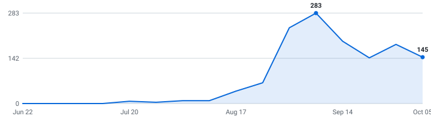

# 🔧 Summer 2027 Mechanical Engineering Internships

**A self-updating engine that tracks mechanical engineering internships so you don't have to.**

&nbsp;&nbsp;&nbsp;

### 986 open roles (564 listed below) · 160 new this week

4,717 employers tracked · data as of Oct 07, 2026 at 16:15 UTC

_628 have a cycle the employer stated · 358 are recent postings whose cycle isn't stated (listed separately, never mixed in)._

**[🖥️ Live dashboard](https://tracker05.github.io/mechanical-engineering-internships/)** · **[📡 RSS](https://tracker05.github.io/mechanical-engineering-internships/feed.xml)** · **[⚙️ JSON API](https://tracker05.github.io/mechanical-engineering-internships/api/jobs.json)** · **[✉️ Email alerts](https://tracker05.github.io/mechanical-engineering-internships/#subscribe)**

> [!TIP]
> **⭐ Star this repo** to save it and get updates when new roles are added.

Instead of refreshing a dozen career pages by hand, it reads company hiring feeds directly and keeps one live list — newest roles on top, refreshed automatically throughout the day.

**🔔 New roles in your inbox:** [subscribe by email](https://tracker05.github.io/mechanical-engineering-internships/#subscribe) - one email a day, only when new internships actually appeared, unsubscribe from any email in two clicks. (Prefer RSS-to-email? [Feedrabbit works too](https://feedrabbit.com/subscriptions/new?url=https%3A%2F%2Fraw.githubusercontent.com%2FTracker05%2Fmechanical-engineering-internships%2Fmain%2Fdocs%2Ffeed.xml).)

---

## What this is

This is an engine, not a hand-kept list. It polls company career feeds every 30 minutes, finds the internships, removes duplicates, and rebuilds this page on its own.

Every link comes straight from the source — so it's real and current, not a stale list someone forgot to update. Speed matters.

## What makes this different

| | |
|---|---|
| 📅 **[Drop Radar](#drop-radar)** | A forecast of **what's coming**. Each marquee company's typical opening window, replaced by the real drop date the moment the engine catches it live. Windows are estimates and labelled as such; only dates the engine saw itself are marked verified. |
| 🛂 **Visa intel, computed** | 🇺🇸 / 🛂 flags detected automatically from every job description, plus ✓ for employers with a real H-1B track record (USCIS data, FY2022-23 — a history, not a promise). The big lists crowdsource this by hand; here it's code. Most postings say nothing either way, and those show as unknown rather than guessed. |
| 📆 **A real date on nearly every role** | Taken from the job portal itself wherever the portal states one, so newest-first actually means newest. The exact coverage figure is printed at the bottom of this page every run. |
| 🧰 **Skill tags + pay, extracted** | Every posting's text is scanned for the stack it wants (Python, C++, PyTorch, …) and the pay it states — searchable on the [dashboard](https://tracker05.github.io/mechanical-engineering-internships/), and included in the CSV and API. |
| 🔔 **Alerts your way** | [Email digests](https://tracker05.github.io/mechanical-engineering-internships/#subscribe) or [RSS](https://tracker05.github.io/mechanical-engineering-internships/feed.xml) — point any reader, or a Slack/Discord RSS integration, at it. Plus a [live dashboard](https://tracker05.github.io/mechanical-engineering-internships/) with search, filters, and a saved-roles list that never leaves your browser. |
| ⚙️ **An engine, not a spreadsheet** | 4,991 job-board endpoints (4,717 distinct employers; some run more than one board) polled every 30 minutes across 12 ATS platforms. Full source and tests in this repo. |

## Scope

| | |
|---|---|
| **Roles** | Mechanical Design, Manufacturing, Thermal/Fluids, Automotive, Aerospace, Robotics & Controls, Structures & Materials, Energy, Test & Quality (and closely related technical internships) |
| **Region** | United States |
| **Cycles** | Summer 2027 and Fall 2026 |

## About

I'm an international student studying in the United States, so I built this for the search I'm doing myself. The list is US roles only for now — that's where I'm searching.

Use it to spot roles early and apply before they fill up. Being first genuinely helps.

## Where this is going

I'm building this in the open and adding to it as it grows.

**Recently shipped:** email alerts · the Drop Radar · auto-detected sponsorship flags · the live dashboard

**Next up:** personalized alerts (pick your categories) · per-company hiring pages · a ghost-posting detector

If it helps you, a star means a lot and tells me to keep going.

## How to use

<b>Reading the table — flags, dates, and the cycle split</b> (click to expand)

- Roles are grouped by cycle below - **newest posting on top, oldest at the bottom.**
- A cycle section holds only roles whose **employer stated that cycle** - in the title, or in the posting's own text. Postings that name no cycle anywhere are in *Recently posted — cycle not stated* further down, with **no cycle guessed for them**. Same quality bar, different amount of evidence.
- The **Posted** column is the date the company published the role.
- **_(3 openings)_ after a role title** = the employer has that many separate live requisitions for the same job, in the same place, for the same cycle. They're all real and each takes its own application, so they're linked individually (**Apply**, then **#2**, **#3**) instead of repeating the row. Counts still count requisitions, and the CSV export is never grouped.
- **🆁 after a company name** = **this role is remote** — the posting's own location or title says so. It marks the role on that row, not the whole company.
- **Flags after a role title:** 🇺🇸 = requires U.S. citizenship or a security clearance · 🛂 = the posting says it won't sponsor a work visa · 🆕 = spotted in the last 48 hours. Sponsorship flags are detected automatically from each job description - treat them as a strong hint and confirm on the posting.
- **✓ after a company name** = a real H-1B track record: USCIS approved 10+ petitions for that employer in FY2022–2023 (matched automatically against the official [H-1B Employer Data Hub](https://www.uscis.gov/tools/reports-and-studies/h-1b-employer-data-hub)). No ✓ doesn't mean they won't sponsor - it means we can't prove they have.
- Track your applications with [`data/internships.csv`](data/internships.csv) (opens in Excel / Google Sheets).
- Missing a company? Adding one takes a single line, see [CONTRIBUTING.md](CONTRIBUTING.md).

---

## Summer 2027  (299 employer-stated)

| Company | Role | Category | Location | Skills | Posted | Apply |
|---|---|---|---|---|---|---|
| Johnson & Johnson | GTO Manufacturing Engineering Co-op, Summer 2027 🛂 🆕 | Manufacturing & Process | Cornelia +2 more | Excel, PLC | Oct 07, 2026 | [Apply](https://jj.wd5.myworkdayjobs.com/JJ/job/Cornelia-Georgia-United-States-of-America/GTO-Manufacturing-Engineering-Co-op--Summer-2027_R-103371) |
| S&C Electric Company ✓ | Tool Design Engineer Intern 🆕 | Design & CAD | Chicago, IL, United States | PLM/PDM | Oct 07, 2026 | [Apply](https://ejia.fa.us6.oraclecloud.com/hcmUI/CandidateExperience/en/sites/CX_1001/job/107356) |
| S&C Electric Company ✓ | Mechanical Engineer Intern - Franklin,WI 🆕 | Design & CAD | Franklin, WI, United States | GD&T, FEA, Excel | Oct 07, 2026 | [Apply](https://ejia.fa.us6.oraclecloud.com/hcmUI/CandidateExperience/en/sites/CX_1001/job/107361) |
| S&C Electric Company ✓ | Manufacturing Engineer Intern 🆕 | Manufacturing & Process | Chicago, IL, United States | SolidWorks, AutoCAD, Excel, Lean | Oct 07, 2026 | [Apply](https://ejia.fa.us6.oraclecloud.com/hcmUI/CandidateExperience/en/sites/CX_1001/job/107366) |
| CACI | Manufacturing Engineering Intern - Summer 2027 🆕 | Manufacturing & Process | Danbury, CT, US | No skills listed | Oct 07, 2026 | [Apply](https://caci.wd1.myworkdayjobs.com/external/job/Danbury-CT-US/Manufacturing-Engineering-Intern---Summer-2027_333189-1) |
| ABB ✓ | Manufacturing Continuous Improvement Intern - Summer 2027 🛂 🆕 | Manufacturing & Process | USA, NM, Albuquerque | No skills listed | Oct 06, 2026 | [Apply](https://abb.wd3.myworkdayjobs.com/external_career_page/job/USA-NM-Albuquerque/Manufacturing-Continuous-Improvement-Intern---Summer-2027_JR00048449) |
| WSP | Transmission Engineering Co-op - Spring/Summer 2027 🆕 | Automotive & Mobility | Mount Laurel, NJ, United States | No skills listed | Oct 06, 2026 | [Apply](https://emit.fa.ca3.oraclecloud.com/hcmUI/CandidateExperience/en/sites/CX_2001/job/95920) |
| ABB ✓ | Manufacturing Quality Intern - Summer 2027 🛂 🆕 | Manufacturing & Process | USA, NM, Albuquerque | No skills listed | Oct 06, 2026 | [Apply](https://abb.wd3.myworkdayjobs.com/external_career_page/job/USA-NM-Albuquerque/Manufacturing-Quality-Intern---Summer-2027_JR00048446) |
| Northrop Grumman | 2027 Mechanical Engineer Intern - Annapolis MD 🇺🇸 🆕 | Design & CAD | United States-Maryland-Annapolis | SolidWorks | Oct 06, 2026 | [Apply](https://ngc.wd1.myworkdayjobs.com/Northrop_Grumman_External_Site/job/United-States-Maryland-Annapolis/XMLNAME-2027-Mechanical-Engineer-Intern---Annapolis-MD_R10251185) |
| Clean Harbors | Mechanical Engineer Intern - Summer 2027 🆕 | Design & CAD | La Porte, TX, United States | No skills listed | Oct 06, 2026 | [Apply](https://epyc.fa.us2.oraclecloud.com/hcmUI/CandidateExperience/en/sites/CX_1001/job/166786) |
| Vantor | Summer Internship: Aerospace Modeling & Simulation 🇺🇸 🆕 | Aerospace & Defense | Herndon, VA | CFD, MATLAB, Python, Excel | Oct 06, 2026 | [Apply](https://maxar.wd1.myworkdayjobs.com/Vantor/job/Herndon-VA/Summer-Internship--Aerospace-Modeling---Simulation_R24758) |
| Northrop Grumman | 2027 Mechanical Engineer Intern - Sunnyvale CA 🇺🇸 🆕 | Design & CAD | United States-California-Sunnyvale | SolidWorks | Oct 06, 2026 | [Apply](https://ngc.wd1.myworkdayjobs.com/Northrop_Grumman_External_Site/job/United-States-California-Sunnyvale/XMLNAME-2027-Mechanical-Engineer-Intern---Sunnyvale-CA_R10251428) |
| Oshkosh | Engineer Intern - Mechanical (Summer 2027) 🆕 | Design & CAD | Appleton, Wisconsin, United States | CATIA, PLM/PDM | Oct 06, 2026 | [Apply](https://oshkoshcorporation.wd5.myworkdayjobs.com/Oshkosh/job/Appleton-Wisconsin-United-States/Engineer-Intern---Mechanical--Summer-2027-_R49741) |
| Carpenter Technology | Maintenance Intern - Mechanical 🆕 | Design & CAD | Reading, PA | Additive Manufacturing, Lean | Oct 06, 2026 | [Apply](https://cartech.wd5.myworkdayjobs.com/CTCExternal/job/Reading-PA/Maintenance-Intern---Mechanical_26885) |
| Hitachi Energy | Mechanical Engineering Internship/Co-op 🆕 | Design & CAD | Liberty, South Carolina, United States | Creo, Excel, Machining | Oct 05, 2026 | [Apply](https://hitachi.wd1.myworkdayjobs.com/hitachi/job/Liberty-South-Carolina-United-States/Mechanical-Engineering-Internship-Co-op_R0144979) |
| Anduril | 2027 Quality & Test Engineer Intern 🆕 | Test & Quality | Ashville +14 more | MATLAB | Oct 05, 2026 | [Apply](https://boards.greenhouse.io/andurilindustries/jobs/5257674007?gh_jid=5257674007) |
| Anduril | 2027 Reliability Engineer Intern 🆕 | Test & Quality | Costa Mesa, California, United States | FMEA | Oct 05, 2026 | [Apply](https://boards.greenhouse.io/andurilindustries/jobs/5257682007?gh_jid=5257682007) |
| Arc | Powertrain Electrical Engineer Intern 🆕 | Automotive & Mobility | Torrance, CA | FEA, Python | Oct 05, 2026 | [Apply](https://job-boards.greenhouse.io/arcboatcompany/jobs/5443971008) |
| ABB ✓ | Manufacturing Intern - Summer 2027 🛂 🆕 | Manufacturing & Process | USA, NM, Albuquerque | SolidWorks, Creo | Oct 05, 2026 | [Apply](https://abb.wd3.myworkdayjobs.com/external_career_page/job/USA-NM-Albuquerque/Manufacturing-Intern---Summer-2027_JR00047889) |
| Northrop Grumman | 2027 Mechanical Engineering Intern - Chandler AZ 🇺🇸 🆕 | Design & CAD | United States-Arizona-Chandler | No skills listed | Oct 05, 2026 | [Apply](https://ngc.wd1.myworkdayjobs.com/Northrop_Grumman_External_Site/job/United-States-Arizona-Chandler/XMLNAME-2027-Mechanical-Engineering-Intern---Chandler-AZ_R10254534) |
| General Motors ✓ | 2027 Summer Intern – Global Manufacturing Robotics & Automation 🆕 | Robotics & Controls | Warren +2 more | C++, PLC | Oct 05, 2026 | [Apply](https://generalmotors.wd5.myworkdayjobs.com/Careers_GM/job/Warren-Michigan-United-States-of-America/XMLNAME-2027-Summer-Intern---Manufacturing-Engineering-Global-Automation_JR-202619348) |
| WSP | Mechanical Engineering Co-op - Spring/Summer 2027 🆕 | Design & CAD | Philadelphia, PA, United States | AutoCAD, Revit | Oct 05, 2026 | [Apply](https://emit.fa.ca3.oraclecloud.com/hcmUI/CandidateExperience/en/sites/CX_2001/job/95758) |
| Solar Turbines ✓ | 2027 Manufacturing Engineer Intern 🛂 🆕 | Manufacturing & Process | Channelview, Texas | Creo, Machining, Welding, PLM/PDM | Oct 05, 2026 | [Apply](https://cat.wd5.myworkdayjobs.com/solarturbines/job/Channelview-Texas/XMLNAME-2027-Manufacturing-Engineer-Intern_R0000398054) |
| Solar Turbines ✓ | 2027 Welding Engineer Intern 🛂 🆕 | Manufacturing & Process | Channelview, Texas | Welding, Machining | Oct 05, 2026 | [Apply](https://cat.wd5.myworkdayjobs.com/solarturbines/job/Channelview-Texas/XMLNAME-2027-Welding-Engineer-Intern_R0000379964) |
| WSP | Structural Engineering Intern- Summer 2027 🆕 | Structures & Materials | Valhalla, NY, United States | AutoCAD | Oct 05, 2026 | [Apply](https://emit.fa.ca3.oraclecloud.com/hcmUI/CandidateExperience/en/sites/CX_2001/job/96920) |
| Arc | Vehicle Controls Engineering Intern 🆕 | Automotive & Mobility | Torrance, CA | MATLAB, Simulink | Oct 05, 2026 | [Apply](https://job-boards.greenhouse.io/arcboatcompany/jobs/5442902008) |
| Arc | Mechanical Engineering Intern - Powertrain 🆕 | Automotive & Mobility | Torrance, CA | FEA, MATLAB, Simulink, CNC | Oct 05, 2026 | [Apply](https://job-boards.greenhouse.io/arcboatcompany/jobs/5442958008) |
| Philips | Co-op – R&D Engineer – Colorado Springs, CO – Summer 2027 | General Engineering | Colorado Springs +2 more | No skills listed | Oct 05, 2026 | [Apply](https://philips.wd3.myworkdayjobs.com/jobs-and-careers/job/Colorado-Springs-Colorado-United-States/Co-op---R-D-Engineer---Colorado-Springs--CO---Summer-2027_591611) |
| IMEG ✓ | Mechanical Engineering Intern / Melbourne, FL 🛂 | Design & CAD | Melbourne, FL | AutoCAD, Excel | Oct 05, 2026 | [Apply](https://wd1.myworkdaysite.com/recruiting/imeg/Imeg_Careers/job/Melbourne-FL/Mechanical-Engineering-Intern---Melbourne--FL_R-16842) |
| Hitachi Energy | Mechanical Engineering Internship/Co-op | Design & CAD | Auburn Hills, Michigan, United States | Creo, Excel, Machining | Oct 05, 2026 | [Apply](https://hitachi.wd1.myworkdayjobs.com/hitachi/job/Auburn-Hills-Michigan-United-States/Mechanical-Engineering-Internship-Co-op_R0143857) |
| Hitachi Energy | Mechanical Engineering Internship/Co-op _(2 openings)_ | Design & CAD | Holland, Michigan, United States | Creo, Excel, Machining | Oct 05, 2026 | [Apply](https://hitachi.wd1.myworkdayjobs.com/hitachi/job/Holland-Michigan-United-States/Mechanical-Engineering-Internship-Co-op_R0144975) [#2](https://hitachi.wd1.myworkdayjobs.com/hitachi/job/Holland-Michigan-United-States/Mechanical-Engineering-Internship-Co-op_R0144977) |
| ispace ✓ | 2027 Summer Internship - Mechanical Test Engineer 🇺🇸 🆕 | Test & Quality | Englewood, Colorado | No skills listed | Oct 02, 2026 | [Apply](https://jobs.lever.co/ispace-inc/fa34bd91-bd23-460b-af53-4a7f2066d9f3) |
| Muon Space | Industrial Engineering Intern (Summer 2027) | Manufacturing & Process | San Jose, CA | Python, Excel, Six Sigma, Lean | Oct 02, 2026 | [Apply](https://job-boards.greenhouse.io/muonspace/jobs/5256284007) |
| Muon Space | Environmental Test Engineering Intern (Summer 2027) | Test & Quality | San Jose, CA | MATLAB, Simulink, Python, C++ | Oct 02, 2026 | [Apply](https://job-boards.greenhouse.io/muonspace/jobs/5256286007) |
| The Aerospace Corporation | 2027 Flight Loads Structural Dynamics Graduate Intern 🇺🇸 | Structures & Materials | El Segundo, CA | FEA, MATLAB, Python | Oct 02, 2026 | [Apply](https://aero.wd5.myworkdayjobs.com/external/job/El-Segundo-CA/XMLNAME-2027-Flight-Loads-Structural-Dynamics-Graduate-Intern_R016755) |
| Charter Manufacturing | Controls Engineer Intern (Summer 2027) | Robotics & Controls | Charter Aarrowcast - Shawano, WI | AutoCAD, Excel, PLC, Casting | Oct 02, 2026 | [Apply](https://chartermfg.wd5.myworkdayjobs.com/Charter_Careers/job/Charter-Aarrowcast---Shawano-WI/Controls-Engineer-Intern--Summer-2027-_R08167) |
| Charter Manufacturing | Smart Manufacturing Engineer Intern (Summer 2027) | Manufacturing & Process | Charter Steel - Saukville, WI | Excel, Casting | Oct 02, 2026 | [Apply](https://chartermfg.wd5.myworkdayjobs.com/Charter_Careers/job/Charter-Steel---Saukville-WI/Smart-Manufacturing-Engineer-Intern--Summer-2027-_R08133) |
| Primient | Process Engineering Intern - Summer 2027 | Manufacturing & Process | Decatur, IL | Machining | Oct 02, 2026 | [Apply](https://primient.wd1.myworkdayjobs.com/External_Careers/job/Decatur-IL/Process-Engineering-Intern---Summer-2027_JREQ7048) |
| Anduril | 2027 Industrial Engineer Intern | Manufacturing & Process | Ashville +5 more | AutoCAD, Six Sigma, Lean | Oct 02, 2026 | [Apply](https://boards.greenhouse.io/andurilindustries/jobs/5255593007?gh_jid=5255593007) |
| Stantec | Structural Engineering Intern/Co-op – Transportation (Summer 2027) | Structures & Materials | New York, NY, United States | AutoCAD, Revit, Excel | Oct 02, 2026 | [Apply](https://hdhl.fa.us6.oraclecloud.com/hcmUI/CandidateExperience/en/sites/CX_1/job/1008131) |
| General Motors ✓ | 2027 Summer Intern - Systems/Calibration Engineer, ADAS Drive | Test & Quality | Milford +2 more | MATLAB, Simulink, Python | Oct 02, 2026 | [Apply](https://generalmotors.wd5.myworkdayjobs.com/Careers_GM/job/Milford-Michigan-United-States-of-America/XMLNAME-2027-Summer-Intern---Systems-Calibration-Engineer--ADAS-Drive_JR-202621623) |
| Mach Industries | Summer 2027 Engineering Internship, Manufacturing 🛂 🆕 | Manufacturing & Process | Huntington Beach +5 more | SolidWorks, CATIA, Siemens NX, AutoCAD | Oct 01, 2026 | [Apply](https://job-boards.greenhouse.io/machindustries/jobs/4429928009) |
| General Motors ✓ | 2027 Summer Intern - AI/ML Engineer, Autonomous Vehicle: Simulation | Automotive & Mobility | Sunnyvale +2 more | Python, C++ | Oct 01, 2026 | [Apply](https://generalmotors.wd5.myworkdayjobs.com/Careers_GM/job/Sunnyvale-California-United-States-of-America/XMLNAME-2027-Summer-Intern---AI-ML-Engineer--Autonomous-Vehicle--Simulation_JR-202621508) |
| Philips | Intern - Systems Test Engineering – New Kensington, PA – Summer 2027 | Test & Quality | New Kensington +2 more | MATLAB, Python, LabVIEW | Oct 01, 2026 | [Apply](https://philips.wd3.myworkdayjobs.com/jobs-and-careers/job/New-Kensington-Pennsylvania-United-States/Intern---Systems-Test-Engineering---New-Kensington--PA---Summer-2027_591469) |
| CoStar Group | Mechanical Engineering Intern 🛂 | Design & CAD | Sunnyvale (US) | SolidWorks, Fusion 360, MATLAB, Python | Oct 01, 2026 | [Apply](https://costar.wd1.myworkdayjobs.com/Costar_Campus/job/Sunnyvale-US/Mechanical-Engineering-Intern_R39952) |
| Stantec | Mechanical Engineering Intern - Water (Summer 2027) | Design & CAD | Nashville, TN, United States | Revit | Oct 01, 2026 | [Apply](https://hdhl.fa.us6.oraclecloud.com/hcmUI/CandidateExperience/en/sites/CX_1/job/1008121) |
| Stantec | Mechanical Engineering Intern - Water (Summer 2027) | Design & CAD | Lexington, KY, United States | Revit | Oct 01, 2026 | [Apply](https://hdhl.fa.us6.oraclecloud.com/hcmUI/CandidateExperience/en/sites/CX_1/job/1008122) |
| AtkinsRéalis | Building Mechanical Engineering Intern - Summer 2027 | Design & CAD | US.FL.Miami.800 Waterford Way | AutoCAD | Oct 01, 2026 | [Apply](https://slihrms.wd3.myworkdayjobs.com/careers/job/USFLMiami800-Waterford-Way/Building-Mechanical-Engineering-Intern---Summer-2027_R-161189-1) |
| The Aerospace Corporation | 2027 Systems Integration and Test Engineer Graduate Intern 🇺🇸 | Test & Quality | Chantilly, VA | SolidWorks, MATLAB, Simulink, Python | Oct 01, 2026 | [Apply](https://aero.wd5.myworkdayjobs.com/external/job/Chantilly-VA/XMLNAME-2027-Systems-Integration-and-Test-Engineer-Graduate-Intern_R016696) |
| RTX | Product Quality Engineering Co-Op (Summer/Fall 2027) 🇺🇸 | Test & Quality | US-IA-CEDAR RAPIDS-108 ~ 400 Collins Rd… | No skills listed | Oct 01, 2026 | [Apply](https://globalhr.wd5.myworkdayjobs.com/rec_rtx_ext_gateway/job/US-IA-CEDAR-RAPIDS-108--400-Collins-Rd-NE--BLDG-108/Product-Quality-Engineering-Co-Op--Summer-Fall-2027-_01878918) |
| Zekelman Industries | Intern, Manufacturing Engineer | Manufacturing & Process | Niles, OH | SolidWorks, AutoCAD, Excel | Oct 01, 2026 | [Apply](https://zekelman.wd12.myworkdayjobs.com/Careers/job/Niles-OH/Intern--Manufacturing-Engineer_JR002843) |
| Varda Space | Aerodynamics & Analysis Engineering Internship - Summer 2027 🇺🇸 | Aerospace & Defense | El Segundo, California, United States | CFD, MATLAB, Python | Oct 01, 2026 | [Apply](https://job-boards.greenhouse.io/vardaspace/jobs/8010632003) |
| CACI | Manufacturing Engineering Intern - Summer 2027 | Manufacturing & Process | Melbourne, FL, US | SolidWorks, AutoCAD, Six Sigma, Lean | Oct 01, 2026 | [Apply](https://caci.wd1.myworkdayjobs.com/external/job/Melbourne-FL-US/Manufacturing-Engineering-Intern---Summer-2027_332898) |
| Allison Transmission ✓ | Manufacturing Engineering Intern - Summer 2027 | Manufacturing & Process | Indianapolis, IN | No skills listed | Oct 01, 2026 | [Apply](https://allisontransmission.wd1.myworkdayjobs.com/ATI-External/job/Indianapolis-IN/Manufacturing-Engineering-Intern---Summer-2027_R008126) |
| RTX | Manufacturing Electrical Engineering Co-Op (Summer/Fall 2027) 🇺🇸 | Manufacturing & Process | US-IA-CEDAR RAPIDS-109 ~ 400 Collins Rd… | PLM/PDM | Oct 01, 2026 | [Apply](https://globalhr.wd5.myworkdayjobs.com/rec_rtx_ext_gateway/job/US-IA-CEDAR-RAPIDS-109--400-Collins-Rd-NE--BLDG-109/Manufacturing-Electrical-Engineering-Co-Op--Summer-Fall-2027-_01871450) |
| RTX | Industrial Engineering Co-Op (Spring/Summer 2027) 🇺🇸 | Manufacturing & Process | US-IA-CEDAR RAPIDS-109 ~ 400 Collins Rd… | SolidWorks, AutoCAD, PLM/PDM | Oct 01, 2026 | [Apply](https://globalhr.wd5.myworkdayjobs.com/rec_rtx_ext_gateway/job/US-IA-CEDAR-RAPIDS-109--400-Collins-Rd-NE--BLDG-109/Industrial-Engineering-Co-Op--Spring-Summer-2027-_01871431) |
| Varda Space | Avionics Engineering Internship - Summer 2027 🇺🇸 | Aerospace & Defense | El Segundo, California, United States | Python | Oct 01, 2026 | [Apply](https://job-boards.greenhouse.io/vardaspace/jobs/8010158003) |
| Varda Space | Manufacturing Engineering Internship - Summer 2027 🇺🇸 | Manufacturing & Process | El Segundo, California, United States | MATLAB, LabVIEW, Lean | Oct 01, 2026 | [Apply](https://job-boards.greenhouse.io/vardaspace/jobs/8010166003) |
| Generac | 2027 Summer Intern Digital Manufacturing Engineering | Manufacturing & Process | Waukesha, WI - USA | Python, Excel | Oct 01, 2026 | [Apply](https://generac.wd5.myworkdayjobs.com/external/job/Waukesha-WI---USA/XMLNAME-2027-Summer-Intern-Digital-Manufacturing-Engineering_JR16255) |
| Allison Transmission ✓ | Quality Engineering Intern - Summer 2027 🇺🇸 | Test & Quality | Indianapolis, IN | No skills listed | Oct 01, 2026 | [Apply](https://allisontransmission.wd1.myworkdayjobs.com/ATI-External/job/Indianapolis-IN/Quality-Engineering-Intern---Summer-2027_R008206) |
| Helion Energy | Mechanical Engineering Summer 2027 Intern | Design & CAD | Everett, WA | SolidWorks, GD&T | Sep 30, 2026 | [Apply](https://jobs.ashbyhq.com/helion/b73602bd-b644-4a46-9188-fded4b2db606) |
| Muon Space | Quality Engineering Intern (Summer 2027) | Test & Quality | San Jose, CA | Excel, SPC | Sep 30, 2026 | [Apply](https://job-boards.greenhouse.io/muonspace/jobs/5253432007) |
| Vishay Intertechnology | Process Engineer Intern | Manufacturing & Process | Columbus, NE | No skills listed | Sep 30, 2026 | [Apply](https://vishay.wd3.myworkdayjobs.com/VishayCareers/job/Columbus-NE/Process-Engineer-Intern_JR-20358-1) |
| Vishay Intertechnology | R&D Engineer Intern | General Engineering | Columbus, NE | No skills listed | Sep 30, 2026 | [Apply](https://vishay.wd3.myworkdayjobs.com/VishayCareers/job/Columbus-NE/R-D-Engineer-Intern_JR-20357-1) |
| onsemi | Summer 2027 - Manufacturing Engineer Intern | Manufacturing & Process | Nampa, ID, United States | Python, Excel, Six Sigma, Lean | Sep 30, 2026 | [Apply](https://hctz.fa.us2.oraclecloud.com/hcmUI/CandidateExperience/en/sites/CX_1001/job/2506814) |
| MetOx International | Process Engineering Co-Op/Intern (Spring/Summer 2027) | Manufacturing & Process | Houston, TX | Excel, Six Sigma, Lean, Design of Experiments | Sep 30, 2026 | [Apply](https://job-boards.greenhouse.io/metoxinternationalinc/jobs/5439987008) |
| Allison Transmission ✓ | Manufacturing Engineer Intern - Summer 2027-1 🇺🇸 | Manufacturing & Process | Indianapolis, IN | No skills listed | Sep 30, 2026 | [Apply](https://allisontransmission.wd1.myworkdayjobs.com/ATI-External/job/Indianapolis-IN/Manufacturing-Engineer-Intern---Summer-2027-1_R008267) |
| Marvell | Test Engineering Intern, MS - Summer 2027 | Test & Quality | Santa Clara, CA | Python | Sep 30, 2026 | [Apply](https://marvell.wd1.myworkdayjobs.com/MarvellCareers/job/Santa-Clara-CA/Test-Engineering-Intern--MS---Summer-2027_2604002-1) |
| STV ✓ | Structural Engineering Intern - Summer 2027 🛂 | Structures & Materials | Oklahoma City, Oklahoma | AutoCAD, Revit | Sep 30, 2026 | [Apply](https://stvinc.wd5.myworkdayjobs.com/stv/job/Oklahoma-City-Oklahoma/Structural-Engineering-Intern---Summer-2027_JR6315) |
| Zekelman Industries | Intern, Manufacturing Engineer | Manufacturing & Process | Rochelle, IL | SolidWorks, AutoCAD, Excel | Sep 30, 2026 | [Apply](https://zekelman.wd12.myworkdayjobs.com/Careers/job/Rochelle-IL/Intern--Manufacturing-Engineer_JR002824) |
| Zekelman Industries | Intern, Quality Engineer | Test & Quality | Warren, OH | Excel | Sep 30, 2026 | [Apply](https://zekelman.wd12.myworkdayjobs.com/Careers/job/Warren-OH/Intern--Quality-Engineer_JR002821) |
| Helion Energy | Materials Engineering Summer 2027 Intern | Structures & Materials | Everett, WA | MATLAB, Python, Composites | Sep 29, 2026 | [Apply](https://jobs.ashbyhq.com/helion/56636c72-2c72-4f4f-8334-3b233a235c8d) |
| Helion Energy | Process Engineering Summer 2027 Intern | Manufacturing & Process | Everett, WA | MATLAB, Python, Excel | Sep 29, 2026 | [Apply](https://jobs.ashbyhq.com/helion/7fe24e8e-365b-40bf-aad8-309fbd429e5e) |
| The Aerospace Corporation | 2027 Structural Mechanics Undergraduate Intern 🇺🇸 | Structures & Materials | El Segundo, CA | FEA, MATLAB, Python, Excel | Sep 29, 2026 | [Apply](https://aero.wd5.myworkdayjobs.com/external/job/El-Segundo-CA/XMLNAME-2027-Structural-Mechanics-Undergraduate-Intern_R016763) |
| Freeform | Manufacturing Engineering Intern, CNC Machining (Summer 2027) | Manufacturing & Process | Los Angeles, CA (On-site) | CNC, Machining, GD&T, Additive Manufacturing | Sep 29, 2026 | [Apply](https://job-boards.greenhouse.io/freeformfuturecorp/jobs/8004101003) |
| Sherwin-Williams ✓ | 2027 Summer Robotics Engineering Co-Op - Middleburg Heights, OH | Robotics & Controls | Middleburg Heights, OH, United States | Excel | Sep 29, 2026 | [Apply](https://ejhp.fa.us6.oraclecloud.com/hcmUI/CandidateExperience/en/sites/CX_2/job/2625128) |
| Leidos ✓ | Electrical Hardware Design Engineering Intern 🇺🇸 | Design & CAD | Huntsville, AL | MATLAB, Python, C++ | Sep 29, 2026 | [Apply](https://leidos.wd5.myworkdayjobs.com/External/job/Huntsville-AL/Electrical-Hardware-Design-Engineering-Intern_R-00193413) |
| IMEG ✓ | Mechanical Engineering Intern / Freeport, ME 🛂 | Design & CAD | Freeport, ME | AutoCAD, Excel | Sep 29, 2026 | [Apply](https://wd1.myworkdaysite.com/recruiting/imeg/Imeg_Careers/job/Freeport-ME/Mechanical-Engineering-Intern---Freeport--ME_R-16818) |
| The Toro Company | Manufacturing Engineer Intern - Ditch Witch 🛂 | Manufacturing & Process | Perry, OK | SolidWorks, AutoCAD, Solid Edge, ANSYS | Sep 29, 2026 | [Apply](https://ttc.wd1.myworkdayjobs.com/Toro_External_Careers/job/Perry-OK/Manufacturing-Engineer-Intern---Ditch-Witch_JR17449) |
| Howmet Aerospace | Interns - Manufacturing Engineer - Whitehall, MI (Summer 2027) 🛂 | Manufacturing & Process | Whitehall, MI, United States | SolidWorks, AutoCAD | Sep 29, 2026 | [Apply](https://fa-exty-saasfaprod1.fa.ocs.oraclecloud.com/hcmUI/CandidateExperience/en/sites/CX_1/job/119686) |
| Howmet Aerospace | Interns - Quality Engineer - Whitehall, MI (Summer 2027) 🛂 | Test & Quality | Whitehall, MI, United States | No skills listed | Sep 29, 2026 | [Apply](https://fa-exty-saasfaprod1.fa.ocs.oraclecloud.com/hcmUI/CandidateExperience/en/sites/CX_1/job/119687) |
| Howmet Aerospace | Interns - Process Engineer - Whitehall, MI (Summer 2027) 🛂 | Manufacturing & Process | Whitehall, MI, United States | Six Sigma, Lean | Sep 29, 2026 | [Apply](https://fa-exty-saasfaprod1.fa.ocs.oraclecloud.com/hcmUI/CandidateExperience/en/sites/CX_1/job/119672) |
| nVent | Manufacturing Automaton Intern (June - August 2027) 🛂 | Manufacturing & Process | Anoka, MN, US | Excel | Sep 29, 2026 | [Apply](https://nvent.wd5.myworkdayjobs.com/nVent/job/Anoka-MN-US/Manufacturing-Automaton-Intern--June---August-2027-_R23865) |
| Ralliant | Manufacturing Engineering Intern - Summer 2027 | Manufacturing & Process | Plainville, CT, United States | SolidWorks, AutoCAD, Excel, Lean | Sep 29, 2026 | [Apply](https://ibwujb.fa.ocs.oraclecloud.com/hcmUI/CandidateExperience/en/sites/CX_1001/job/10681) |
| Ralliant | Manufacturing Engineering Intern - Summer 2027 | Manufacturing & Process | Boxborough, MA, United States | SolidWorks, AutoCAD, Excel, Lean | Sep 29, 2026 | [Apply](https://ibwujb.fa.ocs.oraclecloud.com/hcmUI/CandidateExperience/en/sites/CX_1001/job/10680) |
| AtkinsRéalis | Structural Engineering Intern – Summer 2027 | Structures & Materials | US.CO.Denver | No skills listed | Sep 28, 2026 | [Apply](https://slihrms.wd3.myworkdayjobs.com/careers/job/USCODenver/Structural-Engineering-Intern---Summer-2027_R-161182-1) |
| AtkinsRéalis | Process Engineering Intern - Summer 2027 | Manufacturing & Process | US.WA.Bothell | No skills listed | Sep 28, 2026 | [Apply](https://slihrms.wd3.myworkdayjobs.com/careers/job/USWABothell/Process-Engineering-Intern---Summer-2027_R-162014-1) |
| X-energy | Process Engineering Internship - Summer 2027 | Manufacturing & Process | Oak Ridge, TN | Excel | Sep 28, 2026 | [Apply](https://xenergy.wd5.myworkdayjobs.com/X-energyUS/job/Oak-Ridge-TN/Process-Engineering-Internship---Summer-2027_R101363) |
| onsemi | Summer 2027 - Probe Test Engineer Intern | Test & Quality | Hopewell Junction, NY, United States | MATLAB, Python, C++, Excel | Sep 28, 2026 | [Apply](https://hctz.fa.us2.oraclecloud.com/hcmUI/CandidateExperience/en/sites/CX_1001/job/2506420) |
| Mars | Summer 2027 Mars Petcare Manufacturing Internship | Manufacturing & Process | USA-Arkansas-Ft. Smith | Lean | Sep 28, 2026 | [Apply](https://mars.wd3.myworkdayjobs.com/external/job/USA-Arkansas-Ft-Smith/Summer-2027-Mars-Petcare-Manufacturing-Internship_R168212-1) |
| Michael Baker International ✓ | Structural Intern, Summer 2027 | Structures & Materials | Pittsburgh, PA, United States | Revit | Sep 28, 2026 | [Apply](https://ebxs.fa.us2.oraclecloud.com/hcmUI/CandidateExperience/en/sites/CX_2/job/309901) |
| IMEG ✓ | Mechanical Engineering Intern / New York, NY 🛂 | Design & CAD | New York / Broad Street | AutoCAD, Excel | Sep 28, 2026 | [Apply](https://wd1.myworkdaysite.com/recruiting/imeg/Imeg_Careers/job/New-York--Broad-Street/Mechanical-Engineering-Intern---New-York--NY_R-16661) |
| AECOM | Mechanical Engineering Intern - Hiring Event with AECOM - Arlington, VA | Design & CAD | Arlington, VA, United States (Hybrid) | AutoCAD, Revit | Sep 28, 2026 | [Apply](https://jobs.smartrecruiters.com/AECOM2/744000152172269) |
| GlobalFoundries | Reliability Test Engineering Intern (Summer 2027) | Test & Quality | USA - New York - Malta | Python, C++ | Sep 28, 2026 | [Apply](https://globalfoundries.wd1.myworkdayjobs.com/External/job/USA---New-York---Malta/Reliability-Test-Engineering-Intern--Summer-2027-_JR-2604361) |
| Mach Industries | Summer 2027 Engineering Internship, Mechanical 🛂 🆕 | Design & CAD | Huntington Beach +8 more | Tolerance Analysis, Machining, Additive Manufacturing | Sep 25, 2026 | [Apply](https://job-boards.greenhouse.io/machindustries/jobs/4420611009) |
| Mach Industries | Summer 2027 Engineering Internship, Aerospace 🛂 🆕 | Aerospace & Defense | Huntington Beach +5 more | No skills listed | Sep 25, 2026 | [Apply](https://job-boards.greenhouse.io/machindustries/jobs/4420631009) |
| Life Fitness ✓ | Manufacturing Quality Engineering Intern - Owatonna, MN | Manufacturing & Process | Owatonna, MN | Excel, Six Sigma, Lean | Sep 25, 2026 | [Apply](https://lifefitness.wd1.myworkdayjobs.com/searchLFN/job/Owatonna-MN/Manufacturing-Quality-Engineering-Intern---Owatonna--MN_JR-025245) |
| Watts Water | Production Engineer Intern, Summer 2027 _(2 openings)_ | Manufacturing & Process | Fort Worth, TX | Excel, Lean | Sep 25, 2026 | [Apply](https://wattswater.wd5.myworkdayjobs.com/Intern-External/job/Fort-Worth-TX/Production-Engineer-Intern--Summer-2027_10017591) [#2](https://wattswater.wd5.myworkdayjobs.com/Intern-External/job/Fort-Worth-TX/Production-Engineer-Intern--Summer-2027_10017592) |
| onsemi | Summer 2027 - Test Engineer Intern | Test & Quality | Nampa, ID, United States | Python, C++ | Sep 25, 2026 | [Apply](https://hctz.fa.us2.oraclecloud.com/hcmUI/CandidateExperience/en/sites/CX_1001/job/2506604) |
| GlobalFoundries | Advanced Manufacturing Engineering Intern, Process & Equipment (Summer 2027) _(8 openings)_ | Manufacturing & Process | USA - New York - Malta | SPC | Sep 25, 2026 | [Apply](https://globalfoundries.wd1.myworkdayjobs.com/External/job/USA---New-York---Malta/Advanced-Manufacturing-Engineering-Intern--Process---Equipment--Summer-2027-_JR-2604601) [#2](https://globalfoundries.wd1.myworkdayjobs.com/External/job/USA---New-York---Malta/Advanced-Manufacturing-Engineering-Intern--Process---Equipment--Summer-2027-_JR-2604606) [#3](https://globalfoundries.wd1.myworkdayjobs.com/External/job/USA---New-York---Malta/Advanced-Manufacturing-Engineering-Intern--Process---Equipment--Summer-2027-_JR-2604608) [#4](https://globalfoundries.wd1.myworkdayjobs.com/External/job/USA---New-York---Malta/Advanced-Manufacturing-Engineering-Intern--Process---Equipment--Summer-2027-_JR-2604609) [#5](https://globalfoundries.wd1.myworkdayjobs.com/External/job/USA---New-York---Malta/Advanced-Manufacturing-Engineering-Intern--Process---Equipment--Summer-2027-_JR-2604628) [#6](https://globalfoundries.wd1.myworkdayjobs.com/External/job/USA---New-York---Malta/Advanced-Manufacturing-Engineering-Intern--Process---Equipment--Summer-2027-_JR-2604613) [#7](https://globalfoundries.wd1.myworkdayjobs.com/External/job/USA---New-York---Malta/Advanced-Manufacturing-Engineering-Intern--Process---Equipment--Summer-2027-_JR-2604617) |
| Rocket Lab | Test Engineering Intern Summer 2027 🇺🇸 | Test & Quality | Wallops Island, VA | Siemens NX, Python, Additive Manufacturing | Sep 24, 2026 | [Apply](https://job-boards.greenhouse.io/rocketlab/jobs/8003529003) |
| The Toro Company | Mechanical Engineer Intern - The Toro Company 🛂 | Design & CAD | Bloomington, MN | No skills listed | Sep 24, 2026 | [Apply](https://ttc.wd1.myworkdayjobs.com/Toro_External_Careers/job/Bloomington-MN/Mechanical-Engineer-Intern---The-Toro-Company_JR17112) |
| Mill | Product Design Engineering Intern, Summer 2027 🛂 | Design & CAD | San Bruno, California | FEA, DFM | Sep 24, 2026 | [Apply](https://job-boards.greenhouse.io/mill/jobs/4737767005) |
| ZOLL Medical Corporation | Mechanical Engineering Intern | Design & CAD | Chelmsford, MA | SolidWorks | Sep 24, 2026 | [Apply](https://zoll.wd5.myworkdayjobs.com/ZOLLMedicalCorp/job/Chelmsford-MA/Mechanical-Engineering-Intern_R20310) |
| Continental | 2027 Internship - Manufacturing Engineer (Hoosier Racing Tire) | Manufacturing & Process | Plymouth, IN, United States | No skills listed | Sep 23, 2026 | [Apply](https://jobs.smartrecruiters.com/Continental/744000151462939) |
| Generac | Mechanical Engineering Intern - Transfer Switch - Summer 2027 | Design & CAD | Waukesha, WI - USA | AutoCAD, Excel | Sep 23, 2026 | [Apply](https://generac.wd5.myworkdayjobs.com/external/job/Waukesha-WI---USA/Mechanical-Engineering-Intern---Transfer-Switch---Summer-2027_JR17048) |
| Marvell | Security Verification/Validation Engineer Intern, BS - Summer 2027 | Test & Quality | Chandler, AZ | No skills listed | Sep 23, 2026 | [Apply](https://marvell.wd1.myworkdayjobs.com/MarvellCareers/job/Chandler-AZ/Security-Verification-Validation-Engineer-Intern--BS---Summer-2027_2604148-1) |
| AECOM | Structural Engineering Intern - Networking Event with AECOM – Boston, MA 🛂 | Structures & Materials | Boston, MA, United States (Hybrid) | AutoCAD, Excel | Sep 23, 2026 | [Apply](https://jobs.smartrecruiters.com/AECOM2/744000151381599) |
| Life Fitness ✓ | Manufacturing Engineering Intern - Ramsey, MN | Manufacturing & Process | Ramsey, MN | Excel | Sep 22, 2026 | [Apply](https://lifefitness.wd1.myworkdayjobs.com/searchLFN/job/Ramsey-MN/Manufacturing-Engineering-Intern---Ramsey--MN_JR-025239) |
| Charter Manufacturing | Process Engineer Intern (Summer 2027) | Manufacturing & Process | Charter Steel - Cleveland, OH | AutoCAD, Excel | Sep 22, 2026 | [Apply](https://chartermfg.wd5.myworkdayjobs.com/Charter_Careers/job/Charter-Steel---Cleveland-OH/Process-Engineer-Intern--Summer-2027-_R08123) |
| Formlabsinternships | Mechanical Engineering Intern (Summer 2027) | Design & CAD | Somerville, MA | Additive Manufacturing | Sep 21, 2026 | [Apply](https://job-boards.greenhouse.io/formlabsinternships/jobs/8199928) |
| Avav | Summer 2027 Autonomy & Robotics Engineering Intern | Robotics & Controls | Moorpark, CA | MATLAB, Python, C++, ROS | Sep 21, 2026 | [Apply](https://avav.wd1.myworkdayjobs.com/avav/job/Moorpark-CA/Summer-2027-Autonomy---Robotics-Engineering-Intern_8551) |
| Shield AI | Summer 2027 - Mechanical Engineering Intern | Design & CAD | Seattle, Washington | SolidWorks, CATIA | Sep 21, 2026 | [Apply](https://jobs.lever.co/shieldai/da54c482-fe62-4f60-98b1-55ac0b82b3bc) |
| Zurn Elkay Water Solutions | Mechanical Engineering Intern (Summer 2027) | Design & CAD | Paso Robles, CA | Inventor, AutoCAD, Excel, Additive Manufacturing | Sep 21, 2026 | [Apply](https://elkay.wd1.myworkdayjobs.com/Elkay_External/job/Paso-Robles-CA/Mechanical-Engineering-Intern--Summer-2027-_REQ-020111) |
| Life Fitness ✓ | Mechanical Engineering Intern - Ramsey, MN | Design & CAD | Ramsey, MN | SolidWorks, Tolerance Analysis, FEA, Excel | Sep 21, 2026 | [Apply](https://lifefitness.wd1.myworkdayjobs.com/searchLFN/job/Ramsey-MN/Mechanical-Engineering-Intern---Ramsey--MN_JR-025235) |
| Oshkosh | Motorsports Intern (Summer 2027) | Automotive & Mobility | Huntersville +2 more | Python | Sep 21, 2026 | [Apply](https://oshkoshcorporation.wd5.myworkdayjobs.com/Oshkosh/job/Huntersville-North-Carolina-United-States/Motorsports-Intern--Summer-2027-_R50520) |
| Rocket Lab | Thermal Engineering Intern Summer 2027 🇺🇸 | Thermal & Fluids | Long Beach, CA | FEA, Machining | Sep 21, 2026 | [Apply](https://job-boards.greenhouse.io/rocketlab/jobs/8000958003) |
| Draper | Mechanical Engineering & System Packaging Intern (Summer 2027) 🇺🇸 | Design & CAD | Cambridge, MA | SolidWorks, Creo, ANSYS, FEA | Sep 21, 2026 | [Apply](https://draper.wd5.myworkdayjobs.com/Draper_Careers/job/Cambridge-MA/Mechanical-Engineering---System-Packaging-Intern--Summer-2027-_JR002943) |
| Brunswick ✓ | Mercury Marine: Intern Design Analysis Group-Fluid & Thermal | Thermal & Fluids | Fond du Lac, WI | STAR-CCM+, CFD | Sep 21, 2026 | [Apply](https://brunswick.wd1.myworkdayjobs.com/search/job/Fond-du-Lac-WI/Mercury-Marine--Intern-Design-Analysis-Group-Fluid---Thermal_JR-050977) |
| The Toro Company | Quality Engineer Intern - Ditch Witch 🛂 | Test & Quality | Perry, OK | Excel | Sep 21, 2026 | [Apply](https://ttc.wd1.myworkdayjobs.com/Toro_External_Careers/job/Perry-OK/Quality-Engineer-Intern---Ditch-Witch_JR17218) |
| United Parcel Service (UPS) | 2027 Americas Region Industrial Engineering Summer Intern 🇺🇸 | Manufacturing & Process | US - UPS CORPORATE OFFICES (GACOR) | No skills listed | Sep 18, 2026 | [Apply](https://hcmportal.wd5.myworkdayjobs.com/Search/job/US---UPS-CORPORATE-OFFICES-GACOR/XMLNAME-2027-Americas-Region-Industrial-Engineering-Summer-Intern_R26032989) |
| Watts Water | Manufacturing Quality Intern, Summer 2027 | Manufacturing & Process | Fort Myers, FL | Six Sigma, Lean | Sep 18, 2026 | [Apply](https://wattswater.wd5.myworkdayjobs.com/Intern-External/job/Fort-Myers-FL/Manufacturing-Quality-Intern--Summer-2027_10017584) |
| Valeo | Quality Engineer Co-Op (Summer 2027) | Test & Quality | Hamilton, OH | Excel, FMEA, SPC | Sep 18, 2026 | [Apply](https://valeo.wd3.myworkdayjobs.com/valeo_jobs/job/Hamilton-OH/Quality-Engineer-Co-Op--Summer-2027-_REQ2026080099) |
| Primient | Process Engineering Intern - Summer 2027 | Manufacturing & Process | Duluth, MN | Machining | Sep 17, 2026 | [Apply](https://primient.wd1.myworkdayjobs.com/External_Careers/job/Duluth-MN/Process-Engineering-Intern---Summer-2027_JREQ7015) |
| Rocket Lab | Manufacturing Engineering Intern Summer 2027 🇺🇸 | Manufacturing & Process | Wallops Island, VA | Python | Sep 17, 2026 | [Apply](https://job-boards.greenhouse.io/rocketlab/jobs/7996623003) |
| Echo Global Logistics | Process Engineer Intern- Greenfield, IN | Manufacturing & Process | Roadtex - Greenfield IN | No skills listed | Sep 17, 2026 | [Apply](https://echo.wd1.myworkdayjobs.com/Echo_Logistics/job/Roadtex---Greenfield-IN/Process-Engineer-Intern--Greenfield--IN_R4650-1) |
| Lowe's | Store Operations Industrial Engineering – Undergrad Internship – Summer 2027 | Manufacturing & Process | Mooresville, NC (SSC) 1999 | No skills listed | Sep 17, 2026 | [Apply](https://lowes.wd5.myworkdayjobs.com/LWS_External_CS/job/Mooresville-NC-SSC-1999/Store-Operations-Industrial-Engineering---Undergrad-Internship---Summer-2027_JR-02651868-1) |
| X-energy | Test Engineering Internship - Summer 2027 | Test & Quality | Rockville, MD | Excel | Sep 17, 2026 | [Apply](https://xenergy.wd5.myworkdayjobs.com/X-energyUS/job/Rockville-MD/Test-Engineering-Internship---Summer-2027_R101320-1) |
| X-energy | Mechanical Engineering Internship - Summer 2027 | Design & CAD | Rockville, MD | SolidWorks, Creo, ANSYS, Abaqus | Sep 17, 2026 | [Apply](https://xenergy.wd5.myworkdayjobs.com/X-energyUS/job/Rockville-MD/Mechanical-Engineering-Internship---Summer-2027_R101319-1) |
| Johnson & Johnson | Process Engineer Summer Intern 🛂 | Manufacturing & Process | Jacksonville +2 more | No skills listed | Sep 17, 2026 | [Apply](https://jj.wd5.myworkdayjobs.com/JJ/job/Jacksonville-Florida-United-States-of-America/Process-Engineer-Summer-Intern_R-099289) |
| Smith+Nephew ✓ | Intern Mechanical Engineering | Design & CAD | Pittsburgh, PA | SolidWorks, GD&T | Sep 17, 2026 | [Apply](https://smithnephew.wd5.myworkdayjobs.com/External/job/Pittsburgh-PA/Intern-Mechanical-Engineering_R92508) |
| Michael Baker International ✓ | Structural Intern, Summer 2027 | Structures & Materials | Boston, MA, United States | Revit | Sep 17, 2026 | [Apply](https://ebxs.fa.us2.oraclecloud.com/hcmUI/CandidateExperience/en/sites/CX_2/job/309903) |
| Michael Baker International ✓ | Structural Intern, Summer 2027 | Structures & Materials | Salt Lake City, UT, United States | Revit | Sep 16, 2026 | [Apply](https://ebxs.fa.us2.oraclecloud.com/hcmUI/CandidateExperience/en/sites/CX_2/job/309900) |
| Bass Pro Shops | Advanced Manufacturing Intern Summer 2027 | Manufacturing & Process | Springfield +1 more | Welding | Sep 16, 2026 | [Apply](https://basspro.wd1.myworkdayjobs.com/careers/job/Springfield-MO-Bass-Pro-Shops-Base-Camp/Advanced-Manufacturing-Intern-Summer-2027_R267458) |
| Emerson Electric | Mechanical Engineering Co-op (Summer 2027) | Design & CAD | Elyria +5 more | Solid Edge, FEA | Sep 16, 2026 | [Apply](https://hdjq.fa.us2.oraclecloud.com/hcmUI/CandidateExperience/en/sites/CX_1/job/26011001) |
| Rendezvous Robotics | Mechanical Engineering Intern (Summer 2027) | Design & CAD | Golden, CO | SolidWorks, Fusion 360, Onshape, ANSYS | Sep 16, 2026 | [Apply](https://job-boards.greenhouse.io/rendezvousrobotics/jobs/4408601009) |
| Sensata | Mechanical Engineer Intern (Aerospace) - Summer 2027 | Aerospace & Defense | Thousand Oaks, CA | No skills listed | Sep 16, 2026 | [Apply](https://sensata.wd1.myworkdayjobs.com/Sensata-Careers/job/Thousand-Oaks-CA/Mechanical-Engineer-Intern--Aerospace----Summer-2027_IRC98482) |
| Sensata | Mechanical Engineer Intern (Aerospace) - Summer 2027 | Aerospace & Defense | Vista, CA | No skills listed | Sep 16, 2026 | [Apply](https://sensata.wd1.myworkdayjobs.com/Sensata-Careers/job/Vista-CA/Mechanical-Engineer-Intern--Aerospace----Summer-2027_IRC98483) |
| Rendezvous Robotics | Avionics Engineering Intern (Summer 2027) | Aerospace & Defense | Golden, CO | No skills listed | Sep 16, 2026 | [Apply](https://job-boards.greenhouse.io/rendezvousrobotics/jobs/4408578009) |
| Duracell | PS Manufacturing - Engineering Intern Spring/Summer 2027 | Manufacturing & Process | Cleveland, TN, United States | SolidWorks, AutoCAD | Sep 16, 2026 | [Apply](https://fa-ewub-saasfaprod1.fa.ocs.oraclecloud.com/hcmUI/CandidateExperience/en/sites/CX_26/job/1399) |
| Duracell | PS Manufacturing -Engineering Co-Op-2027 | Manufacturing & Process | Cleveland, TN, United States | No skills listed | Sep 16, 2026 | [Apply](https://fa-ewub-saasfaprod1.fa.ocs.oraclecloud.com/hcmUI/CandidateExperience/en/sites/CX_26/job/1400) |
| Lonza | Summer 2027 Manufacturing, Science & Technology Internship | Manufacturing & Process | US - Portsmouth, NH | No skills listed | Sep 16, 2026 | [Apply](https://lonza.wd3.myworkdayjobs.com/lonza_careers/job/US---Portsmouth-NH/Summer-2026-Manufacturing--Science---Technology-Internship_R79570) |
| Lonza | Summer 2027 Plant Engineer Internship | Manufacturing & Process | US - Portsmouth, NH | No skills listed | Sep 16, 2026 | [Apply](https://lonza.wd3.myworkdayjobs.com/lonza_careers/job/US---Portsmouth-NH/Summer-2026-Plant-Engineer-Internship_R79569) |
| Johnson & Johnson | Systems & Simulation Engineering Intern - Robotics R&D | Robotics & Controls | Santa Clara +2 more | ANSYS, Abaqus, FEA, MATLAB | Sep 16, 2026 | [Apply](https://jj.wd5.myworkdayjobs.com/JJ/job/Santa-Clara-California-United-States-of-America/Systems---Simulation-Engineering-Intern---Robotics-R-D_R-100027) |
| Brunswick ✓ | Mercury Marine: Industrial Engineer Intern | Manufacturing & Process | Brownsburg, IN | No skills listed | Sep 15, 2026 | [Apply](https://brunswick.wd1.myworkdayjobs.com/search/job/Brownsburg-IN/Mercury-Marine--Industrial-Engineer-Intern_JR-051584) |
| Philips | Intern – R&D Engineer – Plymouth, MN – Summer 2027 | General Engineering | Plymouth, Minnesota, United States | SolidWorks, Excel | Sep 15, 2026 | [Apply](https://philips.wd3.myworkdayjobs.com/jobs-and-careers/job/Plymouth-Minnesota-United-States/Intern---R-D-Engineer---Plymouth--MN---Summer-2027_591610) |
| Everest | 2027 Everest Design Engineering Internship Program | Design & CAD | Warren, NJ | Excel | Sep 15, 2026 | [Apply](https://everestre.wd5.myworkdayjobs.com/careers/job/Warren-NJ/XMLNAME-2027-Everest-Design-Engineering-Internship-Program_R7401) |
| Ensign-Bickford Aerospace & Defense Company | Electronics Manufacturing Engineer Intern | Manufacturing & Process | Simsbury, CT | SPC | Sep 15, 2026 | [Apply](https://ebi.wd5.myworkdayjobs.com/ebadcareers/job/Simsbury-CT/Electronics-Manufacturing-Engineer-Intern_REQ107696-1) |
| Granite Construction | Plant Engineer Intern - Summer 2027 | Manufacturing & Process | Pleasanton, California | No skills listed | Sep 15, 2026 | [Apply](https://granite.wd1.myworkdayjobs.com/careers/job/Pleasanton-California/Plant-Engineer-Intern---Summer-2027_R0000008111) |
| Granite Construction | Plant Engineer Intern - Summer 2027 | Manufacturing & Process | Ukiah, California | No skills listed | Sep 15, 2026 | [Apply](https://granite.wd1.myworkdayjobs.com/careers/job/Ukiah-California/Plant-Engineer-Intern---Summer-2027_R0000008112) |
| Granite Construction | Plant Engineer Intern - Summer 2027 | Manufacturing & Process | Watsonville, California | No skills listed | Sep 15, 2026 | [Apply](https://granite.wd1.myworkdayjobs.com/careers/job/Watsonville-California/Plant-Engineer-Intern---Summer-2027_R0000008110) |
| Woodward Governor | Engineering Co-op - Design Engineering / Zeeland, MI (Summer 2027) | Design & CAD | Zeeland, MI, US | Excel | Sep 15, 2026 | [Apply](https://woodward.wd5.myworkdayjobs.com/woodward/job/Zeeland-MI-US/Engineering-Co-op---Design-Engineering---Zeeland--MI--Summer-2027-_JR112252) |
| Woodward Governor | Engineering Co-op - Manufacturing Engineering / Zeeland, MI (Summer 2027) | Manufacturing & Process | Zeeland, MI, US | Excel | Sep 15, 2026 | [Apply](https://woodward.wd5.myworkdayjobs.com/woodward/job/Zeeland-MI-US/Engineering-Co-op---Manufacturing-Engineering---Zeeland--MI--Summer-2027-_JR112088) |
| LabCorp | Intern - Mechanical Engineer 🛂 | Design & CAD | Bloomfield CT | SolidWorks, Additive Manufacturing | Sep 14, 2026 | [Apply](https://labcorp.wd1.myworkdayjobs.com/external/job/Bloomfield-CT/Intern---Mechanical-Engineer_2632739-1) |
| RESPEC | Student Engineering Intern (Structural) | Structures & Materials | Sioux Falls, SD, United States | AutoCAD, Revit | Sep 14, 2026 | [Apply](https://jobs.smartrecruiters.com/RESPECInc/744000149447560) |
| RESPEC | Student Engineering Intern (Structural) | Structures & Materials | Brookings, SD, United States | AutoCAD, Revit | Sep 14, 2026 | [Apply](https://jobs.smartrecruiters.com/RESPECInc/744000149430049) |
| RESPEC | Student Engineering Intern (Structural) | Structures & Materials | Rapid City, SD, United States | AutoCAD, Revit | Sep 14, 2026 | [Apply](https://jobs.smartrecruiters.com/RESPECInc/744000149427190) |
| Airbus | 2027 Summer Internship - Manufacturing Engineer | Manufacturing & Process | Kinston, NC | SolidWorks, CATIA, AutoCAD, Composites | Sep 14, 2026 | [Apply](https://ag.wd3.myworkdayjobs.com/Airbus/job/Kinston-NC/XMLNAME-2027-Summer-Internship---Manufacturing-Engineer_JR10441369) |
| Zurn Elkay Water Solutions | Industrial Engineering Intern (Summer 2027) _(2 openings)_ | Manufacturing & Process | Freeport, IL | AutoCAD, Excel | Sep 14, 2026 | [Apply](https://elkay.wd1.myworkdayjobs.com/Elkay_External/job/Freeport-IL/Industrial-Engineering-Intern--Summer-2027-_REQ-020073) [#2](https://elkay.wd1.myworkdayjobs.com/Elkay_External/job/Freeport-IL/Industrial-Engineering-Intern--Summer-2027-_REQ-020072) |
| Zurn Elkay Water Solutions | Industrial Engineering Intern (Summer 2027) | Manufacturing & Process | Lanark, IL | AutoCAD, Excel | Sep 14, 2026 | [Apply](https://elkay.wd1.myworkdayjobs.com/Elkay_External/job/Lanark-IL/Industrial-Engineering-Intern--Summer-2027-_REQ-020075) |
| The Walt Disney Company | Disneyland Resort Industrial Engineering Intern, Summer 2027 | Manufacturing & Process | Anaheim, CA, USA | No skills listed | Sep 14, 2026 | [Apply](https://disney.wd5.myworkdayjobs.com/disneycareerdc/job/Anaheim-CA-USA/Disneyland-Resort-Industrial-Engineering-Intern--Summer-2027_10159978) |
| The Walt Disney Company | Walt Disney World Industrial Engineering Intern, Summer/Fall 2027 | Manufacturing & Process | Lake Buena Vista, FL, USA | No skills listed | Sep 14, 2026 | [Apply](https://disney.wd5.myworkdayjobs.com/disneycareerdc/job/Lake-Buena-Vista-FL-USA/Walt-Disney-World-Industrial-Engineering-Intern--Fall-2027_10159994) |
| nVent | Manufacturing Engineering Co-op (June - December 2027) | Manufacturing & Process | Anoka, MN, US | SolidWorks, AutoCAD, Lean | Sep 14, 2026 | [Apply](https://nvent.wd5.myworkdayjobs.com/nVent/job/Anoka-MN-US/Manufacturing-Engineering-Co-op--June---December-2027-_R23578) |
| nVent | Mechanical Engineering and Design Co-op (June - December 2027) | Design & CAD | Anoka, MN, US | SolidWorks, FEA, Sheet Metal | Sep 14, 2026 | [Apply](https://nvent.wd5.myworkdayjobs.com/nVent/job/Anoka-MN-US/Mechanical-Engineering-and-Design-Co-op--June---December-2027-_R23573) |
| Oshkosh | Manufacturing Intern - Summer 2027 | Manufacturing & Process | New Hudson, Michigan, United States | SolidWorks, Creo, Excel, Machining | Sep 14, 2026 | [Apply](https://oshkoshcorporation.wd5.myworkdayjobs.com/Oshkosh/job/New-Hudson-Michigan-United-States/Manufacturing-Intern---Summer-2027_R50275) |
| TD Bank | 2027 Summer Internship Program - Global Technology & Solutions - Quality Engineer | Test & Quality | Mount Laurel, New Jersey | No skills listed | Sep 13, 2026 | [Apply](https://td.wd3.myworkdayjobs.com/TD_Bank_Careers/job/Mount-Laurel-New-Jersey/XMLNAME-2027-Summer-Internship-Program---Global-Technology---Solutions---Quality-Engineer_R_1510798) |
| The Walt Disney Company | Disneyland Resort Alumni Industrial Engineering Intern, Summer 2027 | Manufacturing & Process | Anaheim, CA, USA | No skills listed | Sep 12, 2026 | [Apply](https://disney.wd5.myworkdayjobs.com/disneycareerdc/job/Anaheim-CA-USA/Disneyland-Resort-Alumni-Industrial-Engineering-Intern--Summer-2027_10160092) |
| Ingredion | Process Engineering Intern | Manufacturing & Process | Belcamp, MD | Lean | Sep 12, 2026 | [Apply](https://ingredion.wd1.myworkdayjobs.com/IngredionCareers/job/Belcamp-MD/Process-Engineering-Intern_Req-40181-1) |
| Xcimer Energy | Summer 2027 Internship - Mechanical Engineering 🇺🇸 | Design & CAD | Denver, CO | FEA | Sep 11, 2026 | [Apply](https://jobs.lever.co/xcimer/c672a37e-007d-45ee-a4f9-b5d4dd25a2e3) |
| Emerson Electric | Hardware Design Engineer Intern | Design & CAD | Round Rock, TX, United States | SolidWorks, Creo, AutoCAD, MATLAB | Sep 11, 2026 | [Apply](https://hdjq.fa.us2.oraclecloud.com/hcmUI/CandidateExperience/en/sites/CX_1/job/26010801) |
| AES | Transmission Planning Engineer Intern (Summer 2027) | Automotive & Mobility | US, Indianapolis, IN | No skills listed | Sep 11, 2026 | [Apply](https://aes.wd1.myworkdayjobs.com/AES_US/job/US-Indianapolis-IN/Transmission-Planning-Engineer-Intern--Summer-2027-_R1064788) |
| Blue Origin | Summer 2027 Marine Mechanical & Test Engineering Internship - Undergraduate 🇺🇸 | Test & Quality | Space Coast, FL | No skills listed | Sep 11, 2026 | [Apply](https://blueorigin.wd5.myworkdayjobs.com/blueorigin/job/Space-Coast-FL/Summer-2027-Marine-Mechanical---Test-Engineering-Internship---Undergraduate_R72238) |
| Graco | Manufacturing Engineering Intern - Summer 2027 🛂 | Manufacturing & Process | Sioux Falls, South Dakota, USA | SolidWorks, Creo, AutoCAD, Excel | Sep 11, 2026 | [Apply](https://graco.wd501.myworkdayjobs.com/Graco_Careers/job/Sioux-Falls-South-Dakota-USA/Manufacturing-Engineering-Intern---Summer-2027_R0023643) |
| LabCorp | Intern - Quality Engineer - Oncology 🛂 | Test & Quality | Baltimore MD | No skills listed | Sep 11, 2026 | [Apply](https://labcorp.wd1.myworkdayjobs.com/external/job/Baltimore-MD/Intern---Quality-Engineer_2630918) |
| Momentive ✓ | Summer 2027- Polymers and New Product Development Production Engineer Intern | Manufacturing & Process | US WV Friendly | Excel, Six Sigma, Lean | Sep 11, 2026 | [Apply](https://momentive.wd1.myworkdayjobs.com/MC/job/US-WV-Friendly/Summer-2027--Polymers-and-New-Product-Development-Production-Engineer-Intern_R9799) |
| Momentive ✓ | Summer 2027 Reliability Engineer Intern | Test & Quality | US WV Friendly | Excel | Sep 11, 2026 | [Apply](https://momentive.wd1.myworkdayjobs.com/MC/job/US-WV-Friendly/Summer-2027-Reliability-Engineer-Intern_R9818-1) |
| Motorola | Product Quality Engineering 2027 Internship | Test & Quality | Chicago, IL | Six Sigma, Lean | Sep 11, 2026 | [Apply](https://motorolasolutions.wd5.myworkdayjobs.com/Careers/job/Chicago-IL/Product-Quality-Engineering-Intern_R68669) |
| Amazon ✓ | Industrial Development Engineer Intern/Co-op, ROBOTICS - 2027 | Robotics & Controls | North Reading, Massachusetts, USA | SolidWorks, Creo, AutoCAD, Revit | Sep 10, 2026 | [Apply](https://www.amazon.jobs/en/jobs/10536817/industrial-development-engineer-intern-co-op-robotics-2027) |
| Bedrock Robotics | 2027 Internship Sensor Hardware Test Engineer | Test & Quality | San Francisco, CA | Python, Git | Sep 10, 2026 | [Apply](https://jobs.ashbyhq.com/bedrock-robotics/1f413f83-b897-4938-a19e-ab91bd326c51) |
| Bedrock Robotics | 2027 Internship Validation & Verification Test Engineer | Test & Quality | San Francisco, CA | Python, Hydraulics | Sep 10, 2026 | [Apply](https://jobs.ashbyhq.com/bedrock-robotics/c396dedc-06ec-4a23-8408-0194e360f30e) |
| Momentive ✓ | Summer 2027- Process Engineer Intern | Manufacturing & Process | US WV Friendly | Excel, Six Sigma, Lean | Sep 10, 2026 | [Apply](https://momentive.wd1.myworkdayjobs.com/MC/job/US-WV-Friendly/Summer-2027--Process-Engineer-Intern_R9784-1) |
| Amazon ✓ | Hardware Development Engineer Intern/Co-Op, ROBOTICS - 2027 | Robotics & Controls | North Reading, Massachusetts, USA | SolidWorks, Creo, AutoCAD, Revit | Sep 09, 2026 | [Apply](https://www.amazon.jobs/en/jobs/10535282/hardware-development-engineer-intern-co-op-robotics-2027) |
| Allen Control Systems | Manufacturing Engineering Co-op / Intern, 2027 | Manufacturing & Process | Pflugerville, TX | SolidWorks, Creo, Fusion 360, GD&T | Sep 09, 2026 | [Apply](https://jobs.ashbyhq.com/allen-control-systems/e7cefcf6-7322-43ba-861e-22e76f8186bd) |
| Saronic | Manufacturing Engineer Intern (Summer 2027) 🇺🇸 | Manufacturing & Process | Franklin, LA | Lean | Sep 09, 2026 | [Apply](https://jobs.ashbyhq.com/saronic/2b037fca-754c-4077-b224-eb35cf2b2b97) |
| Saronic | Mechanical Engineer Intern (Summer 2027) 🇺🇸 | Design & CAD | Austin, TX | SolidWorks, AutoCAD, CFD | Sep 09, 2026 | [Apply](https://jobs.ashbyhq.com/saronic/f52ae6eb-7eba-4c64-97c7-57e2a234e088) |
| Pacific Fusion | Summer 2027 Internship- Mechanical Engineering | Design & CAD | San Leandro +3 more | SolidWorks, Creo, FEA, MATLAB | Sep 09, 2026 | [Apply](https://job-boards.greenhouse.io/pacificfusion/jobs/4398312009) |
| Pacific Fusion | Summer 2027 Internship-Manufacturing Engineering | Manufacturing & Process | San Leandro +3 more | MATLAB, Python, Excel, Machining | Sep 09, 2026 | [Apply](https://job-boards.greenhouse.io/pacificfusion/jobs/4398388009) |
| Emerson Electric | Mechanical Engineering Internship - Summer 2027 🛂 | Design & CAD | Austin, TX, United States | Creo, Tolerance Analysis, Design of Experiments | Sep 09, 2026 | [Apply](https://hdjq.fa.us2.oraclecloud.com/hcmUI/CandidateExperience/en/sites/CX_1/job/26009934) |
| AECOM | Structural Engineering Intern | Structures & Materials | Virginia Beach +2 more | AutoCAD, Excel | Sep 09, 2026 | [Apply](https://jobs.smartrecruiters.com/AECOM2/744000148586189) |
| Bosch ✓ | Manufacturing Engineer Intern - Summer 2027 _(2 openings)_ | Manufacturing & Process | Lincolnshire, IL, United States | Creo, Lean, FMEA | Sep 09, 2026 | [Apply](https://jobs.smartrecruiters.com/BoschGroup/744000148518808) [#2](https://jobs.smartrecruiters.com/BoschGroup/744000148542054) |
| Lawrence Livermore National Laboratory (LLNL) | Materials Engineering Division (MED): Undergraduate Intern - Summer 2027 | Structures & Materials | Livermore, CA, United States | Excel, Design of Experiments | Sep 09, 2026 | [Apply](https://jobs.smartrecruiters.com/LLNL/3743990015127766) |
| Lawrence Livermore National Laboratory (LLNL) | Materials Engineering Division (MED): Graduate Intern - Summer 2027 | Structures & Materials | Livermore, CA, United States | Excel, Design of Experiments | Sep 09, 2026 | [Apply](https://jobs.smartrecruiters.com/LLNL/3743990015127776) |
| Clarios ✓ | Advanced Manufacturing Intern (Summer 2027) 🛂 | Manufacturing & Process | United States, Michigan, Holland | PLC | Sep 09, 2026 | [Apply](https://clarios.wd5.myworkdayjobs.com/clarioscareers/job/United-States-Michigan-Holland/Advanced-Manufacturing-Intern--Summer-2027-_WD49914) |
| HMH | Manufacturing Shop Operations Intern | Manufacturing & Process | Houston, TX | Excel | Sep 09, 2026 | [Apply](https://hmhw.wd12.myworkdayjobs.com/hmh_careers/job/Houston-TX/Manufacturing-Shop-Operations-Intern_JR102389) |
| HMH | Mechanical Engineering Intern | Design & CAD | Houston, TX | Excel | Sep 09, 2026 | [Apply](https://hmhw.wd12.myworkdayjobs.com/hmh_careers/job/Houston-TX/Mechanical-Engineering-Intern_JR102383) |
| Moog | Intern, Design Engineering _(2 openings)_ | Design & CAD | Mineral Wells, TX | No skills listed | Sep 09, 2026 | [Apply](https://moog.wd5.myworkdayjobs.com/moog_external_career_site/job/Mineral-Wells-TX/Intern--Design-Engineering_R-26-19881) [#2](https://moog.wd5.myworkdayjobs.com/moog_external_career_site/job/Mineral-Wells-TX/Intern--Design-Engineering_R-26-19882) |
| Moog | Intern, Hardware Design Engineering | Design & CAD | Mineral Wells, TX | No skills listed | Sep 09, 2026 | [Apply](https://moog.wd5.myworkdayjobs.com/moog_external_career_site/job/Mineral-Wells-TX/Intern--Hardware-Design-Engineering_R-26-19887) |
| Motorola | Quality & Process Engineer Summer Internship 2027 🛂 | Manufacturing & Process | Elgin, IL | Design of Experiments | Sep 09, 2026 | [Apply](https://motorolasolutions.wd5.myworkdayjobs.com/Careers/job/Elgin-IL/Quality---Process-Engineer-Summer-Internship-2027_R68673) |
| Stryker ✓ | Summer 2027 Internship - Intern, Process Engineering, Advanced Operations - Tempe | Manufacturing & Process | Tempe, Arizona | Excel, Lean | Sep 09, 2026 | [Apply](https://stryker.wd1.myworkdayjobs.com/StrykerCareers/job/Tempe-Arizona/Intern--Process-Engineering--Advanced-Operations_R572881) |
| Stryker ✓ | Summer 2027 Internship - Process Engineer - Florida | Manufacturing & Process | Weston, Florida | FEA, LabVIEW, Excel, Lean | Sep 09, 2026 | [Apply](https://stryker.wd1.myworkdayjobs.com/StrykerCareers/job/Weston-Florida/Summer-2027-Internship---Process-Engineer---Florida_R572764) |
| Formlabsinternships | Manufacturing Engineering Intern (Summer 2027) | Manufacturing & Process | Somerville, MA | SolidWorks, Onshape, GD&T, Python | Sep 08, 2026 | [Apply](https://job-boards.greenhouse.io/formlabsinternships/jobs/8186604) |
| Danaher Corporation | Mechanical Engineering Intern Summer 2027 | Design & CAD | Logan, Utah, United States | SolidWorks, Excel | Sep 08, 2026 | [Apply](https://danaher.wd1.myworkdayjobs.com/danaherjobs/job/Logan-Utah-United-States/Mechanical-Engineering-Intern-Summer-2027_R1317859) |
| Brunswick ✓ | Manufacturing Engineering Intern Summer '27 🛂 | Manufacturing & Process | Edgewater, FL | Excel, Six Sigma, Lean | Sep 08, 2026 | [Apply](https://brunswick.wd1.myworkdayjobs.com/search/job/Edgewater-FL/Manufacturing-Engineering-Intern-Summer--27_JR-051339) |
| Allen Control Systems | Mechanical Engineering Intern, 2027 | Design & CAD | Austin, TX | SolidWorks | Sep 08, 2026 | [Apply](https://jobs.ashbyhq.com/allen-control-systems/ad41a645-7b94-407d-a579-003fba1b8e68) |
| Allegion | Summer Intern - Process Engineering (Fabrication) | Manufacturing & Process | Indianapolis, IN - Tobey Dr | AutoCAD, PLC, CNC, Machining | Sep 08, 2026 | [Apply](https://allegion.wd5.myworkdayjobs.com/careers/job/Indianapolis-IN---Tobey-Dr/Summer-Intern---Process-Engineering--Fabrication-_JR37368-2) |
| Becton Dickinson | BD 2027 Summer Internship - Quality Engineering Development Program | Test & Quality | USA NJ - Franklin Lakes | No skills listed | Sep 08, 2026 | [Apply](https://bdx.wd1.myworkdayjobs.com/US_EARLY_TALENT_SITE/job/USA-NJ---Franklin-Lakes/BD-2027-Summer-Internship---Quality-Engineering-Development-Program_R-554256) |
| Gilead Sciences ✓ | Intern - PDM - Manufacturing (Biologics) 🛂 | Manufacturing & Process | United States - California - Foster City | PLM/PDM, Excel | Sep 08, 2026 | [Apply](https://gilead.wd1.myworkdayjobs.com/gileadcareers/job/United-States---California---Foster-City/Intern---PDM---Manufacturing--Biologics-_R0054750) |
| Graco | Manufacturing Engineering Co-op (May - December 2027) 🛂 | Manufacturing & Process | Anoka, Minnesota, USA | AutoCAD, Machining | Sep 08, 2026 | [Apply](https://graco.wd501.myworkdayjobs.com/Graco_Careers/job/Anoka-Minnesota-USA/Manufacturing-Engineering-Co-op--May---December-2027-_R0023613) |
| Graco | Manufacturing Engineering Co-Op (May - December 2027) 🛂 | Manufacturing & Process | Dayton, Minnesota, USA | AutoCAD, Machining | Sep 08, 2026 | [Apply](https://graco.wd501.myworkdayjobs.com/Graco_Careers/job/Dayton-Minnesota-USA/Manufacturing-Engineering-Co-Op_R0023506) |
| Marvell | Process Engineer Intern, MS - Summer 2027 | Manufacturing & Process | Santa Clara, CA | Python, Excel, Casting | Sep 08, 2026 | [Apply](https://marvell.wd1.myworkdayjobs.com/MarvellCareers/job/Santa-Clara-CA/Process-Engineer-Intern--MS---Summer-2027_2603856-1) |
| Meijer | Labor Industrial Engineering Intern- Summer 2027 | Manufacturing & Process | Grand Rapids, MI | Excel | Sep 08, 2026 | [Apply](https://meijer.wd5.myworkdayjobs.com/Meijer/job/Grand-Rapids-MI/Labor-Industrial-Engineering-Intern--Summer-2027_R000698645) |
| Meijer | Supply Chain Manufacturing Intern - Summer 2027 | Manufacturing & Process | Grand Rapids, MI | Excel | Sep 08, 2026 | [Apply](https://meijer.wd5.myworkdayjobs.com/Meijer/job/Grand-Rapids-MI/Supply-Chain-Manufacturing-Intern---Summer-2027_R000699607) |
| Sensata | Mechanical Engineer Intern (Dynapower) - Summer 2027 | Design & CAD | Dynapower South Burlington, VT | No skills listed | Sep 08, 2026 | [Apply](https://sensata.wd1.myworkdayjobs.com/Sensata-Careers/job/Dynapower-South-Burlington-VT/Mechanical-Engineer-Intern--Dynapower----Summer-2027_IRC98334) |
| Stryker ✓ | Summer 2027 Internship R&D engineer - Columbia City, IN | General Engineering | Columbia City, Indiana | FEA, Excel | Sep 08, 2026 | [Apply](https://stryker.wd1.myworkdayjobs.com/StrykerCareers/job/Columbia-City-Indiana/Summer-2027-Internship-R-D-engineer---Columbia-City--IN_R572950) |
| Watts Water | Production Engineer Intern, Summer 2027 | Manufacturing & Process | Blauvelt, NY | Excel | Sep 08, 2026 | [Apply](https://wattswater.wd5.myworkdayjobs.com/Intern-External/job/Blauvelt-NY/Production-Engineer-Intern--Summer-2027_10017356) |
| Applied Materials ✓ | 2027 Manufacturing Engineer Summer Internship (Bachelors Austin, TX) | Manufacturing & Process | Austin,TX | No skills listed | Sep 07, 2026 | [Apply](https://amat.wd1.myworkdayjobs.com/External/job/AustinTX/XMLNAME-2027-Manufacturing-Engineer-Summer-Internship--Bachelors-Austin--TX-_R2626242) |
| Allegion | Summer Intern - Robotics Technician | Robotics & Controls | Indianapolis, IN - Tobey Dr | PLC, SPC | Sep 07, 2026 | [Apply](https://allegion.wd5.myworkdayjobs.com/careers/job/Indianapolis-IN---Tobey-Dr/Summer-Intern---Robotics-Technician_JR37367-1) |
| Xcel Energy | Transmission Line Engineering Intern - TX | Automotive & Mobility | Amarillo, TX, 79101 | No skills listed | Sep 07, 2026 | [Apply](https://xcelenergy.wd1.myworkdayjobs.com/External/job/Amarillo-TX-79101/Transmission-Line-Engineering-Intern---TX_JR115637-1) |
| Xcel Energy | Transmission Engineering Services Intern- CO | Automotive & Mobility | Denver, CO, 80205 | Excel | Sep 07, 2026 | [Apply](https://xcelenergy.wd1.myworkdayjobs.com/External/job/Denver-CO-80205/Transmission-Engineering-Services-Intern--CO_JR115576-1) |
| Xcel Energy | Transmission Planning Intern- CO | Automotive & Mobility | Denver, CO, 80205 | MATLAB, Python, Design of Experiments | Sep 07, 2026 | [Apply](https://xcelenergy.wd1.myworkdayjobs.com/External/job/Denver-CO-80205/Transmission-Planning-Intern--CO_JR115733-2) |
| AMCA | Mechanical Engineering Intern (Summer 2027) | Design & CAD | El Segundo, CA | SolidWorks, Siemens NX, GD&T, FEA | Sep 04, 2026 | [Apply](https://job-boards.greenhouse.io/amca/jobs/4396629009) |
| Barr | Internship – Structural Engineer (Hybrid) 🛂 | Structures & Materials | Ann Arbor, MI | No skills listed | Sep 04, 2026 | [Apply](https://barr.wd1.myworkdayjobs.com/barrcareers/job/Ann-Arbor-MI/Internship---Structural-Engineer--Hybrid-_R-102315) |
| Barr | Internship – Structural Engineer (Hybrid) 🛂 | Structures & Materials | Hibbing, MN | No skills listed | Sep 04, 2026 | [Apply](https://barr.wd1.myworkdayjobs.com/barrcareers/job/Hibbing-MN/Internship---Structural-Engineer--Hybrid-_R-102316) |
| Barr | Internship – Mechanical Engineer (Hybrid) 🛂 | Design & CAD | Minneapolis, MN | SolidWorks, AutoCAD, Excel | Sep 04, 2026 | [Apply](https://barr.wd1.myworkdayjobs.com/barrcareers/job/Minneapolis-MN/Internship---Mechanical-Engineer--Hybrid-_R-102306) |
| Applied Materials ✓ | Summer 2027 Mechanical Engineer Intern- Bachelor's (Austin, TX) | Design & CAD | Austin,TX | GD&T, Python, DFM, Teamcenter | Sep 04, 2026 | [Apply](https://amat.wd1.myworkdayjobs.com/External/job/AustinTX/Summer-2027-Mechanical-Engineer-Intern--Bachelor-s--Austin--TX-_R2628093) |
| Applied Materials ✓ | Summer 2027 Industrial Engineering Intern- Bachelor's (Santa Clara, CA) | Manufacturing & Process | Santa Clara,CA | Python, Excel | Sep 04, 2026 | [Apply](https://amat.wd1.myworkdayjobs.com/External/job/Santa-ClaraCA/Summer-2027-Industrial-Engineering-Intern--Bachelor-s--Santa-Clara--CA-_R2626710) |
| Skydio ✓ | Flight Test Intern - Summer 2027 | Aerospace & Defense | San Mateo, California, United States | No skills listed | Sep 04, 2026 | [Apply](https://jobs.ashbyhq.com/skydio/3eb06d6e-b6f0-4814-a80a-f1c43075873b) |
| Skydio ✓ | Product Design Engineer Intern - Summer 2027 | Design & CAD | San Mateo, California, United States | CATIA, CNC, Machining, Injection Molding | Sep 04, 2026 | [Apply](https://jobs.ashbyhq.com/skydio/e541e878-567c-4c03-add8-baf19c63418f) |
| Duke Energy | Vehicle Maintenance Technician Internship - 2027 | Automotive & Mobility | Florence, SC | Hydraulics | Sep 04, 2026 | [Apply](https://dukeenergy.wd1.myworkdayjobs.com/search/job/Florence-SC/Vehicle-Maintenance-Technician-Internship---2027_R41190) |
| Elanco | Manufacturing Scientist/Quality Control Chemist Intern – Fort Dodge, Iowa (Summer 2027) | Manufacturing & Process | Fort Dodge, IA | No skills listed | Sep 04, 2026 | [Apply](https://elanco.wd5.myworkdayjobs.com/External_Career/job/Fort-Dodge-IA/Manufacturing-Scientist-Quality-Control-Chemist-Intern---Fort-Dodge--Iowa--Summer-2027-_R0027070) |
| Elanco | Manufacturing Scientist/Technical Services Intern – Fort Dodge, Iowa (Summer 2027) | Manufacturing & Process | Fort Dodge, IA | No skills listed | Sep 04, 2026 | [Apply](https://elanco.wd5.myworkdayjobs.com/External_Career/job/Fort-Dodge-IA/Manufacturing-Scientist-Technical-Services-Intern---Fort-Dodge--Iowa--Summer-2027-_R0027069-1) |
| HNTB ✓ | Intern Electrical and Mechanical/Fire Protection Engineering (Summer 2027) 🛂 | Design & CAD | Bellevue, WA (Seattle) | AutoCAD, Revit | Sep 04, 2026 | [Apply](https://hntb.wd5.myworkdayjobs.com/hntb_careers/job/Bellevue-WA-Seattle/Intern-Electrical-and-Mechanical-Fire-Protection-Engineering--Summer-2027-_R-31482-1) |
| Motorola | Industrial Engineer: Continuous Improvement Summer Internship 2027 | Manufacturing & Process | Elgin, IL | Lean | Sep 03, 2026 | [Apply](https://motorolasolutions.wd5.myworkdayjobs.com/Careers/job/Elgin-IL/Industrial-Engineer--Continuous-Improvement-Summer-Internship-2027_R68051) |
| POET | Mechanical Engineering Intern - Summer 2027 | Design & CAD | Sioux Falls, SD | No skills listed | Sep 03, 2026 | [Apply](https://poet.wd1.myworkdayjobs.com/POET/job/Sioux-Falls-SD/Mechanical-Engineering-Intern---Summer-2027_R101696) |
| Sierra Nevada Corporation | Aerospace Engineering Intern (Summer 2027) 🇺🇸 | Aerospace & Defense | Dayton, OH | MATLAB, Excel | Sep 03, 2026 | [Apply](https://snc.wd1.myworkdayjobs.com/snc_external_career_site/job/Dayton-OH/Aerospace-Engineering-Intern--Summer-2027-_R0030727) |
| Sierra Nevada Corporation | Mechanical Engineer Intern (Summer 2027) 🇺🇸 | Design & CAD | Dayton, OH | MATLAB, Excel | Sep 03, 2026 | [Apply](https://snc.wd1.myworkdayjobs.com/snc_external_career_site/job/Dayton-OH/Mechanical-Engineer-Intern--Summer-2027-_R0030744) |
| Sierra Nevada Corporation | Test Engineering Intern (Summer 2027) 🇺🇸 | Test & Quality | Dayton, OH | MATLAB, Excel | Sep 03, 2026 | [Apply](https://snc.wd1.myworkdayjobs.com/snc_external_career_site/job/Dayton-OH/Test-Engineering-Intern--Summer-2027-_R0030766) |
| FOTH | Structural Engineering Intern (Summer 2027) | Structures & Materials | Green Bay, Wisconsin | No skills listed | Sep 02, 2026 | [Apply](https://jobs.lever.co/foth/2dab53e6-9f06-41fe-a2c9-c9808402c1e7) |
| FOTH | Mechanical Packaging Systems Engineering Co-op (Summer/Fall 2027) | Design & CAD | Green Bay, Wisconsin | AutoCAD | Sep 02, 2026 | [Apply](https://jobs.lever.co/foth/78374fff-0ecd-4505-9f9d-bbfb0686c51e) |
| FOTH | Mechanical Process Engineering Intern (Summer 2027) | Manufacturing & Process | Green Bay, Wisconsin | No skills listed | Sep 02, 2026 | [Apply](https://jobs.lever.co/foth/9b9e654e-cca7-463f-b0c0-fab83c0acd81) |
| Hermeus | Manufacturing Engineering Intern - Spring/Summer 2027 🇺🇸 | Manufacturing & Process | Atlanta, GA | GD&T, Machining, Welding | Sep 02, 2026 | [Apply](https://jobs.lever.co/hermeus/1bdf3754-5649-4a50-913e-b05140cb004f) |
| Hermeus | Manufacturing Engineering Intern - Spring/Summer/Fall 2027 🇺🇸 | Manufacturing & Process | Los Angeles, CA | No skills listed | Sep 02, 2026 | [Apply](https://jobs.lever.co/hermeus/5f6a6e79-9836-4c33-b40b-a2bb6c27bd06) |
| Hermeus | Structures/Mechanical Engineering Intern - Spring/Summer 2027 🇺🇸 | Design & CAD | Atlanta, GA | Teamcenter | Sep 02, 2026 | [Apply](https://jobs.lever.co/hermeus/60b5d40a-1065-4bd2-8c72-6b2fb69d4761) |
| Covestro ✓ | Process Engineering Intern | Manufacturing & Process | Frankfort, IN | No skills listed | Sep 02, 2026 | [Apply](https://covestro.wd3.myworkdayjobs.com/cov_external/job/Frankfort-IN/Process-Engineering-Intern_JR-2026-01889-1) |
| United Parcel Service (UPS) | 2027 Industrial Engineering Summer Intern - Bayonne NJ 🇺🇸 | Manufacturing & Process | US - BAYONNE CENTER (NJBAY) | No skills listed | Sep 02, 2026 | [Apply](https://hcmportal.wd5.myworkdayjobs.com/Search/job/US---BAYONNE-CENTER-NJBAY/XMLNAME-2027-Industrial-Engineering-Summer-Intern---Bayonne-NJ_R26030793) |
| United Parcel Service (UPS) | 2027 Industrial Engineering Summer Intern - Portland, OR 🇺🇸 | Manufacturing & Process | US - PORTLAND HUB (ORPOR) | No skills listed | Sep 02, 2026 | [Apply](https://hcmportal.wd5.myworkdayjobs.com/Search/job/US---PORTLAND-HUB-ORPOR/XMLNAME-2027-Industrial-Engineering-Summer-Intern---Portland--OR_R26030709) |
| K2 Space | Vehicle Operations Engineering Intern – Summer 2027 🇺🇸 | Automotive & Mobility | Los Angeles, CA | Python, Welding | Sep 01, 2026 | [Apply](https://job-boards.greenhouse.io/k2spacecorporation/jobs/5411914008) |
| K2 Space | Mechanical  Engineering Intern – Summer 2027 🇺🇸 | Design & CAD | Los Angeles, CA | No skills listed | Sep 01, 2026 | [Apply](https://job-boards.greenhouse.io/k2spacecorporation/jobs/5411915008) |
| K2 Space | Avionics Systems/Test Engineering Intern – Summer 2027 🇺🇸 | Aerospace & Defense | Los Angeles, CA | Python, C++ | Sep 01, 2026 | [Apply](https://job-boards.greenhouse.io/k2spacecorporation/jobs/5411921008) |
| General Matter | Summer 2027 Internship - Mechanical Engineering (HVAC) | Thermal & Fluids | Los Angeles, CA | AutoCAD, Revit, Python, Hydraulics | Sep 01, 2026 | [Apply](https://job-boards.greenhouse.io/generalmatter/jobs/5377104008) |
| Texas Instruments ✓ | Plant Process Engineer Intern - Summer 2027 | Manufacturing & Process | Sioux Center, IA, United States | AutoCAD, Solid Edge, Excel | Sep 01, 2026 | [Apply](https://ebgj.fa.us2.oraclecloud.com/hcmUI/CandidateExperience/en/sites/CX_1/job/253136) |
| Texas Instruments ✓ | Plant Process Engineer Intern - Summer 2027 | Manufacturing & Process | Pella, IA, United States | AutoCAD, Solid Edge, Excel | Sep 01, 2026 | [Apply](https://ebgj.fa.us2.oraclecloud.com/hcmUI/CandidateExperience/en/sites/CX_1/job/253203) |
| Texas Instruments ✓ | 2027 Manufacturing Technician Intern (Dallas/Richardson, TX) 🛂 | Manufacturing & Process | Richardson +5 more | No skills listed | Sep 01, 2026 | [Apply](https://edbz.fa.us2.oraclecloud.com/hcmUI/CandidateExperience/en/sites/CX_1/job/25017474) |
| Mondelez International | Manufacturing- Process Engineering Co-Op(For Naperville, IL Local Candidates Only) | Manufacturing & Process | Naperville, Illinois, United States | Six Sigma, Lean | Sep 01, 2026 | [Apply](https://wd3.myworkdaysite.com/recruiting/mdlz/External/job/Naperville-Illinois-United-States/Manufacturing--Process-Engineering-Co-Op-For-Naperville--IL-Local-Candidates-Only-_R-176632) |
| Stanley Black & Decker ✓ | Mechanical Engineering Intern Summer 2027 | Design & CAD | Towson, MD, United States | SolidWorks, AutoCAD | Sep 01, 2026 | [Apply](https://sbdinc.wd1.myworkdayjobs.com/Stanley_Black_Decker_Career_Site/job/Towson-MD-United-States/Mechanical-Engineering-Intern-Summer-2027_REQ-1000052017) |
| Lexington Medical | Mechanical Engineering Intern | Design & CAD | Bedford, MA | SolidWorks, Creo, AutoCAD | Aug 31, 2026 | [Apply](https://job-boards.greenhouse.io/lexingtonmedical/jobs/5400185008) |
| Lexington Medical | Manufacturing Engineering Intern | Manufacturing & Process | Bedford, MA | SolidWorks, Excel | Aug 31, 2026 | [Apply](https://job-boards.greenhouse.io/lexingtonmedical/jobs/5404584008) |
| Olsson | Mechanical Engineering Internship - Data Center Facilities | Design & CAD | Dallas +9 more | Revit, Excel | Aug 31, 2026 | [Apply](https://job-boards.greenhouse.io/olsson/jobs/5396012008) |
| Olsson | Structural Engineering Internship - Federal Infrastructure | Structures & Materials | Overland Park, KS | Revit, Excel | Aug 31, 2026 | [Apply](https://job-boards.greenhouse.io/olsson/jobs/5396073008) |
| Olsson | Engineering Internship - Transmission and Distribution | Automotive & Mobility | Fort Worth +9 more | AutoCAD, Excel | Aug 31, 2026 | [Apply](https://job-boards.greenhouse.io/olsson/jobs/5406080008) |
| Alcon | Spring + Summer 2027 Co-Op - Manufacturing Science & Technology | Manufacturing & Process | Houston, Texas | Excel, FMEA | Aug 31, 2026 | [Apply](https://alcon.wd5.myworkdayjobs.com/careers_alcon/job/Houston-Texas/Fall---Spring-2026-2027-Co-Op---Manufacturing-Science---Technology_R-2026-47959) |
| Michelin | Summer 2027 Internship: Mechanical Engineer (Emporia, KS) | Design & CAD | EMPORIA, KS | Excel, Additive Manufacturing, Composites, FMEA | Aug 31, 2026 | [Apply](https://michelinhr.wd3.myworkdayjobs.com/Michelin/job/EMPORIA-KS/XMLNAME-2027-Summer-Mechanical-Engineer--Emporia--KS-_R-2026030587) |
| Michelin | Summer 2027 Internship: Process Engineering Intern (Fountain Inn, SC) | Manufacturing & Process | FOUNTAIN INN, SC | Excel, Additive Manufacturing, Composites | Aug 31, 2026 | [Apply](https://michelinhr.wd3.myworkdayjobs.com/Michelin/job/FOUNTAIN-INN-SC/Summer-2027-Internship--Process-Engineering-Intern--Fountain-Inn--SC-_R-2026030120) |
| Vermeer | Quality Engineer Intern - Summer 2027 | Test & Quality | Pella, Iowa, USA - Plant 3 | GD&T, Six Sigma, Lean, FMEA | Aug 31, 2026 | [Apply](https://vermeer.wd5.myworkdayjobs.com/externalcareersite/job/Pella-Iowa-USA---Plant-3/Quality-Engineer-Intern---Summer-2027_REQ-22137) |
| Vermeer | Test Engineering Internship Summer 2027 | Test & Quality | Pella, Iowa, USA - Shop 48 | No skills listed | Aug 31, 2026 | [Apply](https://vermeer.wd5.myworkdayjobs.com/externalcareersite/job/Pella-Iowa-USA---Shop-48/Test-Engineering-Internship-Summer-2027_REQ-22120) |
| Vermeer | Advanced Manufacturing Intern - Summer 2027 | Manufacturing & Process | Pella, Iowa, USA - The Center | Welding | Aug 31, 2026 | [Apply](https://vermeer.wd5.myworkdayjobs.com/externalcareersite/job/Pella-Iowa-USA---The-Center/Advanced-Manufacturing-Intern---Summer-2027_REQ-22140) |
| Northwood Space | Mechanical Engineering Intern (2027 Summer Internship) 🇺🇸 | Design & CAD | Torrance, CA | SolidWorks, Siemens NX, ANSYS | Aug 29, 2026 | [Apply](https://jobs.ashbyhq.com/northwoodspace/6081eebf-7021-4a3f-a34f-78c91c94fcd3) |
| HNTB ✓ | Returning Structural Engineer I - Winter/Summer 2027 - Central States Office (For Current/Former HNTB Interns Only) 🛂 | Structures & Materials | Kansas City, MO | Revit | Aug 28, 2026 | [Apply](https://hntb.wd5.myworkdayjobs.com/hntb_careers/job/Kansas-City-MO/Returning-Structural-Engineer-I---Winter-Summer-2027---Central-States-Office--For-Current-Former-HNTB-Interns-Only-_R-31333-2) |
| GlobalFoundries | Advanced Manufacturing Process Engineering Intern, Junior (Summer 2027) _(2 openings)_ | Manufacturing & Process | USA - Vermont - Essex Junction | SPC, Design of Experiments | Aug 27, 2026 | [Apply](https://globalfoundries.wd1.myworkdayjobs.com/External/job/USA---Vermont---Essex-Junction/Advanced-Manufacturing-Process-Engineering-Intern--Junior--Summer-2027-_JR-2604658) [#2](https://globalfoundries.wd1.myworkdayjobs.com/External/job/USA---Vermont---Essex-Junction/Advanced-Manufacturing-Process-Engineering-Intern--Junior--Summer-2027-_JR-2604661) |
| Shield AI | Summer 2027 - Advanced Manufacturing Engineering Intern | Manufacturing & Process | Dallas, Texas | Excel | Aug 27, 2026 | [Apply](https://jobs.lever.co/shieldai/c41c41a2-83d8-41a0-8a3b-ff8b84dc1c8a) |
| Air Products | Summer Intern/Co-op-Mechanical Engineering (2027) | Design & CAD | Allentown, Pennsylvania | No skills listed | Aug 27, 2026 | [Apply](https://airproducts.wd5.myworkdayjobs.com/AP0001/job/Allentown-Pennsylvania/Summer-Intern-Co-op-Mechanical-Engineering--2027-_JR-2026-21956) |
| HNTB ✓ | WED - 2027 New Grad Mechanical & Fire Protection Engineer I  (For Current & Recent HNTB Interns Only) 🛂 | Design & CAD | Oakland, CA | No skills listed | Aug 27, 2026 | [Apply](https://hntb.wd5.myworkdayjobs.com/hntb_careers/job/Oakland-CA/WED---2027-New-Grad-Mechanical---Fire-Protection-Engineer-I---For-Current---Recent-HNTB-Interns-Only-_R-31165-1) |
| MetOx International | Mechanical Engineering Co-Op/Intern (Spring/Summer 2027) | Design & CAD | Houston, TX | SolidWorks, FEA, CFD | Aug 25, 2026 | [Apply](https://job-boards.greenhouse.io/metoxinternationalinc/jobs/5405775008) |
| Honeywell | Materials Engineering/Materials Science - Summer 2027 Intern | Structures & Materials | United States | No skills listed | Aug 25, 2026 | [Apply](https://ibqbjb.fa.ocs.oraclecloud.com/hcmUI/CandidateExperience/en/sites/CX_1/job/155541) |
| Honeywell | Materials Engineering/Materials Science - Summer 2027 Intern (US Person Required) 🇺🇸 | Structures & Materials | United States | No skills listed | Aug 25, 2026 | [Apply](https://ibqbjb.fa.ocs.oraclecloud.com/hcmUI/CandidateExperience/en/sites/CX_1/job/155543) |
| Honeywell | Mechanical Engineering - Summer 2027 Intern (US Person Required) 🇺🇸 | Design & CAD | United States | No skills listed | Aug 25, 2026 | [Apply](https://ibqbjb.fa.ocs.oraclecloud.com/hcmUI/CandidateExperience/en/sites/CX_1/job/155574) |
| Elanco | Manufacturing Scientist/Quality Control Chemist Intern – Clinton, Indiana (Summer 2027) | Manufacturing & Process | Clinton, IN | No skills listed | Aug 21, 2026 | [Apply](https://elanco.wd5.myworkdayjobs.com/External_Career/job/Clinton-IN/Manufacturing-Scientist-Quality-Control-Chemist-Intern---Clinton--Indiana--Summer-2027-_R0026870) |
| General Matter | Summer 2027 Internship - Manufacturing Engineering | Manufacturing & Process | Los Angeles, CA | GD&T | Aug 20, 2026 | [Apply](https://job-boards.greenhouse.io/generalmatter/jobs/5376060008) |
| Freeform | Manufacturing Engineering Intern (Summer 2027) | Manufacturing & Process | Los Angeles, CA (On-site) | CNC, Machining, Additive Manufacturing, DFM | Aug 19, 2026 | [Apply](https://job-boards.greenhouse.io/freeformfuturecorp/jobs/7895700003) |
| Freeform | Process Engineering Intern (Summer 2027) | Manufacturing & Process | Los Angeles, CA (On-site) | MATLAB, Python, Additive Manufacturing, Metrology | Aug 19, 2026 | [Apply](https://job-boards.greenhouse.io/freeformfuturecorp/jobs/7895787003) |
| H3X Technologies | Advanced Manufacturing Engineering Intern (Spring) | Manufacturing & Process | Louisville, Colorado | SolidWorks, GD&T, Machining, Composites | Aug 18, 2026 | [Apply](https://jobs.ashbyhq.com/h3x-technologies/6af49576-a61d-480c-b155-3e034e2ed5be) |
| H3X Technologies | Test Engineering Intern (Spring) | Test & Quality | Louisville, Colorado | SolidWorks | Aug 18, 2026 | [Apply](https://jobs.ashbyhq.com/h3x-technologies/be8855c5-f8c7-4f09-bd3f-04ecbcf4b42d) |
| Wabtec | Summer 2027 Manufacturing Operations/Supply Chain Internship | Manufacturing & Process | Erie, PA, United States | No skills listed | Aug 18, 2026 | [Apply](https://jobs.smartrecruiters.com/Wabtec/3743990014653896) |
| Caterpillar Inc. ✓ | 2027 Engineering Corporate Internship Program Welding 🛂 | Manufacturing & Process | Mossville, Illinois | Welding | Aug 17, 2026 | [Apply](https://cat.wd5.myworkdayjobs.com/CaterpillarCareers/job/Mossville-Illinois/XMLNAME-2027-Engineering-Corporate-Internship-Program-Welding_R0000380506) |
| American Express ✓ | Campus Undergraduate Summer Internship Program - 2027 Industrial Engineering, Global Servicing- Phoenix, AZ | Manufacturing & Process | Phoenix, AZ, United States | Excel, Six Sigma, SPC, Design of Experiments | Aug 13, 2026 | [Apply](https://egug.fa.us2.oraclecloud.com/hcmUI/CandidateExperience/en/sites/CX_1/job/26012319) |
| American Express ✓ | Campus Undergraduate Summer Internship Program - 2027 Industrial Engineering, Global Servicing- Sunrise, FL | Manufacturing & Process | Sunrise, FL, United States | Excel, Six Sigma, SPC, Design of Experiments | Aug 13, 2026 | [Apply](https://egug.fa.us2.oraclecloud.com/hcmUI/CandidateExperience/en/sites/CX_1/job/26012325) |
| Nexus Engineering Group | Chemical Process Engineering Internship or Co-Op (Summer 2027) | Manufacturing & Process | Cleveland, OH | Excel, Hydraulics | Aug 12, 2026 | [Apply](https://jobs.lever.co/nexuse-group/803bdf77-0351-44ac-a61c-febd0c15f44b) |
| Nexus Engineering Group | Piping Internship or Co-Op (Summer 2027) | Thermal & Fluids | Maumee, OH | Inventor, AutoCAD, Excel | Aug 05, 2026 | [Apply](https://jobs.lever.co/nexuse-group/1c99ce4b-dfc4-423d-af93-ef73557baf4d) |
| Nexus Engineering Group | Civil/Structural Engineer Internship or Co-Op (Summer 2027) | Structures & Materials | Maumee, OH | AutoCAD, Revit, FEA, Excel | Aug 05, 2026 | [Apply](https://jobs.lever.co/nexuse-group/a284c926-1072-4dff-9e62-c07365503224) |
| Kairos Power | Mechanical and Manufacturing Engineering Internship - Summer 2027 | Manufacturing & Process | Alameda +5 more | SolidWorks, AutoCAD, GD&T, ANSYS | Jul 23, 2026 | [Apply](https://job-boards.greenhouse.io/kairospower/jobs/6123676004) |
| Kairos Power | Nuclear Engineering Internship - Summer 2027 | Energy & Power | Alameda +5 more | CFD, MATLAB, Python, C++ | Jul 23, 2026 | [Apply](https://job-boards.greenhouse.io/kairospower/jobs/6123830004) |
| Solar Turbines ✓ | 2027  Gas Turbine Product Engineering Internship 🛂 | Thermal & Fluids | San Diego, California | No skills listed | Jul 23, 2026 | [Apply](https://cat.wd5.myworkdayjobs.com/solarturbines/job/San-Diego-California/XMLNAME-2027--Gas-Turbine-Product-Engineering-Internship_R0000382293) |
| Kairos Power | Chemical and Materials Engineering Internship - Summer 2027 | Structures & Materials | Alameda +4 more | AutoCAD, MATLAB, Python, Excel | Jul 22, 2026 | [Apply](https://job-boards.greenhouse.io/kairospower/jobs/6122803004) |
| Mosaic | Structural Engineer Co-Op/Intern - Summer 2027 | Structures & Materials | US - Tampa, FL (Lithia area) | No skills listed | Jul 22, 2026 | [Apply](https://mosaic.wd5.myworkdayjobs.com/mosaic/job/US---Tampa-FL-Lithia-area/Structural-Engineer-Co-Op-Intern---Summer-2027_64448) |
| Torus | Mechanical Engineer Intern (Summer 2027) | Design & CAD | Salt Lake City, UT | No skills listed | — | [Apply](https://ats.rippling.com/torus/jobs/c88bd62f-243e-4aca-8b72-c0ce36ab4d4c) |
| REV Robotics | Mechanical Engineering INTERN 2027 | Design & CAD | Carrollton, TX | No skills listed | — | [Apply](https://ats.rippling.com/rev-robotics/jobs/6f40fd69-7d97-4142-a5fa-3c535a0b3e6e) |
| Collier Aerospace | NCSG Aerospace Methods & Automations Intern (Summer 2027) | Aerospace & Defense | Raleigh, NC | No skills listed | — | [Apply](https://ats.rippling.com/collieraerospace/jobs/c1fcbdc3-fe19-4209-b080-15a5db8c75e1) |
| Collier Aerospace | NCSG Aerospace Structural Engineering Intern (Summer 2027) | Aerospace & Defense | Raleigh, NC | No skills listed | — | [Apply](https://ats.rippling.com/collieraerospace/jobs/e132478d-3a1c-4bb6-9f57-002df2853f0c) |
| American Rare Earths | R&D Process Engineering Intern (Summer 2027) | Manufacturing & Process | Wheat Ridge, CO | No skills listed | — | [Apply](https://ats.rippling.com/usare/jobs/b6210346-8f69-4d89-9900-d450a0a62c44) |

## Fall 2026  (23 employer-stated)

| Company | Role | Category | Location | Skills | Posted | Apply |
|---|---|---|---|---|---|---|
| Sierra Nevada Corporation | Aerospace Engineer I (For 2026 Interns Only) 🇺🇸 🆕 | Aerospace & Defense | Lone Tree, CO | STAR-CCM+, FEA, CFD | Oct 06, 2026 | [Apply](https://snc.wd1.myworkdayjobs.com/snc_external_career_site/job/Lone-Tree-CO/Aerospace-Engineer-I--For-2026-Interns-Only-_R0030592) |
| Amgen ✓ | Undergrad Co-op – Interactive Developer / Immersive Course Programmer for Manufacturing 🆕 | Manufacturing & Process | US - Puerto Rico - Juncos | C++ | Oct 06, 2026 | [Apply](https://amgen.wd1.myworkdayjobs.com/careers/job/US---Puerto-Rico---Juncos/Undergrad-Co-op---Interactive-Developer---Immersive-Course-Programmer-for-Manufacturing_R-256886) |
| Sierra Nevada Corporation | Mechanical Engineer I (For 2026 Interns Only) 🇺🇸 🆕 | Design & CAD | Colorado Springs, CO | GD&T, ASME Y14.5 | Oct 05, 2026 | [Apply](https://snc.wd1.myworkdayjobs.com/snc_external_career_site/job/Colorado-Springs-CO/Mechanical-Engineer-I--For-2026-Interns-Only-_R0030590) |
| RoboForce | Robotics Mechanical Engineering Intern (Fall/Winter 2026) | Robotics & Controls | Milpitas, CA | SolidWorks, Fusion 360, GD&T, Tolerance Analysis | Oct 01, 2026 | [Apply](https://job-boards.greenhouse.io/roboforce/jobs/5441463008) |
| Voyager Technologies | Fall 2026 Mechanical Engineering Internship 🇺🇸 | Design & CAD | Reno, NV | SolidWorks, ANSYS, Excel | Oct 01, 2026 | [Apply](https://job-boards.greenhouse.io/voyagertechnologiesinc/jobs/4428920009) |
| S&C Electric Company ✓ | Test Equipment & Maintenance Engineer Intern- Franklin, WI | Manufacturing & Process | Franklin, WI, United States | Excel | Sep 29, 2026 | [Apply](https://ejia.fa.us6.oraclecloud.com/hcmUI/CandidateExperience/en/sites/CX_1001/job/107296) |
| S&C Electric Company ✓ | Manufacturing Engineer Intern- Palatine | Manufacturing & Process | Palatine, IL, United States | No skills listed | Sep 29, 2026 | [Apply](https://ejia.fa.us6.oraclecloud.com/hcmUI/CandidateExperience/en/sites/CX_1001/job/107298) |
| S&C Electric Company ✓ | Mechanical Engineer Co-Op | Design & CAD | Chicago, IL, United States | Excel | Sep 29, 2026 | [Apply](https://ejia.fa.us6.oraclecloud.com/hcmUI/CandidateExperience/en/sites/CX_1001/job/107299) |
| Contoro | Robotics Engineer Intern - Test & Validation (Fall 2026) | Robotics & Controls | Austin, TX | No skills listed | Sep 16, 2026 | [Apply](https://jobs.ashbyhq.com/contoro/cf7c8043-8fbe-4c7e-b91f-ee6db2a616c5) |
| Flextronics International | Process Engineering Intern - Fall 2026 | Manufacturing & Process | USA, MI, Coopersville | No skills listed | Sep 15, 2026 | [Apply](https://flextronics.wd1.myworkdayjobs.com/Careers/job/USA-MI-Coopersville/Process-Engineering-Intern---Fall-2026_WD229615) |
| Moog | Intern, Mechanical Engineering | Design & CAD | Torrance, CA | No skills listed | Sep 15, 2026 | [Apply](https://moog.wd5.myworkdayjobs.com/moog_external_career_site/job/Torrance-CA/Intern--Mechanical-Engineering_R-26-19918-1) |
| Entegris ✓ | Mechanical Engineering Co-Op | Design & CAD | Bedford, MA | SolidWorks | Sep 14, 2026 | [Apply](https://entegris.wd1.myworkdayjobs.com/entegriscareers/job/Bedford-MA/Mechanical-Engineering-Co-Op_REQ-14401) |
| WSP | Structural Engineering Intern - Fall 2026 | Structures & Materials | San Diego, CA, United States | No skills listed | Sep 08, 2026 | [Apply](https://emit.fa.ca3.oraclecloud.com/hcmUI/CandidateExperience/en/sites/CX_2001/job/94559) |
| Stantec | Structural Engineering Intern - Water (Fall 2026) | Structures & Materials | Las Vegas, NV, United States | AutoCAD, Revit, Excel, Hydraulics | Sep 08, 2026 | [Apply](https://hdhl.fa.us6.oraclecloud.com/hcmUI/CandidateExperience/en/sites/CX_1/job/1007581) |
| Applied Materials ✓ | 2026 Fall Materials Engineering Co-op (TCAD Modeling) - Doctorate (Gloucester, MA) | Structures & Materials | Gloucester,MA | Metrology | Sep 02, 2026 | [Apply](https://amat.wd1.myworkdayjobs.com/External/job/GloucesterMA/XMLNAME-2026-Fall-Materials-Engineering-Co-op---Doctorate--Gloucester--MA-_R2611503) |
| Re:Build Manufacturing | Manufacturing Engineer Intern Fall 2026 | Manufacturing & Process | Merrimack, NH | FEA | Sep 02, 2026 | [Apply](https://job-boards.greenhouse.io/rebuildmanufacturing/jobs/4729848005) |
| Fortive | Test Engineer Co-Op | Test & Quality | Everett, WA, United States | No skills listed | Aug 28, 2026 | [Apply](https://ejta.fa.us6.oraclecloud.com/hcmUI/CandidateExperience/en/sites/CX_2001/job/10562) |
| Bosch ✓ | Manufacturing Engineering/Operations Co-op - Fall 2026 | Manufacturing & Process | Pineville, NC, United States | Excel, CNC, Machining | Aug 14, 2026 | [Apply](https://jobs.smartrecruiters.com/BoschGroup/744000143527019) |
| GlobalFoundries | IP & Design Engineering Intern (Fall 2026) | Design & CAD | USA - Texas - Richardson | Casting | Aug 06, 2026 | [Apply](https://globalfoundries.wd1.myworkdayjobs.com/External/job/USA---Texas---Richardson/XMLNAME-1H-University-Intern---PVD-Equipment_JR-2502699) |
| Phoenix Contact | Manufacturing Co-Op - High School Students | Manufacturing & Process | Middletown, Pennsylvania | No skills listed | Aug 04, 2026 | [Apply](https://job-boards.greenhouse.io/phoenixcontact/jobs/7817228003) |
| Alloy Enterprises | Co-Op, Thermal Test Engineer, Fall 2026 (July-December) 🛂 | Thermal & Fluids | Burlington, MA | SolidWorks, Onshape, MATLAB, Python | Mar 25, 2026 | [Apply](https://jobs.ashbyhq.com/alloyenterprises/946e7ae1-d2ac-4889-a72a-268b0aeda9bd) |
| Mill | Product Design Engineering Intern, Fall/Winter 2026 🛂 | Design & CAD | San Bruno, California | FEA, DFM | Mar 17, 2026 | [Apply](https://job-boards.greenhouse.io/mill/jobs/4674154005) |
| Amazon ✓ | Robotics - Hardware Development Engineer Intern/Co-op - 2026 (Robotics, Mechanical, Electrical, Hardware Test, Reliability, Failure Analysis, Operations, and more) | Robotics & Controls | Westboro, Massachusetts, USA | No skills listed | Dec 17, 2025 | [Apply](https://www.amazon.jobs/en/jobs/3145033/robotics-hardware-development-engineer-intern-co-op-2026-robotics-mechanical-electrical-hardware-test-reliability-failure-analysis-operations-and-more) |

## Recently posted — cycle not stated  (222 roles)

These postings never name a cycle — not in the title, not in the posting text — so neither do we. They're recent mechanical internships (posted within the last few weeks), often exactly the early drops worth applying to first; we just can't tell you which cycle they're for, and we'd rather say so than guess. The moment a posting's own text states a cycle, the role moves up into that section automatically.

| Company | Role | Category | Location | Skills | Posted | Apply |
|---|---|---|---|---|---|---|
| Moss & Associates ✓ | Mechanical Administrator Internship 🆕 | Design & CAD | FORT LAUDERDALE, FL | Excel | Oct 07, 2026 | [Apply](https://mosscm.wd1.myworkdayjobs.com/moss_careers/job/FORT-LAUDERDALE-FL/Mechanical-Administrator-Internship_R-3031) |
| Arcadis | Structural Intern 🆕 | Structures & Materials | Akron +5 more | AutoCAD | Oct 07, 2026 | [Apply](https://ebcs.fa.em2.oraclecloud.com/hcmUI/CandidateExperience/en/sites/CX_1/job/44983) |
| Badger Meter | Mechanical Engineering NPD Intern 🆕 | Design & CAD | US - WI - Milwaukee HQ | No skills listed | Oct 06, 2026 | [Apply](https://badgermeter.wd5.myworkdayjobs.com/US_CareerSite/job/US---WI---Milwaukee-HQ/Mechanical-Engineering-NPD-Intern_4642) |
| KLA ✓ | Electrical Design Engineering Intern 🆕 | Design & CAD | Ann Arbor, MI | AutoCAD, Metrology | Oct 06, 2026 | [Apply](https://kla.wd1.myworkdayjobs.com/UR/job/Ann-Arbor-MI/Electrical-Design-Engineering-Intern_2641708) |
| Leidos ✓ | Controls Engineer Intern 🆕 | Robotics & Controls | Walled Lake, MI | PLC | Oct 06, 2026 | [Apply](https://leidos.wd5.myworkdayjobs.com/External/job/Walled-Lake-MI/Controls-Engineer-Intern_R-00193953) |
| Axis Automation | GVSU Mechanical Engineering Intern Co-op 🆕 | Design & CAD | Walker, Michigan, United States | SolidWorks, AutoCAD, Excel, Machining | Oct 06, 2026 | [Apply](https://job-boards.greenhouse.io/axiscompany/jobs/8871027002) |
| Lumentum | Internship - MOCVD Process Engineer 🆕 | Manufacturing & Process | USA - NC- Greensboro | Metrology | Oct 06, 2026 | [Apply](https://lumentum.wd5.myworkdayjobs.com/LITE/job/USA---NC--Greensboro/Internship---MOCVD-Process-Engineer_20261460) |
| Arcadis | Structural Engineer Intern 🆕 | Structures & Materials | Toledo, OH, United States | AutoCAD, Revit | Oct 06, 2026 | [Apply](https://ebcs.fa.em2.oraclecloud.com/hcmUI/CandidateExperience/en/sites/CX_1/job/44969) |
| Kenco Management Services ✓ | Industrial Engineering Intern 🆕 | Manufacturing & Process | Wilmer, TX | Excel | Oct 06, 2026 | [Apply](https://kencogroup.wd12.myworkdayjobs.com/kenco/job/Wilmer-TX/SCS-Intern_JR106615) |
| BorgWarner | Electrical Design Engineer Intern 🛂 🆕 | Design & CAD | Kokomo Technical Center - Indiana - USA | No skills listed | Oct 06, 2026 | [Apply](https://borgwarner.wd5.myworkdayjobs.com/BorgWarner_Careers/job/Kokomo-Technical-Center---Indiana---USA/Electrical-Design-Engineer-Intern_R2026-3965) |
| Field AI | Mechanical Engineer Internship, Robotics Hardware 🆕 | Robotics & Controls | Boston, MA | SolidWorks, GD&T, FEA, CNC | Oct 06, 2026 | [Apply](https://jobs.lever.co/field-ai/5ae428f8-ac13-49b2-a244-fb97d31bfc79) |
| Community Health Systems | Nurse Intern Robotic Med/Surg PRN 🆕 | Robotics & Controls | Naples, FL, United States | No skills listed | Oct 05, 2026 | [Apply](https://fa-evxo-saasfaprod1.fa.ocs.oraclecloud.com/hcmUI/CandidateExperience/en/sites/CX_1/job/166858) |
| Jabil ✓ | Industrial Engineer Intern 🆕 | Manufacturing & Process | San Jose, CA | AutoCAD, Excel, Six Sigma, Lean | Oct 05, 2026 | [Apply](https://jabil.wd5.myworkdayjobs.com/Jabil_Careers/job/San-Jose-CA/Industrial-Engineer-Intern_J2460247) |
| BorgWarner | Manufacturing Process Engineering Intern 🛂 | Manufacturing & Process | Kokomo Technical Center - Indiana - USA | SolidWorks, Additive Manufacturing | Oct 05, 2026 | [Apply](https://borgwarner.wd5.myworkdayjobs.com/BorgWarner_Careers/job/Kokomo-Technical-Center---Indiana---USA/Manufacturing-Process-Engineering-Intern_R2026-3943-1) |
| Micron Technology ✓ | Intern - Memory Design Engineer, HBM | Design & CAD | Richardson, TX | Python, C++ | Oct 04, 2026 | [Apply](https://micron.wd1.myworkdayjobs.com/External/job/Richardson-TX/Intern---Memory-Design-Engineer--HBM_JR112528) |
| RTX | Avionics Test Engineering -Systems Engineer Intern (Onsite) 🇺🇸 | Aerospace & Defense | US-IA-CEDAR RAPIDS-112 ~ 400 Collins Rd… | MATLAB | Oct 03, 2026 | [Apply](https://globalhr.wd5.myworkdayjobs.com/rec_rtx_ext_gateway/job/US-IA-CEDAR-RAPIDS-112--400-Collins-Rd-NE--BLDG-112/Avionics-Test-Engineering--Systems-Engineer-Intern--Onsite-_01876518) |
| Magna International ✓ | Humanoid Robotics Intern | Robotics & Controls | Troy, Michigan, US | Python, C++, ROS | Oct 02, 2026 | [Apply](https://magna.wd3.myworkdayjobs.com/Magna/job/Troy-Michigan-US/Humanoid-Robotics-Intern_R00264476) |
| Airbus | Long-term Internship - Quality Engineering | Test & Quality | Grand Prairie, TX | AutoCAD, Six Sigma, Lean | Oct 02, 2026 | [Apply](https://ag.wd3.myworkdayjobs.com/Airbus/job/Grand-Prairie-TX/Long-term-Internship---Quality-Engineering_JR10446781) |
| Wabtec | Transducer Manufacturing Engineering Co-Op | Manufacturing & Process | Waltham, MA, United States | LabVIEW, Excel, Lean | Oct 02, 2026 | [Apply](https://jobs.smartrecruiters.com/Wabtec/3743990015874986) |
| AECOM | Structural Engineering Co-Op - Buildings | Structures & Materials | Boston, MA, United States (Hybrid) | Revit, Excel | Oct 02, 2026 | [Apply](https://jobs.smartrecruiters.com/AECOM2/744000153254989) |
| The Toro Company | Mechatronics Engineering Co-Op | Robotics & Controls | Bloomington, MN | Python, LabVIEW | Oct 02, 2026 | [Apply](https://ttc.wd1.myworkdayjobs.com/Toro_External_Careers/job/Bloomington-MN/Mechatronics-Engineering-Co-Op_JR17153) |
| Johnson Controls ✓ | HVAC Controls Intern | Thermal & Fluids | Amherst-New York-United States of Ameri… | AutoCAD, Excel, PLC | Oct 01, 2026 | [Apply](https://jci.wd5.myworkdayjobs.com/JCI/job/Amherst-New-York-United-States-of-America/HVAC-Controls-Intern_WD30281129) |
| Oshkosh | Manufacturing Engineer Internship | Manufacturing & Process | McConnellsburg +2 more | Welding | Oct 01, 2026 | [Apply](https://oshkoshcorporation.wd5.myworkdayjobs.com/Oshkosh/job/McConnellsburg-Pennsylvania-United-States/Manufacturing-Engineer-Internship_R50801) |
| Standard Aero | Engineering Intern/Co-Op (Process Engineering) | Manufacturing & Process | Dallas, TX, United States | SolidWorks, Inventor, Fusion 360, Excel | Oct 01, 2026 | [Apply](https://cva.fa.us1.oraclecloud.com/hcmUI/CandidateExperience/en/sites/CX_3/job/10378) |
| Cisco | Mechanical Engineer I (Intern) - United States | Design & CAD | San Jose, California, US | SolidWorks, Creo, MATLAB, Python | Oct 01, 2026 | [Apply](https://cisco.wd5.myworkdayjobs.com/cisco_careers/job/San-Jose-California-US/Mechanical-Engineer-I--Intern----United-States_2026028) |
| Leidos ✓ | Flight Test and Integration Summer Intern 🇺🇸 | Aerospace & Defense | Huntsville, AL | SolidWorks, MATLAB, Python | Oct 01, 2026 | [Apply](https://leidos.wd5.myworkdayjobs.com/External/job/Huntsville-AL/Flight-Test-and-Integration-Summer-Intern_R-00193562-1) |
| Micron Technology ✓ | Intern - ATE Process Engineer ID1 | Manufacturing & Process | Boise, ID - Main Site | MATLAB, Python, SPC, Design of Experiments | Oct 01, 2026 | [Apply](https://micron.wd1.myworkdayjobs.com/External/job/Boise-ID---Main-Site/Intern---ATE-Process-Engineer-ID1_JR113953) |
| Polaris | Materials Engineering Intern 🛂 | Structures & Materials | Wyoming, MN, USA | Injection Molding, Casting | Oct 01, 2026 | [Apply](https://polaris.wd5.myworkdayjobs.com/PolarisJobs/job/Wyoming-MN-USA/Materials-Engineering-Intern_R31381) |
| Leidos ✓ | Mechanical Analysis Intern 🇺🇸 | Design & CAD | Huntsville, AL | ANSYS, FEA, Excel | Oct 01, 2026 | [Apply](https://leidos.wd5.myworkdayjobs.com/External/job/Huntsville-AL/Mechanical-Analysis-Intern_R-00193608) |
| Hitachi Energy | Intern - Industrial Engineering | Manufacturing & Process | Batesburg-Leesville +2 more | Excel, Machining, Casting | Oct 01, 2026 | [Apply](https://hitachi.wd1.myworkdayjobs.com/hitachi/job/Batesburg-Leesville-South-Carolina-United-States-of-America/Intern---Industrial-Engineering_R0144157) |
| Hitachi Energy | Intern - Test Engineering | Test & Quality | Batesburg-Leesville +2 more | LabVIEW, Excel, Machining, Casting | Oct 01, 2026 | [Apply](https://hitachi.wd1.myworkdayjobs.com/hitachi/job/Batesburg-Leesville-South-Carolina-United-States-of-America/Intern---Test-Engineering_R0144019) |
| Teledyne | Manufacturing Engineer Co-Op | Manufacturing & Process | US - Chestnut Ridge, NY | SolidWorks | Oct 01, 2026 | [Apply](https://flir.wd1.myworkdayjobs.com/flircareers/job/US---Chestnut-Ridge-NY/Manufacturing-Engineer-Co-Op_REQ36603) |
| Base Power | Hardware Reliability & Test Engineering Intern | Test & Quality | Austin, TX | Python | Sep 30, 2026 | [Apply](https://jobs.ashbyhq.com/base-power/fbb553e1-5fb8-49a1-b5a5-9c7dde6b4406) |
| Base Power | Mechanical Engineering Intern | Design & CAD | Austin, TX | SolidWorks, Fusion 360 | Sep 30, 2026 | [Apply](https://jobs.ashbyhq.com/base-power/717274d7-09dc-4176-b307-07301074b87f) |
| Jones Lang LaSalle (JLL) | HVAC Technician Intern 🛂 | Thermal & Fluids | Berkeley, MO | No skills listed | Sep 30, 2026 | [Apply](https://jll.wd1.myworkdayjobs.com/jllcareers/job/Berkeley-MO/HVAC-Technician-Intern_REQ524659) |
| Jones Lang LaSalle (JLL) | HVAC Technician Intern 🛂 | Thermal & Fluids | North Charleston, SC | No skills listed | Sep 30, 2026 | [Apply](https://jll.wd1.myworkdayjobs.com/jllcareers/job/North-Charleston-SC/HVAC-Technician-Intern_REQ524635) |
| KLA ✓ | Mechatronics/Systems Engineering Internship | Robotics & Controls | Milpitas, CA | Metrology | Sep 30, 2026 | [Apply](https://kla.wd1.myworkdayjobs.com/Search/job/Milpitas-CA/Mechatronics-Systems-Engineering-Internship_2641532-1) |
| KLA ✓ | Mechatronics Engineering Internship | Robotics & Controls | Milpitas, CA | MATLAB, Metrology | Sep 30, 2026 | [Apply](https://kla.wd1.myworkdayjobs.com/Search/job/Milpitas-CA/Mechatronics-Engineering-Internship_2641518-1) |
| Monolithic Power Systems ✓ | CAD intern | Design & CAD | San Jose, CA | No skills listed | Sep 30, 2026 | [Apply](https://monolithicpower.wd12.myworkdayjobs.com/MPS_Careers/job/San-Jose-CA/CAD-intern_R-2029) |
| Bose ✓ | Associate Customer Quality Engineer Co-op | Test & Quality | US, MI - Bloomfield Hills | No skills listed | Sep 30, 2026 | [Apply](https://boseallaboutme.wd503.myworkdayjobs.com/Bose_Careers/job/US-MI---Bloomfield-Hills/Associate-Customer-Quality-Engineer-Co-op_R29223) |
| Wabtec | Mechanical Engineer Intern - New Product Development | Design & CAD | Oak Creek, WI, United States | Creo | Sep 30, 2026 | [Apply](https://jobs.smartrecruiters.com/Wabtec/3743990015802516) |
| Wabtec | Mechanical Engineer Intern - Production Operations | Design & CAD | Oak Creek, WI, United States | Creo | Sep 30, 2026 | [Apply](https://jobs.smartrecruiters.com/Wabtec/3743990015802856) |
| RTX | Manufacturing Engineer Intern - 1st shift - On site - Aeroestructuras | Manufacturing & Process | MX-BCN-MEXICALI-238 ~ Blvd Venustiano Carranza #238 ~ BLDG 238 +1 more | CATIA, Additive Manufacturing | Sep 30, 2026 | [Apply](https://globalhr.wd5.myworkdayjobs.com/rec_rtx_ext_gateway/job/MX-BCN-MEXICALI-238--Blvd-Venustiano-Carranza-238--BLDG-238-Desarrollo-Industrial-Colorado/Manufacturing-Engineer-Intern---1st-shift---On-site---Aeroestructuras_01872645) |
| Gilead Sciences ✓ | Intern - Research - Medicinal Chemistry/ Structural Biology & Chemistry - AI 🛂 _(3 openings)_ | Structures & Materials | United States - California - Foster City | Python, Excel | Sep 29, 2026 | [Apply](https://gilead.wd1.myworkdayjobs.com/gileadcareers/job/United-States---California---Foster-City/Intern---Research---Medicinal-Chemistry--Structural-Biology---Chemistry---AI_R0055565) [#2](https://gilead.wd1.myworkdayjobs.com/gileadcareers/job/United-States---California---Foster-City/Intern---Research---Medicinal-Chemistry--Structural-Biology---Chemistry---AI_R0055566) [#3](https://gilead.wd1.myworkdayjobs.com/gileadcareers/job/United-States---California---Foster-City/Intern---Research---Medicinal-Chemistry--Structural-Biology---Chemistry---AI_R0055567) |
| Avav | Production Engineering Intern 🇺🇸 | Manufacturing & Process | Simi Valley, CA | SolidWorks, Creo, Six Sigma, FMEA | Sep 29, 2026 | [Apply](https://avav.wd1.myworkdayjobs.com/avav/job/Simi-Valley-CA/Production-Engineering-Intern_8887) |
| Johnson & Johnson | Manufacturing Execution Systems Co-op 🛂 | Manufacturing & Process | Raritan +2 more | Python, Excel | Sep 29, 2026 | [Apply](https://jj.wd5.myworkdayjobs.com/JJ/job/Raritan-New-Jersey-United-States-of-America/Manufacturing-Execution-Systems-Co-op_R-099373) |
| Cisco | Mechanical Engineer II (Co-op) - United States | Design & CAD | Maynard, Massachusetts, US | Machining, Additive Manufacturing | Sep 29, 2026 | [Apply](https://cisco.wd5.myworkdayjobs.com/cisco_careers/job/Maynard-Massachusetts-US/Mechanical-Engineer-II--Co-op----United-States_2026912) |
| Cisco | Physical Design Engineer I (Co-op) - United States | Design & CAD | Maynard, Massachusetts, US | Python | Sep 29, 2026 | [Apply](https://cisco.wd5.myworkdayjobs.com/cisco_careers/job/Maynard-Massachusetts-US/Physical-Design-Engineer-I--Co-op----United-States_2026763) |
| The Toro Company | Manufacturing Engineer Co-Op - BOSS Snowplow | Manufacturing & Process | Iron Mountain, MI | Creo, Excel, Welding, Lean | Sep 29, 2026 | [Apply](https://ttc.wd1.myworkdayjobs.com/Toro_External_Careers/job/Iron-Mountain-MI/Manufacturing-Engineer-Co-Op_JR17469) |
| ABB ✓ | R&D Mechanical Engineering Co-op 🛂 _(2 openings)_ | Design & CAD | Greenville +2 more | No skills listed | Sep 29, 2026 | [Apply](https://abb.wd3.myworkdayjobs.com/external_career_page/job/Greenville-South-Carolina-United-States-of-America/R-D-Mechanical-Engineering-Co-op_JR00048185) [#2](https://abb.wd3.myworkdayjobs.com/external_career_page/job/Greenville-South-Carolina-United-States-of-America/R-D-Mechanical-Engineering-Co-op_JR00048188-1) |
| The Toro Company | Mechanical Design Engineer Co Op - BOSS Snowplow | Design & CAD | Iron Mountain, MI | Creo, Excel, Welding, Hydraulics | Sep 29, 2026 | [Apply](https://ttc.wd1.myworkdayjobs.com/Toro_External_Careers/job/Iron-Mountain-MI/Mechanical-Design-Engineer-Co-Op---BOSS-Snowplow_JR17092) |
| IMEG ✓ | Structural Engineering Intern / Farmington Hills, MI 🛂 | Structures & Materials | Detroit Metro, MI | AutoCAD, Excel | Sep 28, 2026 | [Apply](https://wd1.myworkdaysite.com/recruiting/imeg/Imeg_Careers/job/Detroit-Metro-MI/Structural-Intern_R-16351) |
| Airbus | Summer Internship - Tooling & Logistics Engineer | Manufacturing & Process | Mobile Area, AL | Hydraulics | Sep 28, 2026 | [Apply](https://ag.wd3.myworkdayjobs.com/Airbus/job/Mobile-Area-AL/Summer-Internship---Tooling---Logistics-Engineer_JR10442128) |
| BorgWarner | Mechanical Engineering Intern (Year Round) | Design & CAD | Auburn Hills - Michigan - USA | No skills listed | Sep 28, 2026 | [Apply](https://borgwarner.wd5.myworkdayjobs.com/BorgWarner_Careers/job/Auburn-Hills---Michigan---USA/Mechanical-Engineering-Intern--Year-Round-_R2026-3788) |
| Oshkosh | Controls Engineer Intern | Robotics & Controls | Jefferson City, Tennessee, United States | No skills listed | Sep 28, 2026 | [Apply](https://oshkoshcorporation.wd5.myworkdayjobs.com/Oshkosh/job/Jefferson-City-Tennessee-United-States/Controls-Engineer-Intern_R50551) |
| Zachry Group | Intern - Process Engineer | Manufacturing & Process | Charlotte +5 more | No skills listed | Sep 28, 2026 | [Apply](https://fa-evfm-saasfaprod1.fa.ocs.oraclecloud.com/hcmUI/CandidateExperience/en/sites/CX_1029/job/15846) |
| Nordson | Intern (Mechanical Engineering) | Design & CAD | USA - Rhode Island - East Providence | SolidWorks, Excel | Sep 28, 2026 | [Apply](https://nordsonhcm.wd501.myworkdayjobs.com/nordsoncareers/job/USA---Rhode-Island---East-Providence/Intern--Mechanical-Engineering-_REQ52997) |
| Cummins ✓ | Structural, Dynamic and Acoustic Systems - Summer Internship Positions | Structures & Materials | Columbus, IN, United States | ANSYS | Sep 28, 2026 | [Apply](https://fa-espx-saasfaprod1.fa.ocs.oraclecloud.com/hcmUI/CandidateExperience/en/sites/CX_1/job/2437307) |
| Cummins ✓ | Structural, Dynamic and Acoustic Systems - Co-Op Positions | Structures & Materials | Columbus, IN, United States | ANSYS | Sep 28, 2026 | [Apply](https://fa-espx-saasfaprod1.fa.ocs.oraclecloud.com/hcmUI/CandidateExperience/en/sites/CX_1/job/2437754) |
| Analog Devices ✓ | Healthcare Mechanical Engineering Co-op (Spring) | Design & CAD | US, MA, Wilmington | SolidWorks | Sep 25, 2026 | [Apply](https://analogdevices.wd1.myworkdayjobs.com/External/job/US-MA-Wilmington/Healthcare-Mechanical-Engineering-Co-op--Spring-_R266691) |
| Zurn Elkay Water Solutions | Manufacturing Engineer Intern | Manufacturing & Process | Sanford, NC | No skills listed | Sep 25, 2026 | [Apply](https://elkay.wd1.myworkdayjobs.com/Elkay_External/job/Sanford-NC/Manufacturing-Engineer-Intern_REQ-020175) |
| Heidelberg Materials | Mechanical Engineer Intern | Design & CAD | Mason City, IA | Excel | Sep 25, 2026 | [Apply](https://heidelbergmaterials.wd3.myworkdayjobs.com/global_hm_career_site/job/Mason-City-IA/Mechanical-Engineer-Intern_JR10019137-1) |
| Michael Baker International ✓ | Mechanical Engineering Intern | Design & CAD | Moon Township, PA, United States | Revit | Sep 25, 2026 | [Apply](https://ebxs.fa.us2.oraclecloud.com/hcmUI/CandidateExperience/en/sites/CX_2/job/309934) |
| Analytical Mechanics Associates 🆁 | Intern: Research on CFD Analysis with Hybrid Mesh Adaptation for High-Speed Configurations | Thermal & Fluids | Remote - Georgia | CFD, MATLAB, Python, C++ | Sep 25, 2026 | [Apply](https://amainc.wd12.myworkdayjobs.com/ama_careers/job/Remote---Georgia/Intern--Research-on-CFD-Analysis-with-Hybrid-Mesh-Adaptation-for-High-Speed-Configurations_R-100770) |
| Michael Baker International ✓ | Mechanical Engineering Intern | Design & CAD | Baltimore, MD, United States | Revit | Sep 25, 2026 | [Apply](https://ebxs.fa.us2.oraclecloud.com/hcmUI/CandidateExperience/en/sites/CX_2/job/309935) |
| Bosch ✓ | High Performance Vehicle Calibration Co-op, Kettering University - Section B | Automotive & Mobility | Farmington Hills, MI, United States | No skills listed | Sep 25, 2026 | [Apply](https://jobs.smartrecruiters.com/BoschGroup/744000151861019) |
| Regal Rexnord ✓ | Manufacturing Supply Chain Co-Op | Manufacturing & Process | Florence, Kentucky, United States | No skills listed | Sep 25, 2026 | [Apply](https://regalrexnord.wd1.myworkdayjobs.com/careers/job/Florence-Kentucky-United-States/Manufacturing-Supply-Chain-Co-Op_R26_05084) |
| Heven AeroTech | Manufacturing Intern 🇺🇸 | Manufacturing & Process | Winchester, Virginia | Machining, Six Sigma, Lean | Sep 24, 2026 | [Apply](https://job-boards.greenhouse.io/hevenaerotech/jobs/4410446009) |
| Aevex Aerospace | Robotics Engineering Co-op 🇺🇸 | Robotics & Controls | Tampa, Florida, United States | Python, C++, ROS | Sep 24, 2026 | [Apply](https://job-boards.greenhouse.io/aevexaerospace/jobs/5415815008) |
| Cummins ✓ | Thermal and Fluid Sciences Engineering Co-Op Positions | Thermal & Fluids | Columbus, IN, United States | ANSYS, CFD, MATLAB, Simulink | Sep 24, 2026 | [Apply](https://fa-espx-saasfaprod1.fa.ocs.oraclecloud.com/hcmUI/CandidateExperience/en/sites/CX_1/job/2437752) |
| Michael Baker International ✓ | Mechanical Engineering Intern | Design & CAD | Salt Lake City +11 more | Revit | Sep 24, 2026 | [Apply](https://ebxs.fa.us2.oraclecloud.com/hcmUI/CandidateExperience/en/sites/CX_2/job/309936) |
| Amgen ✓ | Undergrad Co-op – MCS Manufacturing Associate | Manufacturing & Process | US - California - Thousand Oaks | No skills listed | Sep 23, 2026 | [Apply](https://amgen.wd1.myworkdayjobs.com/careers/job/US---California---Thousand-Oaks/Undergrad-Co-op---MCS-Manufacturing-Associate_R-256774) |
| Johnson & Johnson | Impella Pump Systems Test Engineering Co-Op 🛂 | Test & Quality | Danvers +2 more | SolidWorks | Sep 23, 2026 | [Apply](https://jj.wd5.myworkdayjobs.com/JJ/job/Danvers-Massachusetts-United-States-of-America/Impella-Pump-Systems-Test-Engineering-Co-Op_R-099097) |
| Greenheck Group | Machine Design and Controls Engineering Co-op | Design & CAD | Schofield, WI | Excel | Sep 23, 2026 | [Apply](https://greenheckgroup.wd5.myworkdayjobs.com/external/job/Schofield-WI/Machine-Design-and-Controls-Engineering-Co-op_JR104723) |
| Johnson & Johnson | AIC Systems Test Engineering Co-Op 🛂 | Test & Quality | Danvers +2 more | SolidWorks | Sep 23, 2026 | [Apply](https://jj.wd5.myworkdayjobs.com/JJ/job/Danvers-Massachusetts-United-States-of-America/AIC-Systems-Test-Engineering-Co-Op_R-099094) |
| Jabil ✓ | CNC Operator - Co-op | Manufacturing & Process | Clinton, MA | CNC, Machining, Injection Molding | Sep 23, 2026 | [Apply](https://jabil.wd5.myworkdayjobs.com/Jabil_Careers/job/Clinton-MA/CNC-Operator---Co-op_J2465948) |
| Keenfinity | Electrical Test Engineering Co-Op | Test & Quality | Fairport, NY, United States (Hybrid) | LabVIEW | Sep 23, 2026 | [Apply](https://jobs.smartrecruiters.com/Keenfinity/744000151397415) |
| Micron Technology ✓ | Intern - ID1 Manufacturing Engineer | Manufacturing & Process | Boise, ID - ID1 | MATLAB, Python, Excel, SPC | Sep 23, 2026 | [Apply](https://micron.wd1.myworkdayjobs.com/External/job/Boise-ID---ID1/Intern---ID1-Manufacturing-Engineer_JR113287) |
| ZOLL Medical Corporation | Sustaining Mechanical Engineer Intern | Design & CAD | Chelmsford, MA | SolidWorks | Sep 23, 2026 | [Apply](https://zoll.wd5.myworkdayjobs.com/ZOLLMedicalCorp/job/Chelmsford-MA/Sustaining-Mechanical-Engineer-Intern_R20313) |
| Allegion | Summer Intern - Digital Manufacturing | Manufacturing & Process | Colorado Springs, CO | C++, PLC | Sep 22, 2026 | [Apply](https://allegion.wd5.myworkdayjobs.com/careers/job/Colorado-Springs-CO/Summer-Intern---Digital-Manufacturing_JR37704-1) |
| Axis Automation | Welding Engineer Intern | Manufacturing & Process | Walker, Michigan, United States | Welding, Hydraulics | Sep 22, 2026 | [Apply](https://job-boards.greenhouse.io/axiscompany/jobs/8832086002) |
| Keenfinity | Engineering Co-Op, Electro-Acoustics | Structures & Materials | Burnsville, MN, United States | MATLAB, Simulink, Python, LabVIEW | Sep 22, 2026 | [Apply](https://jobs.smartrecruiters.com/Keenfinity/744000151117294) |
| Creation Technologies | Process Engineering Intern | Manufacturing & Process | Newark, NY USA | No skills listed | Sep 22, 2026 | [Apply](https://creationtech.wd1.myworkdayjobs.com/Creation/job/Newark-NY-USA/Process-Engineering-Intern_JR6973) |
| Creation Technologies | Test Engineering Intern | Test & Quality | Newark, NY USA | No skills listed | Sep 22, 2026 | [Apply](https://creationtech.wd1.myworkdayjobs.com/Creation/job/Newark-NY-USA/Test-Engineering-Intern_JR6972) |
| Nightwing Intelligence Solutions | Mechanical Engineer Intern | Design & CAD | Springfield, VA | SolidWorks, FEA, MATLAB, Python | Sep 22, 2026 | [Apply](https://nwis.wd12.myworkdayjobs.com/NW/job/Springfield-VA/Mechanical-Engineer-Intern_JR102089-1) |
| Moog | Intern, Mechanical Analysis Engineering | Design & CAD | Buffalo, NY | FEA, CFD | Sep 22, 2026 | [Apply](https://moog.wd5.myworkdayjobs.com/moog_external_career_site/job/Buffalo-NY/Intern--Mechanical-Analysis-Engineering_R-26-20226) |
| EQT Corporation | Production Engineering Intern | Manufacturing & Process | Canonsburg, PA | No skills listed | Sep 22, 2026 | [Apply](https://job-boards.greenhouse.io/eqtcorporation/jobs/5424728008) |
| Gorbel | Mechanical Engineering Co-Op | Design & CAD | USA, New York, Henrietta | SolidWorks, AutoCAD, GD&T, FEA | Sep 21, 2026 | [Apply](https://gorbel.wd501.myworkdayjobs.com/gorbelcareers/job/USA-New-York-Henrietta/Mechanical-Engineering-Co-Op_REQ-2026-2283-1) |
| Gorbel | Mechanical Engineering Co-Op | Design & CAD | USA, New York, Victor | SolidWorks, AutoCAD, GD&T, FEA | Sep 21, 2026 | [Apply](https://gorbel.wd501.myworkdayjobs.com/gorbelcareers/job/USA-New-York-Victor/Mechanical-Engineering-Co-Op_REQ-2026-2284-1) |
| Greenheck Group | Manufacturing Engineer Co-Op | Manufacturing & Process | Bushnell, FL | No skills listed | Sep 21, 2026 | [Apply](https://greenheckgroup.wd5.myworkdayjobs.com/external/job/Bushnell-FL/Manufacturing-Engineer-Co-Op_JR104710) |
| Re:Build Manufacturing | Automation & Controls Engineer Co-op/Intern | Robotics & Controls | Rochester, NY | AutoCAD, PLC, Six Sigma | Sep 21, 2026 | [Apply](https://job-boards.greenhouse.io/rebuildmanufacturing/jobs/4734540005) |
| First Quality | Process Engineering Intern | Manufacturing & Process | US PA Lewistown | No skills listed | Sep 21, 2026 | [Apply](https://firstquality.wd5.myworkdayjobs.com/firstquality/job/US-PA-Lewistown/Process-Engineering-Intern_R12104) |
| LivaNova | Manufacturing Engineer Intern | Manufacturing & Process | Arvada, Colorado, US | No skills listed | Sep 21, 2026 | [Apply](https://livanova.wd5.myworkdayjobs.com/search/job/Arvada-Colorado-US/Manufacturing-Engineer-Intern_JR-14827) |
| Valeo | Mechatronics Engineering Co-Op (Mechanical) 🛂 | Robotics & Controls | Troy, MI | Python, LabVIEW | Sep 21, 2026 | [Apply](https://valeo.wd3.myworkdayjobs.com/valeo_jobs/job/Troy-MI/Mechatronics-Engineering-Co-Op--Mechanical-_REQ2026080157) |
| Nordson | Intern – Manufacturing Electronics / Software Engineering | Manufacturing & Process | USA - Texas - Allen | Excel | Sep 20, 2026 | [Apply](https://nordsonhcm.wd501.myworkdayjobs.com/nordsoncareers/job/USA---Texas---Allen/Intern---Manufacturing-Electronics---Software-Engineering_REQ52925) |
| Greenheck Group | Manufacturing Engineer Co-op | Manufacturing & Process | Knoxville, TN | No skills listed | Sep 20, 2026 | [Apply](https://greenheckgroup.wd5.myworkdayjobs.com/external/job/Knoxville-TN/Manufacturing-Engineer-Co-op_JR104671) |
| Graco | CNC Machine Mechanic Intern 🛂 | Manufacturing & Process | Dayton, Minnesota, USA | Hydraulics | Sep 18, 2026 | [Apply](https://graco.wd501.myworkdayjobs.com/Graco_Careers/job/Dayton-Minnesota-USA/CNC-Machine-Mechanic-Intern_R0023683) |
| 1X | Internship - CNC Machine Park | Manufacturing & Process | Hayward, CA | CNC, GD&T, Machining | Sep 18, 2026 | [Apply](https://jobs.ashbyhq.com/1x/ebc45d87-58d7-40d8-9e3d-5f3c8aa5eb48) |
| Crane Co. ✓ | Manufacturing Engineer Intern | Manufacturing & Process | Saddle Brook, New Jersey | Inventor, Machining, Six Sigma, Lean | Sep 18, 2026 | [Apply](https://cranecompany.wd5.myworkdayjobs.com/Careers/job/Saddle-Brook-New-Jersey/Manufacturing-Engineer-Intern_JR102570) |
| Gordon Food Service ✓ | Industrial / Mechanical / Electrical Engineer Internship | Design & CAD | Wyoming, Michigan | No skills listed | Sep 18, 2026 | [Apply](https://gfs.wd5.myworkdayjobs.com/usjobs-gen-gfs/job/Wyoming-Michigan/Industrial---Mechanical---Electrical-Engineer-Internship_R-57373) |
| Jones Lang LaSalle (JLL) | HVAC Technician Intern 🛂 | Thermal & Fluids | Seattle, WA | No skills listed | Sep 18, 2026 | [Apply](https://jll.wd1.myworkdayjobs.com/jllcareers/job/Seattle-WA/HVAC-Technician-Intern_REQ528097) |
| Niagara Bottling ✓ | Manufacturing Intern - Milesburg | Manufacturing & Process | Milesburg - Milesburg, PA | No skills listed | Sep 18, 2026 | [Apply](https://niagarawater.wd5.myworkdayjobs.com/niagara/job/Milesburg---Milesburg-PA/Manufacturing-Intern---Milesburg_R56065) |
| Analytical Mechanics Associates | Mechanical Engineering Intern | Design & CAD | Hampton, VA | Creo, GD&T | Sep 18, 2026 | [Apply](https://amainc.wd12.myworkdayjobs.com/ama_careers/job/Hampton-VA/Mechanical-Engineering-Intern_R-100764) |
| IDEX | Design Engineering Co-Op | Design & CAD | Cedar Falls, Iowa | SolidWorks, Excel | Sep 18, 2026 | [Apply](https://idexcorp.wd5.myworkdayjobs.com/idex_careers/job/Cedar-Falls-Iowa/Design-Engineering-Co-Op_R-09921) |
| Valeo | Mechatronics Engineering Co-Op 🛂 | Robotics & Controls | Troy, MI | No skills listed | Sep 18, 2026 | [Apply](https://valeo.wd3.myworkdayjobs.com/valeo_jobs/job/Troy-MI/Mechatronics-Engineering-Co-Op_REQ2026079866) |
| RTX | Digital Hardware Design Engineer Co-op (Winter/Spring)(Onsite) 🇺🇸 | Design & CAD | US-IA-CEDAR RAPIDS-130 ~ 5350 C Ave NE… | No skills listed | Sep 18, 2026 | [Apply](https://globalhr.wd5.myworkdayjobs.com/rec_rtx_ext_gateway/job/US-IA-CEDAR-RAPIDS-130--5350-C-Ave-NE--BLDG-130/Digital-Hardware-Design-Engineer-Co-op--Spring-Summer-_01871518-1) |
| AECOM | Engineering Intern - Hydraulics - Hiring Event with AECOM – Raleigh 🛂 _(2 openings)_ | Thermal & Fluids | Raleigh, NC, United States (Hybrid) | Hydraulics | Sep 18, 2026 | [Apply](https://jobs.smartrecruiters.com/AECOM2/744000150370962) [#2](https://jobs.smartrecruiters.com/AECOM2/744000152820560) |
| Astera Labs ✓ | System Validation Engineer Intern (Vancouver) 🆕 | Test & Quality | San Jose, CA | Python, C++, Git | Sep 17, 2026 | [Apply](https://job-boards.greenhouse.io/asteraearlycareer2027/jobs/4729021005) |
| Crane Co. ✓ | Process Engineer Intern _(2 openings)_ | Manufacturing & Process | Marion, North Carolina | SolidWorks, AutoCAD, Machining, Six Sigma | Sep 17, 2026 | [Apply](https://cranecompany.wd5.myworkdayjobs.com/Careers/job/Marion-North-Carolina/Process-Engineer-Intern_JR102567) [#2](https://cranecompany.wd5.myworkdayjobs.com/Careers/job/Marion-North-Carolina/Process-Engineer-Intern_JR102585) |
| Crane Co. ✓ | Quality Engineer Intern | Test & Quality | Marion, North Carolina | Excel, Machining, Welding, Six Sigma | Sep 17, 2026 | [Apply](https://cranecompany.wd5.myworkdayjobs.com/Careers/job/Marion-North-Carolina/Quality-Engineer-Intern_JR102564) |
| IDEX | Design Engineering Co-Op (Biopharma) | Design & CAD | Cedar Falls, Iowa | SolidWorks, Excel, Additive Manufacturing | Sep 17, 2026 | [Apply](https://idexcorp.wd5.myworkdayjobs.com/idex_careers/job/Cedar-Falls-Iowa/Design-Engineering-Co-Op--Biopharma-_R-09909) |
| IDEX | Manufacturing Engineering Co-Op | Manufacturing & Process | Cedar Falls, Iowa | Excel, Casting | Sep 17, 2026 | [Apply](https://idexcorp.wd5.myworkdayjobs.com/idex_careers/job/Cedar-Falls-Iowa/Manufacturing-Engineering-Co-Op_R-09910) |
| SharkNinja | Mechanical Engineering Co-op Opportunities | Design & CAD | Needham, MA, United States | SolidWorks, Creo, Python, Additive Manufacturing | Sep 17, 2026 | [Apply](https://job-boards.greenhouse.io/sharkninjaoperatingllc/jobs/4713783006) |
| SharkNinja | Product Design Engineering Co-op Opportunities | Design & CAD | Needham, MA, United States | SolidWorks, Creo, Additive Manufacturing | Sep 17, 2026 | [Apply](https://job-boards.greenhouse.io/sharkninjaoperatingllc/jobs/4713800006) |
| SharkNinja | Product Design Engineering Intern Opportunities | Design & CAD | Needham, MA, United States | SolidWorks, Creo, Additive Manufacturing | Sep 17, 2026 | [Apply](https://job-boards.greenhouse.io/sharkninjaoperatingllc/jobs/4713810006) |
| American Electric Power ✓ | Civil/Structural Designer Intern - New Albany, OH | Structures & Materials | New Albany, OH | Inventor, AutoCAD | Sep 17, 2026 | [Apply](https://aep.wd1.myworkdayjobs.com/AEPCareerSite/job/New-Albany-OH/Civil-Structural-Designer-Intern---New-Albany--OH_R19383) |
| American Electric Power ✓ | Civil/Structural Designer Intern - Roanoke, VA | Structures & Materials | Roanoke, VA | Inventor, AutoCAD | Sep 17, 2026 | [Apply](https://aep.wd1.myworkdayjobs.com/AEPCareerSite/job/Roanoke-VA/Civil-Structural-Designer-Intern---Roanoke--VA_R19382) |
| American Electric Power ✓ | Civil/Structural Designer Intern - Tulsa, OK | Structures & Materials | Tulsa, OK | Inventor, AutoCAD | Sep 17, 2026 | [Apply](https://aep.wd1.myworkdayjobs.com/AEPCareerSite/job/Tulsa-OK/Civil-Structural-Designer-Intern---Tulsa--OK_R19381) |
| Legrand | Mechanical Engineering Co-op 🆕 | Design & CAD | West Hartford, CT, United States | SolidWorks, Excel | Sep 16, 2026 | [Apply](https://iadugs.fa.ocs.oraclecloud.com/hcmUI/CandidateExperience/en/sites/CX_1001/job/841) |
| Acron Aviation | Manufacturing Engineer Intern - Grand Rapids Site | Manufacturing & Process | Grand Rapids, MI | SolidWorks, AutoCAD, Excel, Lean | Sep 16, 2026 | [Apply](https://jobs.lever.co/acronaviation/2893b51b-c93c-4875-9912-1292ab0f4926) |
| Terex | Design Engineer Intern | Design & CAD | US-SD Watertown | SolidWorks, Excel, Lean | Sep 16, 2026 | [Apply](https://terex.wd1.myworkdayjobs.com/terexcareers/job/US-SD-Watertown/Design-Engineer-Intern_REQ-14324) |
| Terex | Manufacturing Engineer Intern | Manufacturing & Process | US-SD Watertown | SolidWorks, AutoCAD, Onshape, GD&T | Sep 16, 2026 | [Apply](https://terex.wd1.myworkdayjobs.com/terexcareers/job/US-SD-Watertown/Manufacturing-Engineer-Intern_REQ-14323) |
| Masco | Hardware Test Engineering Co-op | Test & Quality | US - Indiana - Indianapolis | No skills listed | Sep 16, 2026 | [Apply](https://masco.wd1.myworkdayjobs.com/Masco/job/US---Indiana---Indianapolis/Hardware-Engineering-Co-op--Electrical-Engineering-_REQ54344-2) |
| Oshkosh | Manufacturing Engineering Intern | Manufacturing & Process | McConnellsburg +2 more | Creo, AutoCAD, Excel, Machining | Sep 16, 2026 | [Apply](https://oshkoshcorporation.wd5.myworkdayjobs.com/Oshkosh/job/McConnellsburg-Pennsylvania-United-States/Manufacturing-Engineering-Intern_R49603) |
| Thermo Fisher Scientific ✓ | Manufacturing Engineering Co-op 🛂 | Manufacturing & Process | Marietta, Ohio, USA | No skills listed | Sep 16, 2026 | [Apply](https://thermofisher.wd5.myworkdayjobs.com/ThermoFisherCareers/job/Marietta-Ohio-USA/Manufacturing-Engineering-Co-op_R-01366628) |
| Sonoco | Manufacturing Internship | Manufacturing & Process | Hartselle, AL, USA | No skills listed | Sep 16, 2026 | [Apply](https://sonoco.wd1.myworkdayjobs.com/CorporateCareers/job/Hartselle-AL-USA/Manufacturing-Internship_JR-159794) |
| Sonoco | Mechanical Internship | Design & CAD | Hartselle, AL, USA | No skills listed | Sep 16, 2026 | [Apply](https://sonoco.wd1.myworkdayjobs.com/CorporateCareers/job/Hartselle-AL-USA/Mechanical-Internship_JR-159771) |
| Sonoco | Manufacturing Internship | Manufacturing & Process | Jefferson, TX, USA | No skills listed | Sep 16, 2026 | [Apply](https://sonoco.wd1.myworkdayjobs.com/CorporateCareers/job/Jefferson-TX-USA/Manufacturing-Internship_JR-159774) |
| Texas Instruments ✓ | Smart Manufacturing and Automation Intern 🛂 | Manufacturing & Process | Dallas, TX, United States | Python, Git | Sep 16, 2026 | [Apply](https://edbz.fa.us2.oraclecloud.com/hcmUI/CandidateExperience/en/sites/CX_1/job/25017994) |
| Ocean Spray | Process Engineering Co-Op | Manufacturing & Process | Lakeville, MA | Excel | Sep 15, 2026 | [Apply](https://oceanspray.wd5.myworkdayjobs.com/OceanSprayJobs/job/Lakeville-MA/Process-Engineering-Co-Op_R5426) |
| Ingredion | Process Engineering Co-Op | Manufacturing & Process | Bedford Park, IL | Excel, Machining | Sep 15, 2026 | [Apply](https://ingredion.wd1.myworkdayjobs.com/IngredionCareers/job/Bedford-Park-IL/Process-Engineering-Co-Op_Req-40269-1) |
| EQT Corporation | Midstream Facilities Engineer Intern | Manufacturing & Process | Canonsburg, PA | AutoCAD, Excel | Sep 15, 2026 | [Apply](https://job-boards.greenhouse.io/eqtcorporation/jobs/5420621008) |
| Graco | CNC Machinist Intern 🛂 | Manufacturing & Process | Dayton, Minnesota, USA (French Lake) | CNC, Machining, Hydraulics, CMM | Sep 15, 2026 | [Apply](https://graco.wd501.myworkdayjobs.com/Graco_Careers/job/Dayton-Minnesota-USA-French-Lake/CNC-Machinist-Intern_R0022988) |
| DigiKey | Industrial Engineering Intern 🛂 | Manufacturing & Process | Thief River Falls, MN | No skills listed | Sep 15, 2026 | [Apply](https://digikey.wd5.myworkdayjobs.com/digi-key/job/Thief-River-Falls-MN/Industrial-Engineering-Intern_R5775) |
| Bass Pro Shops | CAD Technician Co-Op | Design & CAD | Springfield +1 more | CATIA, GD&T, CNC, Machining | Sep 14, 2026 | [Apply](https://basspro.wd1.myworkdayjobs.com/careers/job/Springfield-MO-Tracker-Marine-Base-Camp/CAD-Technician-Co-Op_R267058-1) |
| Bass Pro Shops | Product Validation Engineer Co-Op | Test & Quality | Springfield +1 more | No skills listed | Sep 14, 2026 | [Apply](https://basspro.wd1.myworkdayjobs.com/careers/job/Springfield-MO-Tracker-Marine-Base-Camp/Product-Validation-Engineer-Co-Op_R267057) |
| Rigetti | Research Intern: Scalable Fabrication of Superconducting Quantum Devices | Manufacturing & Process | Berkeley, CA | No skills listed | Sep 14, 2026 | [Apply](https://jobs.lever.co/rigetti/efe28dd4-f331-4738-b282-23106928c3a3) |
| Texas Instruments ✓ | Manufacturing Technician Intern 🛂 | Manufacturing & Process | Lehi, UT, United States | No skills listed | Sep 14, 2026 | [Apply](https://edbz.fa.us2.oraclecloud.com/hcmUI/CandidateExperience/en/sites/CX_1/job/25017932) |
| Allegion | Summer Intern - Mechanical Engineer | Design & CAD | Mount Comfort, IN | Creo, PLC | Sep 14, 2026 | [Apply](https://allegion.wd5.myworkdayjobs.com/careers/job/Mount-Comfort-IN/Summer-Intern---Mechanical-Engineer_JR37495-1) |
| Acron Aviation | Avionics Certification Engineering Intern - Phoenix Site | Aerospace & Defense | Phoenix, AZ | Excel | Sep 14, 2026 | [Apply](https://jobs.lever.co/acronaviation/ad4a75ee-4247-4f71-afe5-174f16832edf) |
| Allegion | Summer Intern - Manufacturing Engineering | Manufacturing & Process | Mount Comfort, IN | SolidWorks, Creo, AutoCAD, Python | Sep 14, 2026 | [Apply](https://allegion.wd5.myworkdayjobs.com/careers/job/Mount-Comfort-IN/Summer-Intern---Manufacturing-Engineering_JR37650-1) |
| Autostore | Co-Op/Intern - Mechanical Engineer | Design & CAD | Atlanta, GA, USA | SolidWorks, Creo, Inventor | Sep 14, 2026 | [Apply](https://autostore.wd3.myworkdayjobs.com/autostore/job/Atlanta-GA-USA/Co-Op---Mechanical-Engineer_JR102694) |
| Base Power | Supply Chain Tooling Engineer Intern | Manufacturing & Process | Austin, TX | Python, Casting | Sep 13, 2026 | [Apply](https://jobs.ashbyhq.com/base-power/7fce3b16-c132-453b-a836-a3bcbd21abd2) |
| Entegris ✓ | Designer/Drafter Co-Op | Design & CAD | San Luis Obispo, CA | SolidWorks | Sep 11, 2026 | [Apply](https://entegris.wd1.myworkdayjobs.com/entegriscareers/job/San-Luis-Obispo-CA/Designer-Drafter-Co-Op_REQ-14428-1) |
| Emerson Electric | Test Engineering Intern 🛂 | Test & Quality | Austin, TX, United States | Python, LabVIEW | Sep 11, 2026 | [Apply](https://hdjq.fa.us2.oraclecloud.com/hcmUI/CandidateExperience/en/sites/CX_1/job/26010099) |
| Aptiv ✓ | Quality Engineering Intern | Test & Quality | Troy, MI - USA | Excel | Sep 11, 2026 | [Apply](https://aptiv.wd5.myworkdayjobs.com/aptiv_careers/job/Troy-MI---USA/Quality-Engineering-Intern_J000702994) |
| Gilead Sciences ✓ | Intern - PDM - Manufacturing Strategy & Operations 🛂 | Manufacturing & Process | United States - California - Foster City | PLM/PDM, Excel | Sep 11, 2026 | [Apply](https://gilead.wd1.myworkdayjobs.com/gileadcareers/job/United-States---California---Foster-City/Intern---PDM---Manufacturing-Strategy---Operations_R0054574) |
| Graco | Mechanical Engineering Intern 🛂 _(2 openings)_ | Design & CAD | Dayton, Minnesota, USA | SolidWorks, Creo, FEA | Sep 11, 2026 | [Apply](https://graco.wd501.myworkdayjobs.com/Graco_Careers/job/Dayton-Minnesota-USA/Mechanical-Engineering-Intern_R0023554) [#2](https://graco.wd501.myworkdayjobs.com/Graco_Careers/job/Dayton-Minnesota-USA/Mechanical-Engineering-Intern_R0023603) |
| Heidelberg Materials | Process Engineer Intern | Manufacturing & Process | Harleyville, SC | No skills listed | Sep 11, 2026 | [Apply](https://heidelbergmaterials.wd3.myworkdayjobs.com/global_hm_career_site/job/Harleyville-SC/Process-Engineer-Intern_JR10018745) |
| Moog | Intern, Mechanical Manufacturing Engineering | Manufacturing & Process | Blacksburg, VA | No skills listed | Sep 11, 2026 | [Apply](https://moog.wd5.myworkdayjobs.com/moog_external_career_site/job/Blacksburg-VA/Intern--Mechanical-Manufacturing-Engineering_R-26-19925) |
| Stanley Black & Decker ✓ | Manufacturing Internship - 1st shift, $15.00hr | Manufacturing & Process | Mission, TX, United States | SolidWorks, AutoCAD, Excel | Sep 11, 2026 | [Apply](https://sbdinc.wd1.myworkdayjobs.com/Stanley_Black_Decker_Career_Site/job/Mission-TX-United-States/Manufacturing-Internship_REQ-1000052318-1) |
| Thermo Fisher Scientific ✓ | Industrial Engineering Co-op 🛂 | Manufacturing & Process | Rochester, New York, USA | No skills listed | Sep 11, 2026 | [Apply](https://thermofisher.wd5.myworkdayjobs.com/ThermoFisherCareers/job/Rochester-New-York-USA/Industrial-Engineering-Co-op_R-01366625) |
| Thermo Fisher Scientific ✓ | Mechanical Engineering Co-op 🛂 | Design & CAD | Rochester, New York, USA | No skills listed | Sep 11, 2026 | [Apply](https://thermofisher.wd5.myworkdayjobs.com/ThermoFisherCareers/job/Rochester-New-York-USA/Mechanical-Engineering-Co-op_R-01366623) |
| Vermeer | Design Engineer Intern | Design & CAD | Piedmont, South Carolina, USA | SolidWorks, FEA, Machining, Hydraulics | Sep 11, 2026 | [Apply](https://vermeer.wd5.myworkdayjobs.com/externalcareersite/job/Piedmont-South-Carolina-USA/Design-Engineer-Intern_REQ-22255) |
| Avav | Mechanical Engineering Intern 🇺🇸 | Design & CAD | Pottstown, PA | SolidWorks, GD&T, ANSYS, Additive Manufacturing | Sep 10, 2026 | [Apply](https://avav.wd1.myworkdayjobs.com/avav/job/Pottstown-PA/Mechanical-Engineering-Intern_8627) |
| Avav | Mechanical Engineering Intern 🇺🇸 | Design & CAD | Simi Valley, CA | SolidWorks, GD&T, ANSYS, Additive Manufacturing | Sep 10, 2026 | [Apply](https://avav.wd1.myworkdayjobs.com/avav/job/Simi-Valley-CA/Mechanical-Engineering-Intern_8591) |
| National Information Solutions Cooperative (NISC) | Intern - Quality Engineer | Test & Quality | Mandan, ND | No skills listed | Sep 10, 2026 | [Apply](https://job-boards.greenhouse.io/testnisc/jobs/8191819) |
| VAST | Emerging Talent - Mechanical/Aerospace Engineering Internship 🇺🇸 | Aerospace & Defense | Long Beach, California, United States | SolidWorks, CATIA | Sep 10, 2026 | [Apply](https://boards.greenhouse.io/vast/jobs/4711400006?gh_jid=4711400006) |
| VAST | Emerging Talent - Manufacturing Engineering Internship 🇺🇸 | Manufacturing & Process | Long Beach, California, United States | SolidWorks, CATIA | Sep 10, 2026 | [Apply](https://boards.greenhouse.io/vast/jobs/4711403006?gh_jid=4711403006) |
| Knobelsdorff Enterprises | Drafting Intern | Design & CAD | Eagan, MN, United States | AutoCAD, Excel | Sep 10, 2026 | [Apply](https://jobs.smartrecruiters.com/KnobelsdorffEnterprises/744000148836429) |
| Cleveland-Cliffs | Manufacturing Planning Intern | Manufacturing & Process | Indiana Harbor | Excel | Sep 10, 2026 | [Apply](https://aksteel.wd1.myworkdayjobs.com/careers/job/Indiana-Harbor/Manufacturing-Planning-Intern_R13519) |
| Cleveland-Cliffs | Material Science/Metallurgical Engineering Intern | Structures & Materials | Indiana Harbor | No skills listed | Sep 10, 2026 | [Apply](https://aksteel.wd1.myworkdayjobs.com/careers/job/Indiana-Harbor/Material-Science-Metallurgical-Engineering-Intern_R13438) |
| Cleveland-Cliffs | Mechanical Engineering Intern | Design & CAD | Indiana Harbor | No skills listed | Sep 10, 2026 | [Apply](https://aksteel.wd1.myworkdayjobs.com/careers/job/Indiana-Harbor/Mechanical-Engineering-Intern_R13466) |
| The Boeing Company ✓ | Boeing Engineering & Technology Innovation Graduate Researcher Program, Computational Fluid Dynamics (CFD) Intern 🇺🇸 | Thermal & Fluids | USA - Hazelwood, MO | CFD | Sep 10, 2026 | [Apply](https://boeing.wd1.myworkdayjobs.com/EXTERNAL_CAREERS/job/USA---Hazelwood-MO/Boeing-Engineering---Technology-Innovation-Graduate-Researcher-Program--Computational-Fluid-Dynamics--CFD--Intern_JR2026523768) |
| CAE | Mechanical Engineering Intern 🇺🇸 | Design & CAD | Arlington, TX | SolidWorks, Creo, GD&T | Sep 10, 2026 | [Apply](https://cae.wd3.myworkdayjobs.com/career/job/Arlington-TX/Mechanical-Engineering-Intern_123573) |
| Niagara Bottling ✓ | Manufacturing Internship - Plainfield | Manufacturing & Process | Plainfield - Plainfield, IN | No skills listed | Sep 10, 2026 | [Apply](https://niagarawater.wd5.myworkdayjobs.com/niagara/job/Plainfield---Plainfield-IN/Manufacturing-Internship---Plainfield_R56553) |
| Nordson | Process Engineering Intern | Manufacturing & Process | USA - Connecticut - Norwich | SolidWorks, Excel, Lean | Sep 10, 2026 | [Apply](https://nordsonhcm.wd501.myworkdayjobs.com/nordsoncareers/job/USA---Connecticut---Norwich/Process-Engineering-Intern_REQ52855) |
| nVent | Mechanical Engineering Co-Op | Design & CAD | Blue Ash, OH, US | Abaqus, FEA, MATLAB, CNC | Sep 10, 2026 | [Apply](https://nvent.wd5.myworkdayjobs.com/nVent/job/Blue-Ash-OH-US/Mechanical-Engineering-Co-Op_R23566) |
| Polar Semiconductor | Facilities Engineer Intern | Manufacturing & Process | Bloomington, MN, USA | Revit, Casting | Sep 10, 2026 | [Apply](https://polarsemi.wd501.myworkdayjobs.com/Polar/job/Bloomington-MN-USA/Facilities-Engineer-Intern_R3781) |
| Polar Semiconductor | Industrial Engineering Intern | Manufacturing & Process | Bloomington, MN, USA | Python, Excel, Casting | Sep 10, 2026 | [Apply](https://polarsemi.wd501.myworkdayjobs.com/Polar/job/Bloomington-MN-USA/Industrial-Engineering-Intern_R3772) |
| Polar Semiconductor | Manufacturing Planning Intern | Manufacturing & Process | Bloomington, MN, USA | Python, Excel, Casting | Sep 10, 2026 | [Apply](https://polarsemi.wd501.myworkdayjobs.com/Polar/job/Bloomington-MN-USA/Manufacturing-Planning-Intern_R3785) |
| Flextronics International | Injection Molding Engineering Co-Op | Manufacturing & Process | USA, IL, Libertyville | Injection Molding | Sep 09, 2026 | [Apply](https://flextronics.wd1.myworkdayjobs.com/Careers/job/USA-IL-Libertyville/Injection-Molding-Engineering-Co-Op_WD229347) |
| Texas Instruments ✓ | Facilities Civil, Structural, Architectural Internship 🛂 | Structures & Materials | Dallas, TX, United States | No skills listed | Sep 09, 2026 | [Apply](https://edbz.fa.us2.oraclecloud.com/hcmUI/CandidateExperience/en/sites/CX_1/job/25015813) |
| Zachry Group | Engineer I Civil/Structural- Intern | Structures & Materials | Stonington +5 more | Excel | Sep 09, 2026 | [Apply](https://fa-evfm-saasfaprod1.fa.ocs.oraclecloud.com/hcmUI/CandidateExperience/en/sites/CX_1029/job/15623) |
| Howmet Aerospace | Process Engineering Intern 🛂 | Manufacturing & Process | Del Rio, TX, United States | Six Sigma, Lean | Sep 09, 2026 | [Apply](https://fa-exty-saasfaprod1.fa.ocs.oraclecloud.com/hcmUI/CandidateExperience/en/sites/CX_1/job/119147) |
| Howmet Aerospace | Manufacturing Engineering Intern 🛂 | Manufacturing & Process | Del Rio, TX, United States | Six Sigma, Lean | Sep 09, 2026 | [Apply](https://fa-exty-saasfaprod1.fa.ocs.oraclecloud.com/hcmUI/CandidateExperience/en/sites/CX_1/job/119148) |
| AECOM | Structural Engineering Intern 🇺🇸 | Structures & Materials | Pittsburgh, PA, United States (Hybrid) | AutoCAD | Sep 09, 2026 | [Apply](https://jobs.smartrecruiters.com/AECOM2/744000148614879) |
| Smiths Detection Group | Mechanical Engineering Co-Op | Design & CAD | Morton Grove, IL, United States | SolidWorks, Creo, Solid Edge, GD&T | Sep 09, 2026 | [Apply](https://jobs.smartrecruiters.com/SmithsGroup2/744000148498329) |
| Bracco | Mechanical Engineering Co-op (R&D Sustaining) 🛂 | Design & CAD | USA, Eden Prairie, Minnesota, 55344 | No skills listed | Sep 09, 2026 | [Apply](https://bracco.wd103.myworkdayjobs.com/braccocareers/job/USA-Eden-Prairie-Minnesota-55344/Mechanical-Engineering-Co-op--R-D-Sustaining-_JR100317) |
| Teledyne | Mechanical Engineering Intern 🇺🇸 | Design & CAD | US - Miamisburg, OH | SolidWorks, Machining | Sep 09, 2026 | [Apply](https://flir.wd1.myworkdayjobs.com/flircareers/job/US---Miamisburg-OH/Mechanical-Engineering-Intern_REQ35562) |
| Hypertherm | Mechanical Engineering Winter/Spring Co-Op - Central Engineering (NH) | Design & CAD | Hanover, NH | SolidWorks, Excel, PLM/PDM | Sep 09, 2026 | [Apply](https://hypertherm.wd503.myworkdayjobs.com/hypertherm-careers/job/Hanover-NH/Mechanical-Engineering-Winter-Spring-Internship-or-Co-Op---Central-Engineering--NH-_R4060) |
| Hypertherm | Mechanical Engineering Winter/Spring Co-Op - Central Engineering (WA) | Design & CAD | Kent, WA | SolidWorks, Excel, PLM/PDM | Sep 09, 2026 | [Apply](https://hypertherm.wd503.myworkdayjobs.com/hypertherm-careers/job/Kent-WA/Mechanical-Engineering-Winter-Spring-Internship-or-Co-Op---Central-Engineering--WA-_R4061) |
| Wonder | Robotics Systems Engineer Intern 🛂 | Robotics & Controls | New York, NY | No skills listed | Sep 09, 2026 | [Apply](https://wonder.wd1.myworkdayjobs.com/WG/job/New-York-NY/Robotics-Systems-Engineer-Intern_JR101321) |
| Astera Labs ✓ | Digital Design Engineering Intern 🆕 | Design & CAD | San Jose, CA | Python, C++, Git | Sep 08, 2026 | [Apply](https://job-boards.greenhouse.io/asteraearlycareer2027/jobs/4731407005) |
| Astera Labs ✓ | Platform Solutions Engineer Intern (MechE) 🆕 | General Engineering | Cary, NC | GD&T, Tolerance Analysis, FEA, CFD | Sep 08, 2026 | [Apply](https://job-boards.greenhouse.io/asteraearlycareer2027/jobs/4731588005) |
| Brunswick ✓ | Electro - Mechanical Engineering Intern 🛂 | Design & CAD | Menomonee Falls, WI | Creo | Sep 08, 2026 | [Apply](https://brunswick.wd1.myworkdayjobs.com/search/job/Menomonee-Falls-WI/Electro---Mechanical-Engineering-Intern_JR-051298) |
| Brunswick ✓ | Industrial Engineering-Continuous Improvement Intern 🛂 | Manufacturing & Process | Menomonee Falls, WI | Excel, Six Sigma, Lean | Sep 08, 2026 | [Apply](https://brunswick.wd1.myworkdayjobs.com/search/job/Menomonee-Falls-WI/Industrial-Engineering-Intern_JR-051429) |
| Matic | Robotics Customer Success Intern | Robotics & Controls | Menlo Park, CA | No skills listed | Sep 08, 2026 | [Apply](https://jobs.ashbyhq.com/maticrobots/a0d77cc5-555f-46d8-89b1-e1df201a77dc) |
| Syska Hennessy Group | Mechanical Engineering Summer Intern | Design & CAD | Los Angeles, CA | AutoCAD, Revit | Sep 08, 2026 | [Apply](https://job-boards.greenhouse.io/syskahennessy/jobs/8175600) |
| Syska Hennessy Group | Mechanical Engineering Summer Intern | Design & CAD | San Diego, CA | AutoCAD, Revit | Sep 08, 2026 | [Apply](https://job-boards.greenhouse.io/syskahennessy/jobs/8177222) |
| Syska Hennessy Group | Mechanical Engineer Summer Intern | Design & CAD | San Francisco, CA | AutoCAD, Revit | Sep 08, 2026 | [Apply](https://job-boards.greenhouse.io/syskahennessy/jobs/8177276) |
| Bosch ✓ | Design Engineer Intern _(2 openings)_ | Design & CAD | Vernon Hills, IL, United States | Creo, CFD | Sep 08, 2026 | [Apply](https://jobs.smartrecruiters.com/BoschGroup/744000148250710) [#2](https://jobs.smartrecruiters.com/BoschGroup/744000148252267) |
| Bosch ✓ | Test Engineer Intern | Test & Quality | Vernon Hills, IL, United States | PLC, Hydraulics, Metrology | Sep 08, 2026 | [Apply](https://jobs.smartrecruiters.com/BoschGroup/744000148253129) |
| Astemo | Quality Engineer Intern | Test & Quality | Rock Spring +2 more | Excel, Machining, Casting | Sep 08, 2026 | [Apply](https://astemo.wd102.myworkdayjobs.com/Global_Career_Site/job/Rock-Spring-Georgia-United-States-of-America/Quality-Engineer-Intern_J0051817) |
| The Boeing Company ✓ | Boeing Engineering & Technology Innovation, Graduate Researcher Program –  Computational Fluid Dynamics Intern 🇺🇸 | Thermal & Fluids | USA - Huntington Beach, CA | CFD, C++ | Sep 08, 2026 | [Apply](https://boeing.wd1.myworkdayjobs.com/EXTERNAL_CAREERS/job/USA---Huntington-Beach-CA/Boeing-Engineering---Technology-Innovation--Graduate-Researcher-Program----Computational-Fluid-Dynamics-Intern_JR2026523774) |
| The Boeing Company ✓ | Boeing Engineering & Technology Innovation Graduate Researcher Program, Aerodynamics Intern 🇺🇸 | Aerospace & Defense | USA - Huntington Beach, CA | CFD, C++ | Sep 08, 2026 | [Apply](https://boeing.wd1.myworkdayjobs.com/EXTERNAL_CAREERS/job/USA---Huntington-Beach-CA/Boeing-Engineering---Technology-Innovation-Graduate-Researcher-Program--Aerodynamics-Intern_JR2026523782) |
| Gilead Sciences ✓ | Intern - PDM - Global External Manufacturing, Packaging Operations 🛂 | Manufacturing & Process | United States - California - Foster City | PLM/PDM, Excel | Sep 08, 2026 | [Apply](https://gilead.wd1.myworkdayjobs.com/gileadcareers/job/United-States---California---Foster-City/Intern---PDM---Global-External-Manufacturing--Packaging-Operations_R0054897) |
| Heidelberg Materials | Mechanical Engineer Intern | Design & CAD | Harleyville, SC | No skills listed | Sep 08, 2026 | [Apply](https://heidelbergmaterials.wd3.myworkdayjobs.com/global_hm_career_site/job/Harleyville-SC/Mechanical-Engineer-Intern_JR10018682) |
| Stryker ✓ | Post Market Quality Engineering Intern | Test & Quality | Redmond, Washington | Excel | Sep 08, 2026 | [Apply](https://stryker.wd1.myworkdayjobs.com/StrykerCareers/job/Redmond-Washington/Post-Market-Quality-Engineering-Intern_R572871) |
| SWBC | Quality Engineering Intern | Test & Quality | San Antonio, TX | No skills listed | Sep 08, 2026 | [Apply](https://swbc.wd1.myworkdayjobs.com/swbccareers/job/San-Antonio-TX/Quality-Engineering-Intern_R0015483-2) |
| TRUMPF | Smart Factory Robotics & Operations Intern | Robotics & Controls | Chicago, IL | No skills listed | Sep 08, 2026 | [Apply](https://trumpf.wd3.myworkdayjobs.com/TRUMPF_Students/job/Chicago-IL/Smart-Factory-Robotics---Operations-Intern_R00042570) |
| Solidigm ✓ | Memory Core Design Engineering Intern | Design & CAD | Rancho Cordova, CA, United States | No skills listed | Sep 07, 2026 | [Apply](https://jobs.smartrecruiters.com/Solidigm/744000147954459) |
| Harbinger Motors | Intern, Powertrain Manufacturing | Automotive & Mobility | Garden Grove, CA | SolidWorks, AutoCAD, Excel, Lean | Sep 05, 2026 | [Apply](https://job-boards.greenhouse.io/harbingermotors/jobs/5231838007) |
| Axcelis Technologies, Inc. ✓ | Manufacturing Test Development Engineer Co-op | Manufacturing & Process | Beverly, MA | SolidWorks, Creo, AutoCAD, Additive Manufacturing | Sep 04, 2026 | [Apply](https://axcelis.wd1.myworkdayjobs.com/axcelis/job/Beverly-MA/Manufacturing-Test-Development-Engineer-Co-op_12010) |
| GenScript | mRNA Manufacturing Intern (Full Time) | Manufacturing & Process | Redmond, Washington, United States | No skills listed | Sep 04, 2026 | [Apply](https://job-boards.greenhouse.io/genscript/jobs/5231601007) |
| Loram | Mechanical Engineering Intern | Design & CAD | Hamel, MN, United States | AutoCAD | Sep 04, 2026 | [Apply](https://jobs.smartrecruiters.com/Loram1/3743990015079155) |
| Loram | Quality Engineer Intern | Test & Quality | Hamel, MN, United States | Excel, Six Sigma, Lean | Sep 04, 2026 | [Apply](https://jobs.smartrecruiters.com/Loram1/3743990015081125) |
| Hadrian | Robotics Engineer Intern 🇺🇸 | Robotics & Controls | Los Angeles, CA | Python, C++, Additive Manufacturing, Welding | Sep 02, 2026 | [Apply](https://jobs.ashbyhq.com/hadrian-automation/02e33109-08c5-4db7-8881-67294c172584) |
| Reflect Orbital | Mechanical Engineering Intern | Design & CAD | Hawthorne, CA | No skills listed | Sep 02, 2026 | [Apply](https://jobs.ashbyhq.com/reflect-orbital/ed0c926a-9a52-4c84-8488-2552b1f0cca6) |
| Intuitive Surgical ✓ | Mechanical Engineering Intern | Design & CAD | Sunnyvale, CA, United States | SolidWorks, MATLAB, Python, Machining | Sep 02, 2026 | [Apply](https://jobs.smartrecruiters.com/Intuitive/744000147091674) |
| Niagara Bottling ✓ | Manufacturing Intern - Stockton 3 | Manufacturing & Process | Stockton - Stockton, CA | No skills listed | Sep 02, 2026 | [Apply](https://niagarawater.wd5.myworkdayjobs.com/niagara/job/Stockton---Stockton-CA/Manufacturing-Intern---Stockton-3_R56070) |
| IEX | Systems Reliability Engineer Intern 🆕 | Test & Quality | New York | Python, Git | Sep 01, 2026 | [Apply](https://job-boards.greenhouse.io/iex-interns/jobs/8171333) |
| Olsson | Structural Engineering Internship - Facilities | Structures & Materials | Omaha, NE | Revit, Excel | Sep 01, 2026 | [Apply](https://job-boards.greenhouse.io/olsson/jobs/5394118008) |
| Olsson | Mechanical Engineering Internship - Healthcare Facilities | Design & CAD | Dallas, TX; Fort Worth, TX | AutoCAD, Revit, Excel | Sep 01, 2026 | [Apply](https://job-boards.greenhouse.io/olsson/jobs/5394239008) |
| Olsson | Mechanical Engineering Internship - Healthcare Facilities | Design & CAD | Omaha, NE | AutoCAD, Revit, Excel | Sep 01, 2026 | [Apply](https://job-boards.greenhouse.io/olsson/jobs/5394243008) |
| Emerson Electric | Design Engineering Co-Op | Design & CAD | Marshalltown, IA, United States | No skills listed | Sep 01, 2026 | [Apply](https://hdjq.fa.us2.oraclecloud.com/hcmUI/CandidateExperience/en/sites/CX_1/job/26008754) |
| Emerson Electric | Materials Engineer Co-Op | Structures & Materials | Marshalltown, IA, United States | Welding | Sep 01, 2026 | [Apply](https://hdjq.fa.us2.oraclecloud.com/hcmUI/CandidateExperience/en/sites/CX_1/job/26008778) |
| Katalyst Space Technologies | Engineering Intern (Electrical / Mechanical / GNC / Software) | Design & CAD | Broomfield, Colorado, United States | GD&T, MATLAB, Simulink, Python | Aug 31, 2026 | [Apply](https://job-boards.greenhouse.io/katalyst/jobs/6176711004) |
| Re:Build Manufacturing | Process & Mechanical Engineer Co-op/Intern | Design & CAD | Rochester, NY | SolidWorks, AutoCAD, Six Sigma | Aug 28, 2026 | [Apply](https://job-boards.greenhouse.io/rebuildmanufacturing/jobs/4728423005) |
| Meridian Partners | Mechanical Engineer Co-op 🇺🇸 | Design & CAD | Cambridge, MA | SolidWorks, CNC, Machining, Additive Manufacturing | Aug 24, 2026 | [Apply](https://job-boards.greenhouse.io/morsecorpcoop/jobs/7968311003) |
| Meridian Partners | Aerospace Algorithms Engineer Graduate Co-op 🇺🇸 | Aerospace & Defense | Cambridge +5 more | Python | Aug 24, 2026 | [Apply](https://job-boards.greenhouse.io/morsecorpcoop/jobs/7968522003) |
| Intel ✓ | New Mexico WPM Manufacturing Technician Internship | Manufacturing & Process | US, New Mexico, Albuquerque | Excel, Welding | Aug 24, 2026 | [Apply](https://intel.wd1.myworkdayjobs.com/external/job/US-New-Mexico-Albuquerque/New-Mexico-WPM-Manufacturing-Technician-Internship_JR0285454) |

## 📅 Drop Radar — when companies usually post for Summer 2027

Stop refreshing career pages. 🎯 = the employer's **own posted date**, read from their careers API. (We may have discovered the role after it went live — the date is the employer's, not our discovery time.) The rest are typical opening **months**, hand-checked against each company's careers page and public recruiting guides. ✅ = already live in the list above.

> **Heads up:** companies trend *earlier* every cycle, and "~Aug" is a month, not a day. Treat "expected" as when to **start watching**, and "rolling" companies as worth checking year-round.

| Company | Typical opening | Expected this cycle | Status |
|---|---|---|---|
| 🎯 Anduril | Jun 11 | dropped Jun 11 | ✅ [open now](https://boards.greenhouse.io/andurilindustries/jobs/5153187007?gh_jid=5153187007) |
| 🎯 Kairos Power | Jul 22 | dropped Jul 22 | ✅ [open now](https://job-boards.greenhouse.io/kairospower/jobs/6122803004) |
| 🎯 Mosaic | Jul 22 | dropped Jul 22 | ✅ [open now](https://mosaic.wd5.myworkdayjobs.com/mosaic/job/US---Tampa-FL-Lithia-area/Structural-Engineer-Co-Op-Intern---Summer-2027_64448) |
| 🎯 Hermeus | Jul 23 | dropped Jul 23 | ✅ [open now](https://jobs.lever.co/hermeus/1bc5c858-1b04-4093-80a0-2ba3491afc60) |
| 🎯 Solar Turbines | Jul 23 | dropped Jul 23 | ✅ [open now](https://cat.wd5.myworkdayjobs.com/solarturbines/job/Channelview-Texas/XMLNAME-2027-Manufacturing-Engineer-Intern_R0000398054) |
| 🎯 Nexus Engineering Group | Jul 27 | dropped Jul 27 | ✅ [open now](https://jobs.lever.co/nexuse-group/1c99ce4b-dfc4-423d-af93-ef73557baf4d) |
| 🎯 American Express | Aug 13 | dropped Aug 13 | ✅ [open now](https://egug.fa.us2.oraclecloud.com/hcmUI/CandidateExperience/en/sites/CX_1/job/26012319) |
| 🎯 GlobalFoundries | Aug 14 | dropped Aug 14 | ✅ [open now](https://globalfoundries.wd1.myworkdayjobs.com/External/job/USA---New-York---Malta/Advanced-Manufacturing-Engineering-Intern--Process---Equipment--Summer-2027-_JR-2604587) |
| 🎯 Kraft Heinz | Jul 31 | dropped Jul 31 · closed | 🗓️ dropped |
| 🎯 Campbellsoup | Aug 20 | dropped Aug 20 · closed | 🗓️ dropped |
| 🎯 Verdantas | Aug 25 | dropped Aug 25 · closed | 🗓️ dropped |
| 🎯 Axon | Aug 26 | dropped Aug 26 · closed | 🗓️ dropped |

_159 companies on the [full radar](https://tracker05.github.io/mechanical-engineering-internships/#radar). **159** dated from our own live observations 🎯 (this grows every cycle). "~Aug" = hand-verified typical month, not a promise of the day; "rolling" = posts year-round; "waiting" = not seen in our tracked feeds yet, not a guarantee it isn't out somewhere else._

<strong>Recently closed</strong> — 40 roles that left the list in the last 14 days

_Why each one left is in the last column, because the two reasons carry different evidence. **Gone from feed** = two consecutive complete reads of the employer's board no longer returned it (strong, but not the employer telling us directly). **Out of scope** = still posted, but it no longer passes our filters — our call, not theirs. **Not recorded** = closed before we started tracking the reason._

| Company | Role | Cycle | Closed | Why |
|---|---|---|---|---|
| Texas Instruments | Plant Process Engineer Intern - Summer 2027 | Summer 2027 | 2026-10-07 | gone from feed |
| Philips | Co-op-Manufacturing Engineering-Reedsville, PA, July - December 2027 | Summer 2027 | 2026-10-07 | out of scope |
| Eversource Energy | 2027: Transmission System Planning Co-op | Summer 2027 | 2026-10-07 | out of scope |
| Eversource Energy | 2027 Co-op: Substation Design Engineering | Summer 2027 | 2026-10-07 | out of scope |
| Nexus Engineering Group | Instrumentation & Controls Engineer Intern or Co-Op (Summer 2027) | Summer 2027 | 2026-10-06 | gone from feed |
| American Rare Earths | Manufacturing Intern (Summer 2027) | Summer 2027 | 2026-10-06 | gone from feed |
| KLA | Mechatronics Summer Intern | Summer 2027 | 2026-10-06 | gone from feed |
| Saab | Mechanical Engineer Co-Op (Summer 2027) | Summer 2027 | 2026-10-06 | gone from feed |
| AES | Transmission Engineering Intern - (Summer 2027) | Summer 2027 | 2026-10-06 | gone from feed |
| Northrop Grumman | 2027 Manufacturing Operations and Planning Intern - Huntsville AL | Summer 2027 | 2026-10-05 | out of scope |
| Northrop Grumman | 2027 Vehicle Engineer Intern | Summer 2027 | 2026-10-05 | out of scope |
| Northrop Grumman | 2027 Structural Engineering Intern Dulles Va | Summer 2027 | 2026-10-05 | out of scope |
| Bosch | Chassis Control Intern - Kettering University Co-Op Section B (Jan-Mar '27) | Summer 2027 | 2026-10-05 | out of scope |
| KLA | Mechatronics Summer Intern | Summer 2027 | 2026-10-05 | gone from feed |
| Saab | Quality Engineer, Summer 2027 Intern | Summer 2027 | 2026-10-05 | gone from feed |
| Saab | Mechanical Engineer (Summer Intern 2027) | Summer 2027 | 2026-10-04 | gone from feed |
| RTX | Mechanical Design Engineering Intern (Summer 2027) | Summer 2027 | 2026-10-03 | gone from feed |
| Kraft Heinz | 2027 US Manufacturing Internship Program – Manufacturing Facility Fremont, Ohio | Summer 2027 | 2026-10-02 | out of scope |
| Kraft Heinz | 2027 US Manufacturing Internship Program – Manufacturing Facility Garland, Texas | Summer 2027 | 2026-10-02 | out of scope |
| Kraft Heinz | 2027 US Manufacturing Internship Program – Manufacturing Facility Kirksville, Missouri | Summer 2027 | 2026-10-02 | out of scope |
| Kraft Heinz | 2027 US Manufacturing Internship Program – Manufacturing Facility Winchester, Virginia | Summer 2027 | 2026-10-02 | out of scope |
| Northrop Grumman | 2027 Hardware Mechanical Engineer Intern - Rolling Meadows IL | Summer 2027 | 2026-10-02 | out of scope |
| Saab | Manufacturing Engineer (Summer Intern 2027) | Summer 2027 | 2026-10-02 | gone from feed |
| AES | Intern- Transmission Engineering Services - (Summer 2027) | Summer 2027 | 2026-10-01 | gone from feed |
| Saab | Mechanical Engineering Co-Op (Summer 2027) | Summer 2027 | 2026-10-01 | gone from feed |
| POET | Process Engineering Intern - Summer 2027 | Summer 2027 | 2026-10-01 | gone from feed |
| Northrop Grumman | 2027 Operations Industrial Engineering Intern | Summer 2027 | 2026-10-01 | out of scope |
| RTX | Manufacturing Electrical Engineering Intern (Summer 2027) | Summer 2027 | 2026-10-01 | gone from feed |
| Northrop Grumman | 2027 Test Engineering Intern - VSFB CA | Summer 2027 | 2026-10-01 | out of scope |
| Northrop Grumman | 2027 Mechanical Engineering Intern - Clearfield UT | Summer 2027 | 2026-10-01 | out of scope |
| Chamberlain Group | Manufacturing Process Documentation Intern (Summer 2027) | Summer 2027 | 2026-09-30 | gone from feed |
| MetOx International | Process Engineering Co-Op/Intern (Spring/Summer 2027) | Summer 2027 | 2026-09-30 | gone from feed |
| Olsson | Mechanical Engineering Internship - Federal Infrastructure | Summer 2027 | 2026-09-30 | gone from feed |
| The Aerospace Corporation | 2027 Aerospace Software Engineer Undergraduate Intern | Summer 2027 | 2026-09-29 | out of scope |
| Sierra Nevada Corporation | Quality Engineer I (For 2026 Interns Only) | Fall 2026 | 2026-09-29 | out of scope |
| BP | Fall Co-Op - Mechanical Engineering - Whiting, IN | Summer 2027 | 2026-09-29 | gone from feed |
| BP | Summer Internship - Mechanical Engineering - Sophomore -Whiting, IN | Summer 2027 | 2026-09-29 | gone from feed |
| Northrop Grumman | 2027 Operations Industrial Engineering Intern | Summer 2027 | 2026-09-29 | out of scope |
| Merck | 2027 Future Talent Program – West Point Vaccine Manufacturing Intern | Summer 2027 | 2026-09-28 | out of scope |
| Merck | 2027 Future Talent Program - Manufacturing Intern | Summer 2027 | 2026-09-28 | out of scope |

---

## Hiring timeline

Internships posted per week, from each role's real published date - redrawn automatically on every run. When this line takes off, recruiting season is open:

<picture>
  <source media="(prefers-color-scheme: dark)" srcset="docs/trends-dark.svg">
  
</picture>

## How it stays current

A small Python engine reads public company hiring feeds directly, keeps the roles that match the scope above, de-duplicates across sources, records each role's published date once (so it never shifts), and regenerates this page through GitHub Actions. It polls every company concurrently (async) with retry/backoff and per-host rate limits. The full source is in this repo.

_Engine (last run): 4,499 of 4,991 registered boards returned successfully across 12 ATS platforms (98% of boards attempted, 90% of the full registry) · completed in 911.8s · 581 board(s) returned a capped result set, so their roles were not eligible to be closed this run · employer or source-derived date on 99% of open roles._

## How this list is built

[METHODOLOGY.md](METHODOLOGY.md) documents exactly what every label claims — what separates a stated cycle from an inferred one, what the ✓ H-1B badge does and doesn't mean, how a role gets closed, and which limitations are known. Anything on this page that doesn't match the code is a bug worth reporting.

## Contributing

Adding a company takes one line, see [CONTRIBUTING.md](CONTRIBUTING.md), or just [open a request](../../issues/new?template=add-company.yml) with the board URL. **Spotted something wrong?** [Report the exact field](../../issues/new?template=wrong-data.yml) — wrong country, wrong cycle, closed role, bad sponsorship flag. Those reports usually fix a rule, which fixes every other role too.

Also here: [PRIVACY.md](PRIVACY.md) (what the email list stores — an address and nothing else) · [SECURITY.md](SECURITY.md) · [ARCHITECTURE.md](ARCHITECTURE.md) · [MIT licensed](LICENSE).

Built by one student with AI assistance, in the open. The part that matters isn't who typed it — it's that the rules, the tests, and every run's output are all public and checkable.

## Note on dates

The **Posted** column shows when a role was published, with the newest at the top. I pull the posting date straight from each job portal, but a lot of them don't expose one publicly, so those rows show a dash (—) for now instead of a guessed date. The ones that do publish a date are dated. Know the real date for a dashed role? Open a PR and I'll merge it.

Roles can close at any time, so always confirm on the company's own site before applying.
